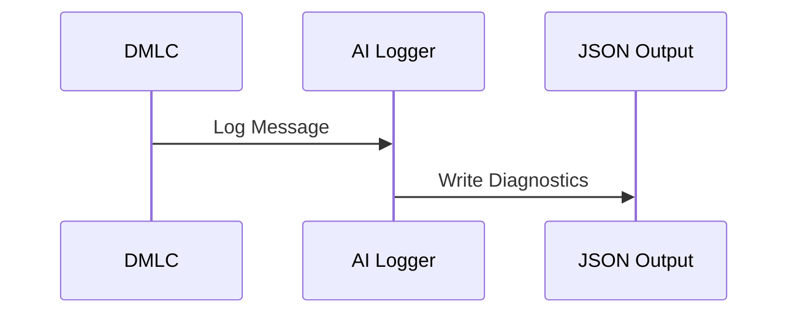
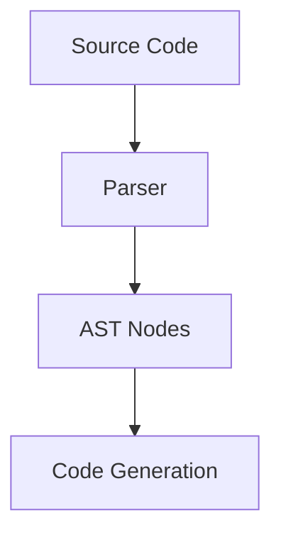
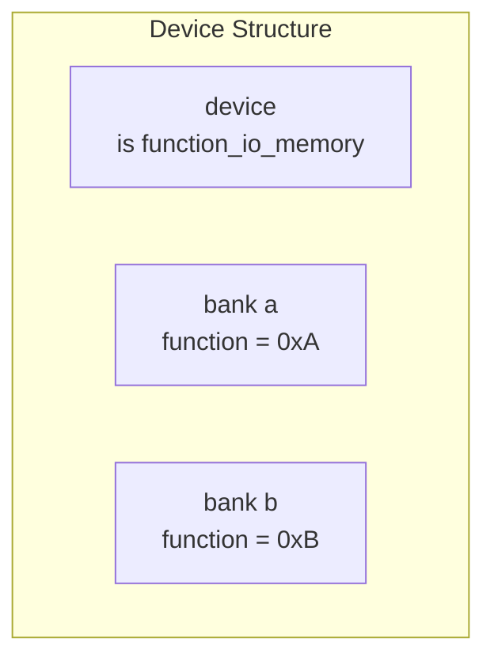
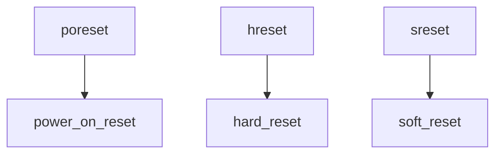
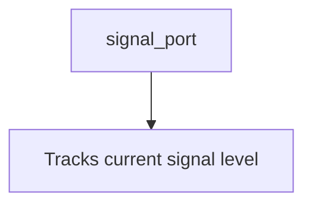

# Extensibility and Customization

## Introduction

Extensibility and customization are key aspects of the Device Modeling Language Compiler (DMLC) framework, enabling developers to adapt and enhance the system for project-specific requirements while maintaining the integrity of the core architecture. The framework offers modular components, well-defined APIs, and robust diagnostic tools, allowing for a high degree of flexibility in extending existing functionality and introducing custom behaviors.

This documentation provides an in-depth look into the mechanisms that enable extension and customization within the DMLC framework, focusing on the diagnostic system, configuration management, and extensible abstract syntax tree (AST) structure. Additionally, it covers practical examples for developers seeking to integrate advanced functionalities like AI-friendly diagnostics and custom parsing workflows.

---

## Key Categories of Extensibility

### Diagnostic Logging System

#### Overview

The diagnostic system in DMLC provides a modular framework for logging messages, capturing warnings, and reporting errors during the compilation process. Notably, it integrates AI-friendly tools to contextualize diagnostics and produce actionable insights.

#### Core Components

**1. `logging.py`**

The module's central `report()` function captures messages and routes them through configurable logging layers. For AI-enabled workflows, it integrates with AI-specific logging handlers.

```python
def report(logmessage):
    # Capture message for AI logging if enabled
    try:
        from . import ai_diagnostics
        if ai_diagnostics.is_ai_logging_enabled():
            ai_logger = ai_diagnostics.get_ai_logger()
            if ai_logger:
                ai_logger.log_message(logmessage)
    except ImportError:
        pass
    # ... existing code continues
```

Sources: [py/dml/logging.py:10-20]()

**2. `ai_diagnostics.py`**

This module defines the `AIFriendlyLogger`, a structured diagnostic tool that categorizes and outputs messages in JSON format, suitable for AI-analysis tools.

```json
{
  "format_version": "1.0",
  "generator": "dmlc-ai-diagnostics",
  "compilation_summary": {
    "total_errors": 5,
    "error_categories": {
      "syntax": 2,
      "type_mismatch": 3
    }
  }
}
```

Sources: [py/dml/ai_diagnostics.py:100-150]()

#### Workflow Diagram



Sources: [py/dml/ai_diagnostics.py:100-150]()

---

### Global Configuration Management

#### Overview

Global configurations are managed centrally in the `globals.py` module, providing common settings for debugging, compatibility, and version control. These configurations are easily extensible.

#### Key Variables

| Variable         | Purpose                              |
|-------------------|--------------------------------------|
| `dml_version`     | Specifies the DML version.           |
| `enabled_compat`  | Tracks enabled compatibility modes. |
| `debuggable`      | Toggles debugging capabilities.     |

```python
# Global variables
dml_version = None
enabled_compat = set()
debuggable = False
```

Sources: [py/dml/globals.py:10-50]()

---

### Abstract Syntax Tree (AST) Customization

#### Overview

The `ast.py` module defines the Abstract Syntax Tree (AST), which can be extended to include new language constructs and logic. Developers can add custom nodes and parsing rules.

#### Example

```python
@prod
def header(t):
    'toplevel : HEADER CBLOCK'
    t[0] = ast.header(site(t), t[2], False)
```

Sources: [py/dml/ast.py:100-120]()

#### Data Flow Diagram



Sources: [py/dml/ast.py:100-120]()

---

## Practical Templates and Usage

### Memory-Mapped I/O Templates

#### Function-Based Routing

The `function_io_memory` template enables memory routing to banks based on functions instead of flat address spaces.



Sources: [lib/1.4/utility.dml:942-1011]()

---

### Reset Template System

#### Multi-Level Hierarchy

Reset templates provide a granular approach for defining initialization and reset behaviors across devices, registers, and fields.



Sources: [lib/1.4/utility.dml:176-215]()

---

### Signal and Port Templates

#### Signal Port Template

The `signal_port` facilitates signal handling within ports.



Sources: [lib/1.4/utility.dml:1066-1127]()

---

## Conclusion

The extensibility and customization capabilities of the DMLC framework empower developers to adapt the compiler to diverse project needs. By leveraging modular behavior, robust logging systems, and a flexible AST structure, DMLC fosters an environment that supports both innovation and consistency.