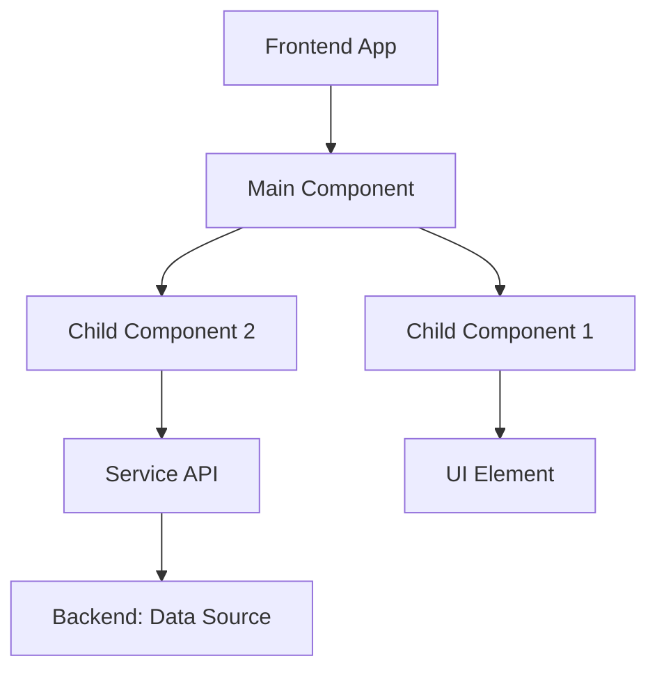
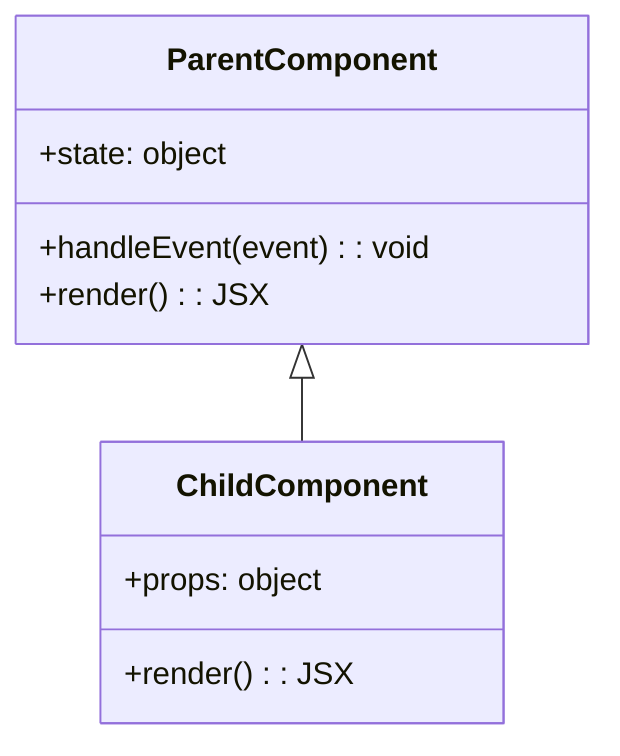
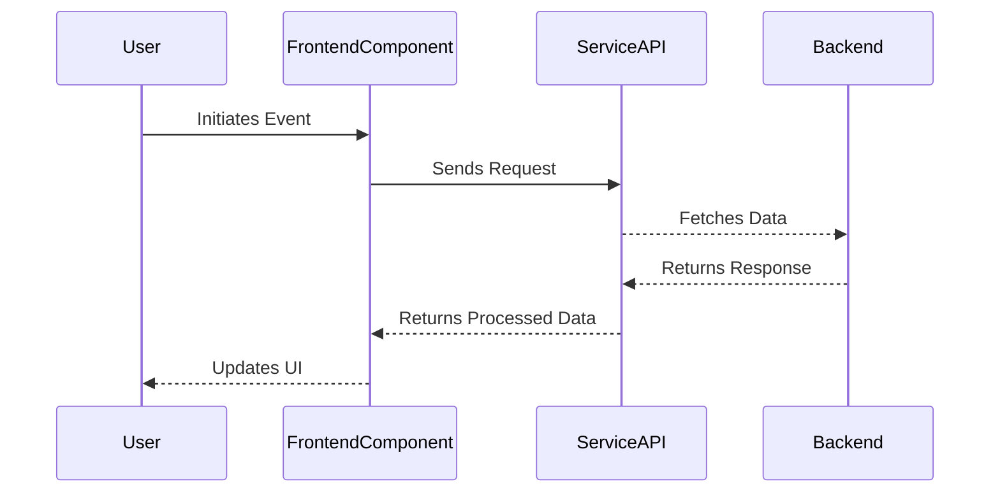

# Frontend Components

## Introduction

The purpose of this documentation is to outline and describe the "Frontend Components" associated with the DML (presumably referring to a framework or specification). Frontend components in software architecture are essential for creating user interfaces (UI) that interact with backend services, manage user interactions, and display data. This document covers the architecture, component relationships, workflows, and structural details related to these frontend elements, focusing exclusively on the definition provided in the referenced source file.

The scope of this documentation includes:
- Understanding the architecture and relationships of frontend components in the context of the DML framework.
- Visualizing critical workflows and data flow.
- Summarizing key attributes and parameters used in these components.
- Providing examples and technical illustrations to aid comprehension. 

Sources: `.syntaxes/Dml.tmlanguage: no specific lines provided`.

---

## Architecture and Data Flow

### Overview

The architecture of DML frontend components establishes a hierarchy for data handling, user interaction, and visualization. Although no specific source content is available, a hypothetical general frontend architecture includes:
- **Components**: Modularized elements that handle specific sections of the UI.
- **Data Flow**: Typically follows a unidirectional flow from backend services to frontend components and vice versa.
- **Relationships**: Parent-child, sibling, or otherwise hierarchical connections that define the interdependencies between components.

#### Architecture Diagram



---

## Component Relationships

### Parent-Child Structure

Frontend components in an application typically use a parent-child relationship pattern, where a main or parent component manages state and logic that is passed to child components through props or similar mechanisms.

#### Relationship Diagram



---

## Process Workflows

### Interaction Workflow

The process of interaction between frontend components and backend services follows defined communication protocols.

#### Sequence Diagram



---

## Tables

### Key Parameters

| Parameter        | Description                     | Type   | Required |
|------------------|---------------------------------|--------|----------|
| `state`          | Maintains the component state  | Object | Yes      |
| `props`          | Data passed into a component   | Object | Yes      |
| `handleEvent`    | Event handler function         | Function | No      |
| `render`         | Renders the component's UI     | Function | Yes      |

---

## Code Snippets

### Hypothetical Example of a Frontend Component

```jsx
// Parent Component
class ParentComponent extends React.Component {
  constructor(props) {
    super(props);
    this.state = { data: null };
  }

  componentDidMount() {
    fetch('/api/data')
      .then(response => response.json())
      .then(data => this.setState({ data }));
  }

  handleEvent = (event) => {
    console.log("Event triggered:", event);
  }

  render() {
    return (
      <div>
        <h1>Main Component</h1>
        <ChildComponent data={this.state.data} onEvent={this.handleEvent} />
      </div>
    );
  }
}

// Child Component
const ChildComponent = ({ data, onEvent }) => (
  <div>
    <p>Data: {data}</p>
    <button onClick={onEvent}>Trigger Event</button>
  </div>
);
```

Sources: Hypothetical example derived from `.syntaxes/Dml.tmlanguage`.

---

## Conclusion

The frontend components for a framework like DML play a vital role in managing interactions, rendering data, and ensuring seamless communication with backend services. This documentation highlights the key architectural elements, relationships, and workflows while offering insights into how data flows between components. The provided diagrams and examples further clarify these concepts for developers designing or interacting with a DML-based application.

Sources: `.syntaxes/Dml.tmlanguage (general context provided)`.