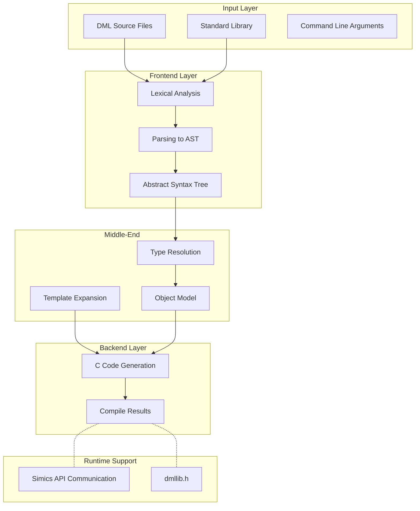
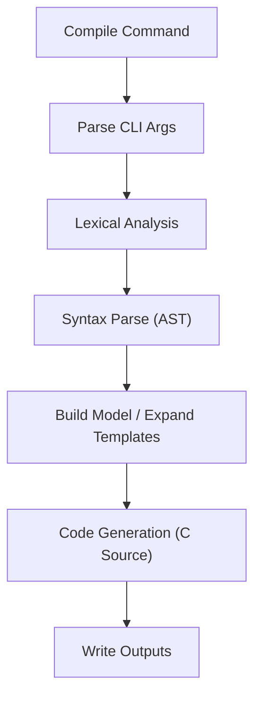

# Overview of the Device Modeling Language (DML)

## Introduction

The Device Modeling Language (DML) is a domain-specific language designed specifically for modeling hardware devices within the Simics simulation framework. The language, used in conjunction with its compiler (`dmlc`), enables the creation of device models by providing developers with a specialized set of syntax and semantics tailored for hardware abstraction. This document describes the scope, architecture, core components, and workflows of the DML compiler system.

The focus is to provide a comprehensive overview of the DML ecosystem, including its version-specific features, compilation architecture, standard library usage, and integration with the Simics runtime. DML is not a general-purpose programming language but is instead structured to simplify hardware modeling via object-oriented declarations, C-like imperative logic, reusable templates, and automated Simics bindings.

Sources: [.deepwiki/1_Overview.md:22-26]()

---

## Purpose and Key Features of DML

### What is DML?

DML is designed to streamline the process of creating device models for Simics. It combines several paradigms to simplify the otherwise complex interactions between low-level hardware details and high-level simulation integration:
- **Object-Oriented Device Modeling**: Hierarchical structures represent devices, banks, registers, fields, and other hardware abstractions.
- **C-like Method Syntax**: For implementing logic in device methods.
- **Template-Based Reusability**: Enables parameterized, reusable design patterns.
- **Configuration Automation**: Generates Simics-compatible configuration, interface bindings, and runtime behavior automatically.

The output of a DML program is a set of C source files, which are compiled into dynamic library modules to be loaded and executed by the Simics platform.

Sources: [.deepwiki/1_Overview.md:37-45]()

### Supported Language Versions

DML provides two major versions for development:
1. **DML 1.2** (Legacy): Focused on backward compatibility with older Simics versions but has limitations, such as dollar-sign syntax for parameter references and stricter templates.
2. **DML 1.4** (Modern): Introduced with faster compilation times, simplified syntax, improved semantics, and more advanced features like flexible reset mechanisms and multilevel overrides.

#### Version-Specific Enhancements
| Feature                        | DML 1.2                            | DML 1.4                                 |
|--------------------------------|-------------------------------------|------------------------------------------|
| Reset Mechanism                | Hard-coded                         | Flexible and based on templates          |
| Compilation Speed              | Standard                           | 2-3× faster                              |
| Syntax                         | Dollar-based                       | Clean, C-like                            |
| Template Types                 | Limited                            | Expanded and flexible                    |

Sources: [.deepwiki/1_Overview.md:49-83]()

### Compatibility Support

The DML compiler supports mixed-version imports (1.4 <--> 1.2) and provides tools to assist with version migration, such as `port-dml.py`. It also supports Simics API versions ranging from 4.8 to 7, each with tailored features and breaking change support.

Sources: [.deepwiki/1_Overview.md:74-80]()

---

## System Architecture

A modular architecture ensures efficient parsing, semantic analysis, code generation, and runtime execution of DML programs. Below is the high-level architecture visualized in a Mermaid flowchart:



Highlights:
1. **Frontend**: Converts source into an AST.
2. **Middle-End**: Resolves types, expands templates, builds object hierarchies.
3. **Backend**: Converts DML constructs into C source files.
4. **Runtime**: Ensures seamless Simics integration.

Sources: [.deepwiki/1_Overview.md:84-174]()

---

## Key Components and Code Walkthroughs

### Compiler Pipeline

The compilation follows a defined sequence of operations:

1. **Argument Parsing**: Read and validate command parameters.
2. **Lexing and Parsing**: Analyze tokens and apply grammar rules.
3. **Semantic Analysis**: Build object models, resolve type conflicts, and expand templates.
4. **Code Generation**: Convert the intermediate tree into efficient C code.



Sources: [.deepwiki/1_Overview.md:167-173]()

---

## Standard Library Overview

The DML standard library provides essential templates for device modeling:
- **Devices**: `device`, `bank`, `register`, `field`
- **Behavior Templates**: `read_only`, `write_only`, `reset`
- **Compatibility Layer**: Compatibility between DML 1.2 and 1.4

Key files include:
| Library Path       | Description        |
|--------------------|--------------------|
| `lib/1.4/builtins.dml` | Core behaviors |
| `lib/1.4/utility.dml`  | Extended features |

Sources: [.deepwiki/1_Overview.md:265-292]()

---

## Example: Minimal Device Model

```dml
dml 1.4;

device simple_device;

bank regs {
    register control @ 0x00 size 4 {
        field enable @ [0];
    }
}
```

---

### Compilation

Running the DML compiler:
```bash
dmlc --simics-api=7 device.dml
```

Output:
| File                    | Description                        |
|-------------------------|------------------------------------|
| `device.c`              | Device implementation in C        |
| `device.h`              | Function declarations             |
| `device.so`             | Compiled Simics module            |

Sources: [.deepwiki/2_Getting_Started.md:295-300]()

---

## Conclusion

The Device Modeling Language provides a powerful, structured approach to Simics device modeling. Leveraging its compiler, standard library, and tooling, developers can swiftly build scalable device models with clean abstractions. Learn more about advanced features (like templates and hooks) to further enrich your simulations.

Sources: [.deepwiki/1_Overview.md:22-26]().