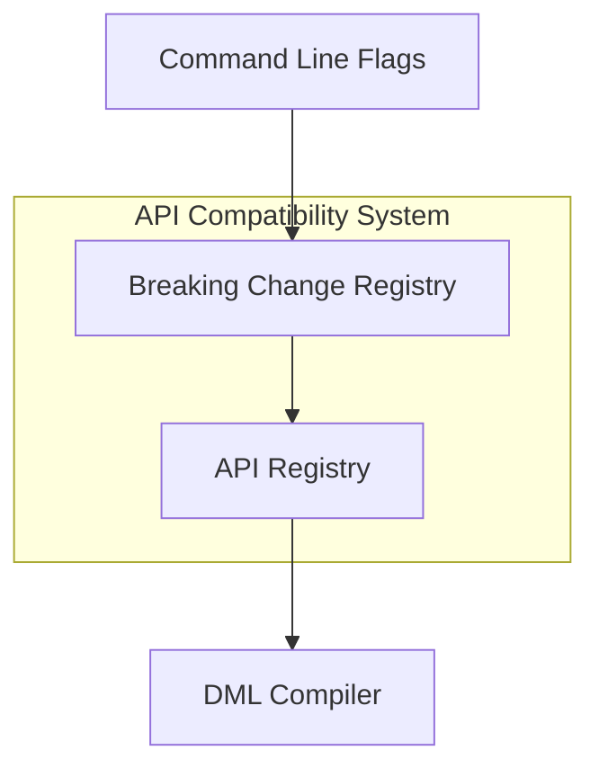
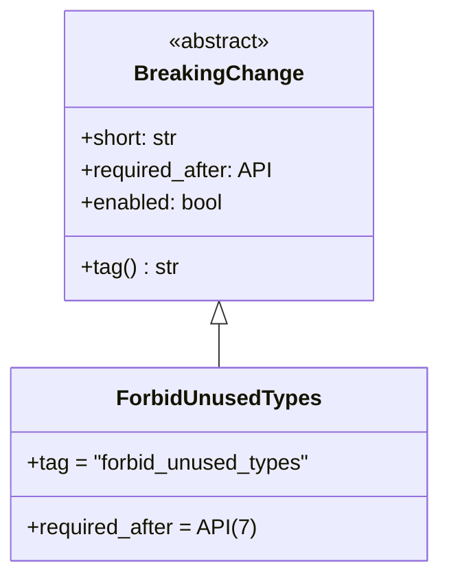
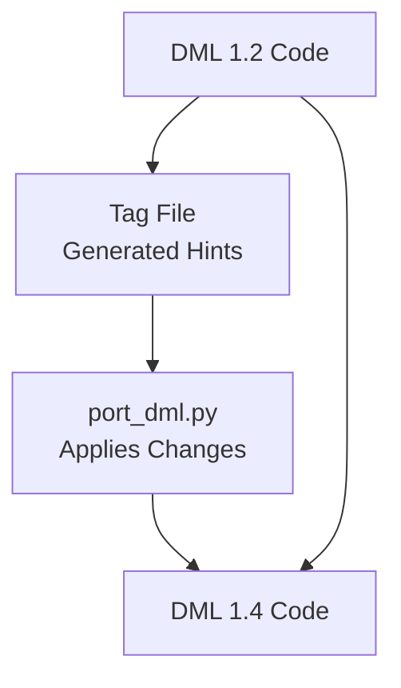
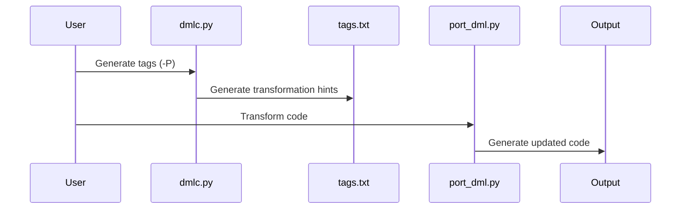

# Release Notes and Compatibility for DML

This comprehensive document provides an overview of breaking changes, compatibility features, and migration workflows between different versions of the Device Modeling Language (DML). It acts as a consolidated reference for developers navigating DML’s evolving language specifications.

---

## Introduction

DML continuously evolves to introduce new features, improve language efficiency, and deprecate legacy behaviors. To ensure a controlled migration path and minimize disruption, various compatibility mechanisms are in place. This document details:

- Breaking changes across Simics API and DML versions
- Compiler flags and tools for managing these changes
- Automated migration tools like `port_dml.py`
- Compatibility strategies for mixed-version codebases
- Highlighted release notes between major DML versions

By understanding these topics, developers can confidently adapt to DML changes while maintaining compatibility in legacy codebases.

---

## Architecture of Compatibility and Breaking Changes

### Framework Overview

DML introduces breaking changes in a controlled manner. Compatibility is managed via:
- **API Versions**: Each API version enforces specific behaviors.
- **Breaking Changes Registry**: Allows opting into changes before they become mandatory.
- **Compatibility Layers**: Templates and libraries that ensure smooth migration between versions.

Compatibility behavior is controlled by flags like `--breaking-change`, `--strict-dml12`, and `--simics-api`. Each API version incrementally enables breaking changes introduced in earlier versions, ensuring seamless enforcement of new standards.

### High-Level Architecture



Sources: [.deepwiki/33_Breaking_Changes_and_Compatibility.md:40-83]()

---

## Breaking Changes Framework

### API Version and Breaking Change Relationship

Each breaking change in DML specifies the minimum API version where it becomes mandatory. This relationship ensures phased adoption.

#### Key Details:
- Use the `--simics-api` flag to set the target API version.
- Enable specific changes early with `--breaking-change=<TAG>`.

### Anatomy of Breaking Change Classes

Breaking changes are implemented as singleton classes. The `enabled` property dynamically checks when a change becomes mandatory based on the API version or explicit flags.



Sources: [.deepwiki/33_Breaking_Changes_and_Compatibility.md:90-141]()

---

## Command-Line Interface

### Key CLI Flags for Compatibility
| Flag                          | Functionality                                      |
|-------------------------------|----------------------------------------------------|
| `--simics-api=VERSION`        | Sets API version for enforcing version-specific changes. |
| `--breaking-change=TAG`       | Opt into specific breaking changes.               |
| `--help-breaking-change`      | Lists all available breaking changes.             |
| `--strict-dml12`              | Enables stricter type-checking in DML 1.2.        |

Example:  
```bash
# Compile with Simics API 7 and enable stricter type-checking
dmlc --simics-api=7 --strict-dml12 device.dml
```

Sources: [.deepwiki/33_Breaking_Changes_and_Compatibility.md:147-157]()

---

## DML Version Migration: 1.2 to 1.4

### Porting Workflow Overview

Migrating from DML 1.2 to DML 1.4 involves a multi-phase workflow:



1. **Tag File Generation**: Compile with `dmlc -P` to generate transformation hints.
2. **Transformation**: Apply edits with `port_dml.py`.
3. **Output**: Obtain updated DML 1.4 code.

Sources: [.deepwiki/36_Porting_from_DML_1.2_to_1.4.md:30-74]()

---

## Key Breaking Changes by Version

### API Version 7
| Change                         | Tag                            | Impact                                           |
|--------------------------------|--------------------------------|-------------------------------------------------|
| Unused Type Errors             | `forbid_unused_types`          | Enforces stricter type checking.                |
| Modern Attribute Semantics     | `modern_attributes`            | Legacy APIs replaced with modern syntax.        |

Sources: [.deepwiki/33_Breaking_Changes_and_Compatibility.md:201-211]()

### API Version 6
| Change                         | Tag                            | Impact                                           |
|--------------------------------|--------------------------------|-------------------------------------------------|
| Transaction Defaults           | `transaction_by_default`       | Updates behavior of banks.                      |

Sources: [.deepwiki/33_Breaking_Changes_and_Compatibility.md:215-220]()

---

## Automated Porting System

The `port_dml.py` tool automates the migration process.

### Workflow



### Most Common Changes:
| Transformation | Example (1.2)     | Example (1.4)     |
|----------------|------------------|------------------|
| `$field` to `this.field`  | `$field`        | `this.field`|
| After Statement   | `after call`  | `after time s:` |
| Inline Params | `$method()` → `method()` |

Sources: [.deepwiki/36_Porting_from_DML_1.2_to_1.4.md:81-146]()

---

## Conclusion

DML’s breaking changes and compatibility layers ensure incremental modernization of the language while preserving legacy support. By understanding these changes and leveraging automated tools like `port_dml.py`, you can efficiently adopt new standards in your DML projects.

The developer experience is enhanced by:
- Clear documentation for all breaking changes.
- Version-aware tooling for compatibility.
- Detailed workflows for handling migration challenges. For further resources, consult the [DML Reference Manual](#).