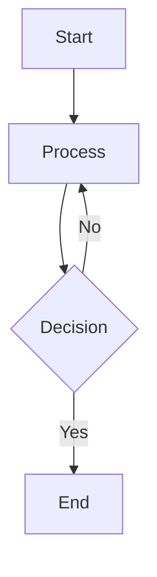

# Code Wiki Extension

View and navigate repository documentation directly in VS Code, with support for both CodeWiki and DeepWiki formats.

## Features

- 📚 **Dual Wiki Support**: Browse both CodeWiki (`.codewiki/`) and DeepWiki (`.deepwiki/`) documentation
- 🚀 **Integrated Generation**: Generate documentation directly from your repository
- 📖 **Custom Webview**: View wiki files with proper markdown rendering
- 📊 **Mermaid Diagrams**: Full support with theme-aware rendering
- 🔄 **Auto-Detection**: Automatically detects available wiki types
- 🎨 **Theme Integration**: Matches VS Code theme colors
- 🏗️ **Hierarchical Navigation**: Structured documentation browsing with sections and pages
- ⚠️ **Error Handling**: Comprehensive error handling for diagram rendering
- 🔐 **Secure API Management**: System keychain integration for API keys
- 🔧 **Auto-Fix**: Automatic Mermaid syntax correction during generation
- 🤖 **AI-Powered Search**: Intelligent documentation search integrated with GitHub Copilot
- 🔍 **Semantic Indexing**: Automatic indexing of generated documentation using DSPy-Memory

## Installation

### Build from Source

1. **Install dependencies:**
   ```bash
   cd vscode-ext
   npm install
   ```

2. **Compile the TypeScript code:**
   ```bash
   npm run compile
   ```

3. **Package the extension:**
   ```bash
   npm run package
   ```
   This builds and packages the extension, creating a `repo-wiki-0.2.0.vsix` file.

4. **Install the extension:**

   **For Local VS Code:**
   ```bash
   code --install-extension repo-wiki-0.2.0.vsix
   ```
   
   Or via VS Code UI:
   - Open VS Code
   - Go to Extensions view (Ctrl+Shift+X / Cmd+Shift+X)
   - Click the `...` menu → "Install from VSIX..."
   - Select the `repo-wiki-0.2.0.vsix` file

   **For Remote VS Code (SSH/WSL/Containers):**
   - Connect to your remote environment in VS Code
   - Open Extensions view (Ctrl+Shift+X / Cmd+Shift+X)
   - Click the `...` menu → "Install from VSIX..."
   - Select the `repo-wiki-0.2.0.vsix` file from your local machine
   - The extension will be installed on the remote environment

5. **Reload VS Code:**
   - Press Ctrl+Shift+P / Cmd+Shift+P
   - Run "Developer: Reload Window"

## Usage

### Viewing Documentation

The extension supports two wiki formats:

**CodeWiki** (`.codewiki/`):
- Standard repository documentation
- Module-based structure
- Flat file hierarchy

**DeepWiki** (`.deepwiki/`):
- Enhanced AI-powered documentation
- Hierarchical structure with sections and subsections
- XML-defined page organization
- Deeper code analysis and insights

**To view documentation:**

1. Open a folder containing wiki documentation (`.codewiki/` or `.deepwiki/`)
2. Click the **Repo Wiki icon** in the Activity Bar (left sidebar)
3. The extension automatically detects available wiki types
4. If both exist, use **"Switch Wiki Type"** command to toggle between them
5. Browse the wiki tree structure:
   - **CodeWiki**: Module folders with markdown files
   - **DeepWiki**: Sections → Subsections → Pages hierarchy
6. Click on any item to view its contents in the webview

**Quick Start (Try Viewer First):**

The repository includes a `.codewiki` folder with reference documentation. You can immediately:
- Click the **Repo Wiki icon** in the Activity Bar
- Browse and explore the viewer features
- See how the documentation looks

**To Test the Generation Flow:**

If you want to test the wiki generation process:

```bash
# Backup existing wiki folders
mv .codewiki .codewiki.backup
mv .deepwiki .deepwiki.backup  # if exists
```

Then reload VS Code (Ctrl+Shift+P / Cmd+Shift+P → "Developer: Reload Window") to see the generation options.

### Generating Documentation

The extension supports generating two types of documentation:

#### CodeWiki Generation

Standard repository documentation with module structure:

1. Open your repository folder in VS Code
2. Click the **Repo Wiki icon** in the Activity Bar
3. Click **"Generate CodeWiki"** button
4. The extension will automatically:
   - Clone the RepoWiki repository (to `<workspace>/codewiki-repo`)
   - Create/activate a Python virtual environment
   - Install CodeWiki and its dependencies
   - Check for API key configuration
   - Generate comprehensive documentation for your repository

**First-time setup:**
- If you haven't configured an API key, the extension will prompt you
- Enter your API key in the input dialog
- Get an API key from:
  - [iFlow](https://platform.iflow.cn/profile?tab=apiKey)
  - [OpenAI](https://platform.openai.com/api-keys)
  - [Anthropic](https://console.anthropic.com/settings/keys)
  - Or your custom LLM provider

**During generation:**
- Monitor progress via the notification in VS Code
- Generation typically takes 30-60 minutes depending on repository size
- View detailed output in the "CodeWiki Setup" output channel
- Cancel anytime by clicking the ❌ button on the progress notification

**After generation:**
- Documentation is saved in `.codewiki/` folder
- The wiki tree automatically refreshes
- Browse and view the generated documentation

#### DeepWiki Generation

Enhanced AI-powered documentation with deeper analysis:

1. Click **"Generate DeepWiki"** button instead
2. The extension will perform additional setup:
   - Clone the deepwiki-open repository (to `<workspace>/deepwiki-repo`)
   - Validate/prompt for GitHub Personal Access Token
   - Install Node.js 22+ using nvm (if needed)
   - Setup Python environment with `uv`
   - Execute DeepWiki CLI with GPT-4o
3. Post-processing includes:
   - Automatic file reference fixing (adds `../` prefix for external files)
   - Mermaid syntax correction (removes quotes from node labels)

**Requirements for DeepWiki:**
- GitHub Personal Access Token with `repo` scope
- Node.js 22+ (automatically installed via nvm if missing)
- Python 3.8+ with `uv` package manager
- LLM API key (same as CodeWiki)

**DeepWiki advantages:**
- Hierarchical documentation structure
- Deeper code analysis with call graphs
- AI-enhanced insights
- Structured with `wiki_structure.xml`
- Better organization for large repositories

**During generation:**
- Monitor progress through 6 setup steps
- Generation may take longer than CodeWiki (1-2 hours for large repos)
- Progress shown in "CodeWiki Setup" output channel

**After generation:**
- Documentation saved in `.deepwiki/` folder
- Hierarchical view with sections and pages
- XML structure for organized navigation

## Wiki Structure

The extension supports two wiki structures:

### CodeWiki Structure
```
<workspace>/.codewiki/
├── module_tree.json          # Module hierarchy metadata
├── Module1/
│   ├── Module1.md           # Module documentation
│   ├── Submodule1.md
│   └── Submodule2.md
└── Module2/
    └── Module2.md
```

### DeepWiki Structure
```
<workspace>/.deepwiki/
├── wiki_structure.xml        # Hierarchical structure definition
├── Page1.md                  # Documentation pages
├── Page2.md
└── ...
```

The XML structure defines:
- **Sections**: Top-level organization
- **Subsections**: Nested categories
- **Pages**: Individual documentation pages with metadata (title, description, importance, relevant files)

## Mermaid Diagram Support

The extension provides comprehensive support for Mermaid diagrams embedded in your wiki markdown files. All standard Mermaid diagram types are supported:

- **Flowcharts and Graphs** - Visualize processes and workflows
- **Sequence Diagrams** - Show interactions between components
- **Class Diagrams** - Document object-oriented structures
- **State Diagrams** - Represent state machines
- **Entity-Relationship Diagrams** - Model database schemas
- **And more** - All Mermaid diagram types from the official documentation

### Features

- **Theme-Aware Rendering**: Diagrams automatically adapt to your VS Code theme (light/dark)
- **Error Handling**: Clear error messages when diagrams fail to render, with retry options
- **Standard Syntax**: Use standard Mermaid syntax without modifications or workarounds
- **Multiple Diagrams**: Render multiple diagrams in a single document independently

### Configuration

You can customize Mermaid rendering through VS Code settings:

- `codewiki.mermaid.theme`: Choose diagram theme (`auto`, `dark`, `light`, `neutral`)
- `codewiki.mermaid.errorDisplay`: Control how errors are displayed (`inline`, `notification`, `console`)

### Example

````markdown

````

## AI-Powered Documentation Search with `@repowiki`

The extension includes an intelligent **chat participant** (`@repowiki`) that searches your documentation and provides AI-generated answers using the full flow: **Search → Load → LLM → Structured Answer**.

### How It Works

**Automatic Indexing**: When you generate CodeWiki or DeepWiki documentation, the extension automatically:
- Clones the [ADK Python repository](https://github.com/fenghaitao/adk-python.git) to `.adk-python-repo/` in your workspace
- Sets up a Python virtual environment with DSPy-Memory
- Indexes all generated documentation for semantic search

**AI-Powered Workflow**:
1. **Search**: Uses DSPy-Memory to find the 5 most relevant documentation files for your question
2. **Load**: Reads the full content of those documentation files
3. **LLM Processing**: Sends the documentation to GitHub Copilot's LLM with your question
4. **Structured Answer**: Streams back a comprehensive, synthesized answer citing the relevant files

### Usage

Use the `@repowiki` chat participant in GitHub Copilot Chat:

```
@repowiki what features are supported in this project?
@repowiki explain the architecture
@repowiki how does authentication work?
@repowiki what file types can be processed?
```

**What Happens:**
1. You ask a question with `@repowiki`
2. The participant searches your indexed documentation
3. Loads the most relevant documentation files
4. Sends them to the LLM along with your question
5. Returns a comprehensive, structured answer based on your actual documentation

### Monitoring Activity

You can monitor the participant's activity:

1. **Output Channel**: 
   - View → Output → Select "Documentation Search" from dropdown
   - Shows: search queries, files loaded, and LLM processing steps

2. **Developer Console**:
   - Help → Toggle Developer Tools → Console tab
   - Look for `[RepoWiki]` prefixed messages
   - Shows when participant is invoked and result counts

**Example Output:**
```
=== Chat Participant Invoked ===
User query: "what features are supported?"
---
Found 5 relevant documents
Loaded: .deepwiki/Key_Features.md
Loaded: .deepwiki/High-Level_Architecture.md
Loaded: .deepwiki/Interactive_Components.md
Calling language model...
Streaming LLM response...
✓ Response completed
```

Result 1:
  File: docs/authentication/overview.md
  Score: 95.0%
  Snippet: The authentication system uses JWT tokens...

✓ Search completed successfully
```

### Technical Details

**DSPy-Memory Setup:**
- Repository: `https://github.com/fenghaitao/adk-python.git`
- Location: `<workspace>/.adk-python-repo/`
- Python Environment: Virtual environment with `uv`
- Dependencies: DSPy-OpenSpec, socksio

**Indexed Content:**
- CodeWiki: All files in `.codewiki/` directory
- DeepWiki: All files in `.deepwiki/` directory
- Supports: Markdown files with code examples, diagrams, and documentation

**Search Features:**
- Returns top 5 most relevant results
- Includes relevance scores (0-100%)
- Extracts relevant snippets from documentation
- Handles multiple file formats and structures

### Requirements

The AI search feature requires:
- Generated CodeWiki or DeepWiki documentation
- GitHub Copilot subscription (for using the integrated search)
- Python virtual environment (automatically set up)
- `uv` package manager (automatically installed during generation)

### Troubleshooting

**Search tool not working?**
1. Ensure documentation has been generated (CodeWiki or DeepWiki)
2. Check the "Documentation Search" output channel for errors
3. Verify that `.adk-python-repo/` exists in your workspace
4. Regenerate documentation to re-index

**Copilot not using the search tool?**
1. Try being more explicit in your question: "Search the project documentation for..."
2. Use phrases that reference "this project", "this codebase", "the documentation"
3. Check Developer Console (Help → Toggle Developer Tools) for `[RepoWiki]` logs
4. The tool may not trigger if Copilot thinks it can answer from README or code analysis
5. Try: "Use the documentation search tool to find information about..."

**No results found?**
- Try rephrasing your query
- Use more specific terms or keywords
- Check that your documentation contains the information you're looking for
- Regenerate documentation if you've made recent changes

## Commands

- **Code Wiki: Generate CodeWiki** - Generate standard repository documentation
- **Code Wiki: Generate DeepWiki** - Generate enhanced AI-powered documentation
- **Code Wiki: Switch Wiki Type** - Toggle between CodeWiki and DeepWiki (when both exist)
- **Code Wiki: Refresh** - Manually refresh the wiki tree view
- **Code Wiki: Show Debug Output** - View captured console output for debugging
- **Code Wiki: Show Mermaid Errors** - Display Mermaid diagram rendering errors
- **Code Wiki: Fix Mermaid Errors with Copilot** - Get AI-powered suggestions to fix diagram errors

## Development

### Automated Mermaid Error Detection

The extension includes automation tools for detecting and fixing Mermaid diagram rendering errors:

```bash
# Scan all wiki files for Mermaid errors
npm run scan:mermaid

# This will:
# - Scan all 115+ markdown files
# - Validate 650+ Mermaid diagrams
# - Generate MERMAID_FIX_PROMPT.txt with errors
# - Provide Copilot-ready prompts for fixes
```

See [AUTOMATION_SUMMARY.md](AUTOMATION_SUMMARY.md) for quick start guide and [docs/MERMAID_ERROR_AUTOMATION.md](docs/MERMAID_ERROR_AUTOMATION.md) for complete documentation.

## Requirements

- VS Code 1.85.0 or higher
- A workspace with wiki documentation (for viewing)

**For CodeWiki generation:**
- Python 3.8 or higher
- [`uv`](https://github.com/astral-sh/uv) package manager (recommended)
- LLM API key (iFlow, OpenAI, Anthropic, or custom provider)

**For DeepWiki generation (additional requirements):**
- GitHub Personal Access Token with `repo` scope
- Node.js 22+ (automatically installed via nvm if missing)
- Git (for cloning deepwiki-open repository)

## Known Issues

None at this time.

## Release Notes

### 0.2.0

Major update with dual wiki support and AI-powered search:

- **DeepWiki Support**: Full support for DeepWiki format with hierarchical navigation
- **Dual Wiki Architecture**: Automatic detection and switching between CodeWiki and DeepWiki
- **Integrated DeepWiki Generator**: Complete setup automation with 6-step process
- **AI-Powered Documentation Search**: GitHub Copilot integration with DSPy-Memory for intelligent search
- **Automatic Indexing**: Generated documentation is automatically indexed for semantic search
- **Language Model Tool**: Registered tool allows Copilot to search project-specific documentation
- **XML Structure Parsing**: Hierarchical documentation with sections, subsections, and pages
- **Auto-Fix**: Automatic Mermaid syntax correction during generation
- **File Reference Fixing**: Automatic path correction for external file references
- **Enhanced UI**: Dynamic view titles and wiki type selection
- **Improved Setup**: GitHub token validation, Node.js environment management via nvm

### 0.1.0

Initial release of Code Wiki extension:

- Browse and view CodeWiki documentation
- Full Mermaid diagram support with theme-aware rendering
- Comprehensive error handling
- Configurable diagram themes

## License

MIT
