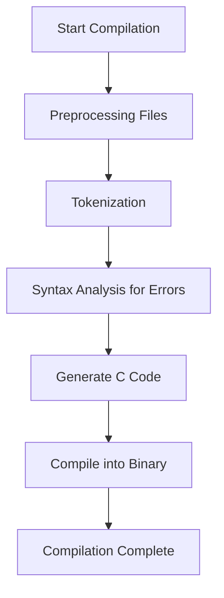
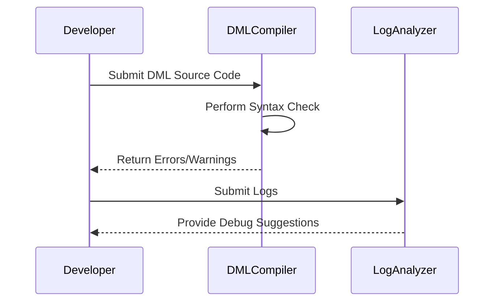

# Device Modeling Language (DML) Documentation: Release Notes and Security

## Introduction

Welcome to the **Device Modeling Language (DML)** documentation page. This document provides an overview of important release notes and historical changes in the evolution of DML, breaking down significant updates from versions 1.2, 1.4, and beyond. Additionally, it outlines the project's security policy to ensure developers and organizations can maintain secure practices when leveraging DML.

The goal of this document is to present a cohesive summary of changes, enhancements, and fixes over time while emphasizing the importance of adhering to security practices in designing and implementing device models. Readers can also find process diagrams, tables, and cited examples for a complete understanding.

---

## Release Notes

### DML Version 1.2 Highlights

#### Key Features and Enhancements
1. **Built-in Templates**: The `read` and `write` templates are now included by default in all 1.2 files without manual import. [Sources: RELEASENOTES-1.2.md:12]  
2. **Porting Assistance**: Environment variable `DMLC_PORTING_TAG_FILE` supports automatic generation of porting instructions for transitioning to DML 1.4. [Sources: RELEASENOTES-1.2.md:19]  
3. **Reset Behavior Enhancements**: Register reset ordering became more predictable across simulations, reducing bugs. [Sources: RELEASENOTES-1.2.md:20]  

#### Bug Fixes
- Fixed crash when using `foreach` for nested register arrays. [Sources: RELEASENOTES-1.2.md:22]  
- Applied restrictions on bitwise operations for better predictability in simulation results (e.g., disallowing errors from `~boolean`). [Sources: RELEASENOTES-1.2.md:32]  

---

### DML Version 1.4 Highlights

#### Major Updates
1. **Improved Compilation Performance**: Compilation of device models with large structures saw speedups by 200%–300%. [Sources: RELEASENOTES-1.4.md:11]
2. **Adaptable Reset Mechanism**: Reset logic is now customizable per device. [Sources: RELEASENOTES-1.4.md:13]  
3. **Improved Syntax**: A significant cleanup of language semantics for greater readability, such as removal of redundant `$`. [Sources: RELEASENOTES-1.4.md:19]  

#### Enhancements
- `Saved` variables now explicitly allow developers to declare simulation checkpoints for runtime storage. [Sources: RELEASENOTES-1.4.md:78]  
- Added support for partial initialization and declaration of templates using advanced compound notations. [Sources: RELEASENOTES-1.4.md:125]  

#### Bug Fixes
- Resolved issues with Simics API compatibility, improving stability in hybrid 1.2 & 1.4 environments. [Sources: RELEASENOTES-1.4.md:227]  

---

### Security Policy

#### Overview
The DML development team prioritizes security to protect developers and users from vulnerabilities. The team adheres to structured guidelines for identifying, addressing, and mitigating risks in the project.

#### Reporting a Vulnerability
Please follow [Intel’s vulnerability reporting policy](https://www.intel.com/content/www/us/en/security-center/vulnerability-handling-guidelines.html) for any issues. Transparency and timely resolutions ensure that security remains a foundation of DML development. [Sources: SECURITY.md:10]

---

## Process Diagrams

### DML Compilation Workflow



### Error Reporting Workflow



---

## Tables

### Summary of Key Changes (DML 1.2 to 1.4)

| Version | Feature/Improvement                   | Description                                                                                                                                          | Source File                   |
|---------|---------------------------------------|------------------------------------------------------------------------------------------------------------------------------------------------------|--------------------------------|
| 1.2     | `read/write` Inclusion               | Default templates reduce boilerplate for device models.                                                                                             | RELEASENOTES-1.2.md:12        |
| 1.4     | Improved Reset Adaptability          | Support for customizable reset mechanisms.                                                                                                          | RELEASENOTES-1.4.md:13        |
| 1.4     | Optimized Compilation                | Drastic performance boosts for large registers.                                                                                                     | RELEASENOTES-1.4.md:11        |
| 1.2     | Porting Tag Files                    | Streamlined upgrades by generating port-hints automatically.                                                                                        | RELEASENOTES-1.2.md:19        |

---

## Code Snippets

### Example of Reset Adaptability in DML 1.4
```dml
reset {
    method soft_reset() { /* Custom device initialization */ }
    method hard_reset() {
        // Reset more parameters here that persist across power-cycles
    }
}
```
[Sources: RELEASENOTES-1.4.md:13]

### Example: Debugging Logs with Error Levels
```dml
log warning: "*Unmapped Register Access at Level1 in Simulation";
after { value.adjusted_range = inner_field(len); }
```
[Sources: RELEASENOTES.md:188]

---

## Conclusion

The documented release notes illustrate DML’s progression from simpler constructs in version 1.2 to powerful adaptability and optimization in version 1.4. Developers benefit from significant performance, usability improvements, and clearer log-level debugging. Simultaneously, a robust security protocol reinforces the platform's trustworthiness.

Developers are encouraged to explore the latest documentation, such as the DML 1.4 Reference Manual, and apply best practices in secure and efficient model implementation.