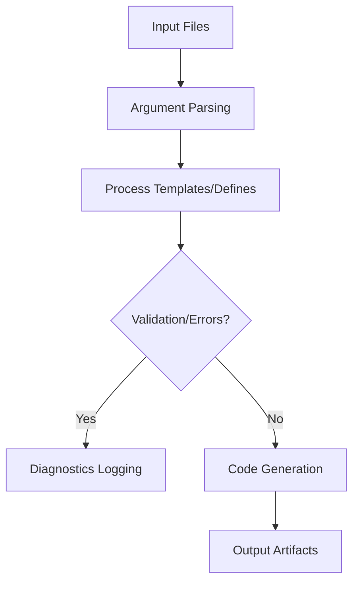
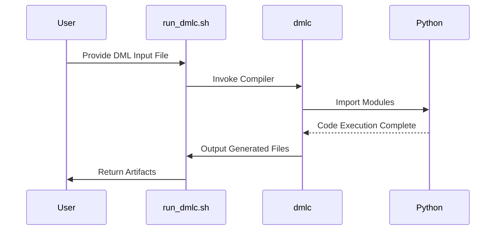
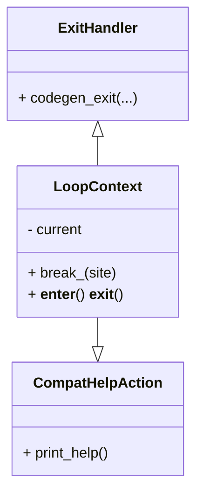

# Backend Systems

This documentation page provides an overview of the `Backend Systems` framework based on the supplied source files. It explains the functionality, framework components, workflows, configurations, and implementation details of the "Backend Systems."

---

## Introduction

**Backend Systems** represent a robust framework focused on facilitating the building, compilation, and deployment of Device Modeling Language  (DML) modules. This framework primarily operates with the `dmlc` (DML Compiler) tool and provides mechanisms to process DML files, generate output, and manage dependencies while leveraging the Simics API.

The goal of Backend Systems is to streamline the development of hardware modules by enhancing compilation workflows for DML-based device definitions. It enables the integration of diagnostic output, facilitates compatibility with complex ecosystems, and supports advanced features like warnings/errors tracking.

### Related Components
- **`py/dml/dmlc.py`**: Core component of the DML compiler logic for parsing, preprocessing, and handling input/output files.
- **`py/dml/codegen.py`**: Supplies utility functions, code generation strategies, and internal abstractions for processing DML.
- **`run_dmlc.sh`**: A script to invoke `dmlc` in a standalone implementation, providing environmental configurations.

Sources: [py/dml/dmlc.py](), [py/dml/codegen.py](), [run_dmlc.sh]()

---

## Detailed Sections

### Core Functionalities

#### DML Compilation Logic: (`dmlc.py`)
The `dmlc.py` module implements the primary logic for compiling DML files. Key features include:

- **Argument Parsing**  
   Parses runtime arguments using Python's `argparse` module. Users specify input files, compiler paths, flags, and configuration directives.

   Example:
   ```
   --dep-target          Specify dependency computation targets.
   --warn=<tag>          Enable warning tags.
   ```

- **Error/Warning Management**  
   It handles runtime diagnostics output via `dml.messages` to provide comprehensive logging and error recovery strategies.

   Sources: [py/dml/dmlc.py:22-42]()

#### Code Generation Utilities: (`codegen.py`)
The `codegen.py` module provides utilities for generating expressions, functions, or structures during the compilation process.

- **Memoization for Intermediate States**:  
   Optimizes redundant calculations during expression evaluation by caching generated outputs. Example handlers:
   - `MemoizedReturnExit`
   - `IndependentMemoized`

- **Loop Contexts**:  
   Manages nested DML loop constructs to ensure proper scoping.

   Example implementation:
   ```python
   class LoopContext:
       '''Routine for enclosing loop management'''
       def __enter__(self):
           self.prev = LoopContext.current
   ```

   Sources: [py/dml/codegen.py:99-142]()

---

## Architecture and Data Flow

### Flowchart: End-to-End Process


### Sequence Diagram: Workflow of `run_dmlc.sh`


### Class Diagram: Code Relationships


---

## Process Workflows

The following steps outline the workflow:

### High-Level Overview

1. **Initialization**
   - `run_dmlc.sh` computes runtime paths and launches the Python-based `dmlc`.
   - Default configurations (DML_DIR, SIMICS_PATHS) are loaded.

   Sources: [run_dmlc.sh:13-27]()

2. **Parsing & Preprocessing**
   - The `dmlc.py` ingests the input file(s) and validates configurations.
   - User errors such as missing inputs prompt immediate diagnostic logs.

   Sources: [py/dml/dmlc.py:309-618]()

3. **Template Handling**
   - Templates and runtime parameters are processed using functions such as:
     ```python
     def process(devname, global_defs, top_tpl, extra_params)
     ```

4. **Code Generation/Compilation**
   - Output includes `.c`, `.xml`, or `.g` file types. The design adheres to `Simics-7` APIs.

   Sources: [py/dml/codegen.py:71-369]()

---

## Key Parameters & Configurations

| Parameter/Argument      | Description                                                                 |
|--------------------------|-----------------------------------------------------------------------------|
| `-D NAME=VALUE`          | Defines compile-time variables.                                            |
| `--warn=<tag>`           | Enable selected warnings.                                                  |
| `--info`                 | Generates metadata in XML for registers.                                   |
| `--ai-json=FILE`         | Outputs diagnostics assistance for AI tools.                               |

Sources: [py/dml/dmlc.py:314-618]()

---

## Practical Examples

### DMLC Command Usage
```bash
./run_dmlc.sh my_device_model.dml
```

Expected Output:
```
main.c
register_map.xml
diagnostic.json
```

Sources: [run_dmlc.sh:46-66]()

### Advanced Debugging
To enable debug mode:
```bash
DMLC_DEBUG=1 ./run_dmlc.sh my_model.dml
```

---

## Conclusion

The Backend Systems framework streamlines the compilation and management of hardware components in DML, effectively integrating with Simics for further flexibility. Its ability to provide dynamic configurations, robust diagnostic tracking, and extensibility to user-defined APIs makes it ideal for scalable hardware simulation and design projects.

For contributions or error reporting, review these modules:
- `py/dml/dmlc.py` for compiler logic
- `py/dml/codegen.py` for backend utilities

Sources: See [Relevant Source Files]()