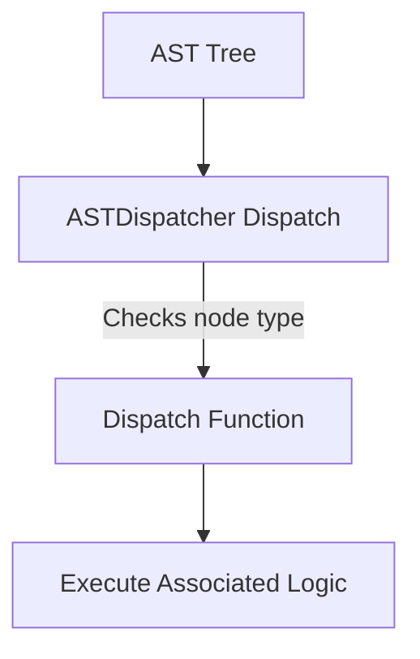
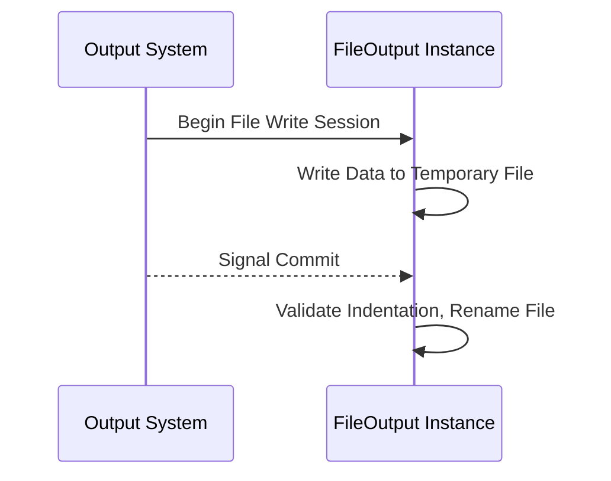
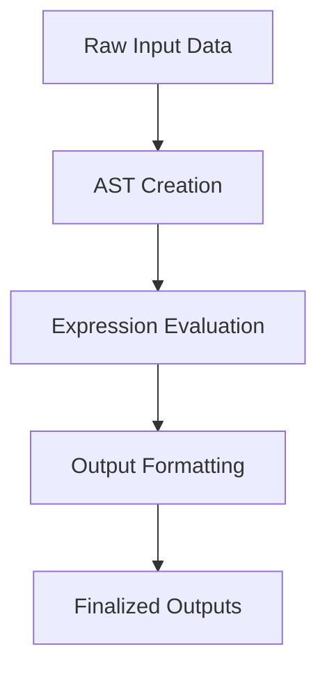

# Data Management and Flow

This document details the `Data Management and Flow` (DML) subsystem, focusing on its architecture, data flow, main components, and processing workflows. The content of this documentation is directly informed by the `ast.py`, `expr.py`, and `output.py` source files.

---

## Introduction

The **DML** subsystem is a core component of a data processing framework, enabling structured management of data manipulation and code generation. Its primary responsibilities include:

- Parsing and representing abstract syntax trees (AST) for DML operations.
- Managing code expression workflows for data processing and transformations.
- Facilitating data outputs via customizable interfaces.

This document provides insights into how the DML subsystem handles data, leverages its components, and integrates them into the larger processing pipeline.

---

## Core Components

### Abstract Syntax Trees (AST)

The `AST` class and its associated utilities enable the representation of DML constructs in tree form for structured parsing. 

#### Key Features
- **Modularity:** Each AST node (`astkinds`) represents specific programming constructs such as loops, assignments, or expressions.  
- **Dispatch Mechanism:** Functions within an `astdispatcher` allow conditional execution based on the node type.

#### Example: AST Node Creation
```python
def astclass(name):
    kind = name.rstrip('_')
    def create(site, *args):
        return AST(kind, site, *args)
    create.__name__ = name
    return create
```  
**Source:** [py/dml/ast.py:132-137]()

#### AST Dispatch Mechanism Flow
Mermaid visualization of how dispatches process AST nodes:



---

### Expressions

The expressions subsystem translates DML constructs into code blocks or C-style expressions. Core classes include:
- `Expression`: A foundational class for defining expressions.
- Special expression types like `Lit` (literals) and `NonValue` (subexpressions not considered standalone values).

#### Key Features
- **Flexible Composition**
- **Type Checking and Validation:** Ensures composability and correctness.

#### Example: Literal Expression
```python
class Lit(Expression):
    def __init__(self, site, cexpr, type, safe=False, str=None):
        super().__init__(site)
        self.cexpr = cexpr
        self.type = type
        self.safe = safe
        self.str = cexpr if str is None else str
```
**Source:** [py/dml/expr.py:189-207]()

#### Expression Priority Table
| **Operator**             | **Priority** | **Adjusted Priority** |
|--------------------------|--------------|------------------------|
| Function call (`f(...)`) | 160          | 160                   |
| Multiplication (`* / %`) | 130          | 130                   |
| Addition (`+ -`)         | 120          | 110                   |
| Logical `AND` (`&&`)     | 50           | 40                    |

**Source:** [py/dml/expr.py:83-100]()

---

### Output Management

The `Output` class ensures robust handling of data outputs, enabling formatting and file management during data processing.

#### Key Implementations:
- **FileOutput:** Outputs data to structured files.
- **StrOutput:** Collects output in an internal buffer for in-memory use.

#### Example: FileOutput Commit
```python
def commit(self):
    if self.indent:
        raise ICE(SimpleSite(f"{self.filename}:0"), 'Unbalanced indent')
    try:
        os.remove(self.filename)
    except OSError:
        pass
    os.rename(self.filename+'.tmp', self.filename)
```
**Source:** [py/dml/output.py:118-126]()

#### File Output Workflow


---

## Processing Workflow and Data Flow

This subsystem orchestrates data through the lifecycle stages outlined below:

1. **AST Creation**
   - AST nodes interpret raw input and represent logical constructs.
2. **Expression Evaluation**
   - AST expressions convert to logical code or C expressions.
3. **Output Formatting**
   - Generated expressions/outputs are written to buffers or file systems.

#### Complete Data Flow Diagram


---

## Key Functions and Purpose Overview

| **Component**     | **Core Classes/Functions**                                      | **Purpose**                                                                          |
|--------------------|----------------------------------------------------------------|--------------------------------------------------------------------------------------|
| **AST**           | `AST`, `astdispatcher`, `get`                                  | Represent and categorize syntactical elements in tree form.                          |
| **Expressions**   | `Expression`, `Lit`, `Apply`, `typecheck_inarg_inits`          | Define and manage expressions; ensure correct types and code generation.             |
| **Output**        | `Output`, `FileOutput`, `StrOutput`, `quote_filename`, `out`   | Manage data output channels for files and strings while maintaining structured data.  |

---

## Example Code Overview

Combining components:

```python
# Example illustrating AST creation and dispatch
node = AST('apply', site, 'arg1', 'arg2')
dispatcher = astdispatcher('dispatch_')

@dispatcher
def dispatch_apply(node, *args):
    # Processing logic for 'apply' node
    return node
dispatcher.dispatch(node)
```
**Source:** [py/dml/ast.py:170-171]()

---

## Conclusion

The DML subsystem exhibits a well-architected flow where raw input data transitions through AST processing, expression handling, and output generation. With robust error handling, type checking, and modular design, it provides a scalable solution for data-driven applications. Future documentation can expand integrations with other systems.