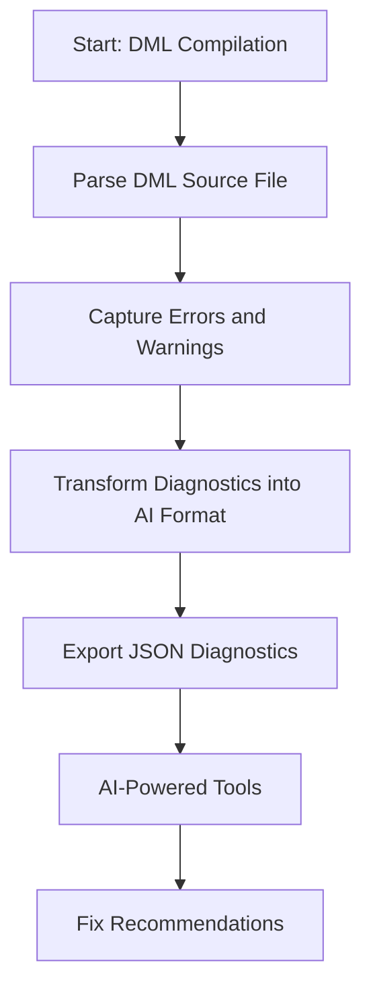
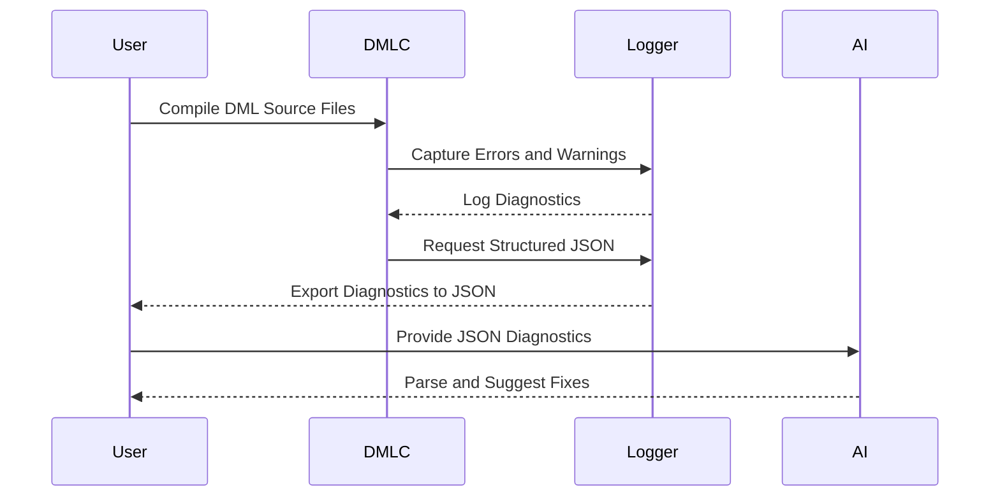

# Model Integration

## Introduction

The **Model Integration** framework within the DML Compiler (DMLC) provides a structured mechanism to utilize artificial intelligence (AI) for diagnostics. The system is designed to enhance the error and warning reporting capabilities of the compiler while enabling AI models to generate actionable recommendations and automated code fixes.

By exporting diagnostics in machine-readable JSON format, **AI-Friendly Diagnostics** help developers and AI automation systems interpret and address issues in an intuitive way. This document provides a comprehensive breakdown of the architecture, components, and workflows surrounding the integration of AI into DMLC diagnostics.

## Core Objectives

- **AI-Assisted Debugging:** Use AI to interpret compiler errors and suggest fixes based on structured diagnostics.
- **Enhanced Context Delivery:** Augment error reporting with detailed suggestions, categorized issues, and relevant documentation links.
- **AI-Friendly Format:** Structure diagnostics in JSON, optimized for machine consumption and integration with automated tools.

---

## Architecture Overview

### High-Level Workflow

The workflow for the Model Integration of AI diagnostics can be described as follows:

1. **Source Compilation**: The DMLC processes the provided `.dml` source files and generates diagnostics during compilation.
2. **Logging and AI Diagnostics**: Errors and warnings are captured and transformed into structured data by the **AI diagnostics module**.
3. **JSON Export**: All diagnostic information is exported as a single JSON file for consumption by AI-powered systems or tools.
4. **Fix Recommendation (Optional)**: External AI tools consume the diagnostics to recommend and implement code fixes.

---

### Mermaid Diagram: Architecture and Data Flow



---

## Detailed Components

### AI Diagnostics Module

#### Class: `AIDiagnostic`

**Purpose**:  
Represents a single structured diagnostic message, categorizing errors and warnings to ensure that AI systems can analyze them effectively.

**Key Attributes**:
- **type**: Indicates error severity (e.g., `error`, `warning`).
- **category**: Categorizes the issue for fix strategy (e.g., `syntax`, `type_mismatch`).
- **fix_suggestions**: Suggests actionable fixes based on diagnostic type.
- **location**: Specifies the file and line number for the issue.
- **related_locations**: Links to related code locations critical for context.

**Source Reference**: [py/dml/ai_diagnostics.py:41-283]()

#### Class: `AIFriendlyLogger`

**Purpose**:  
Collects diagnostic messages throughout the compilation process and exports them as structured JSON data.

**Key Capabilities**:
- Maintains a log of diagnostic messages.
- Categorizes errors and warnings by analyzing log messages.
- Provides summary statistics on errors and warnings.
- Outputs diagnostics in JSON format for AI consumption.

**Source Reference**: [py/dml/ai_diagnostics.py:286-364]()

---

### Diagnostic Categorization

The system maps diagnostic tags to predefined categories to identify fix strategies quickly:

| **Category**         | **Description**                                                                                      | **Example Tag**          |
|-----------------------|------------------------------------------------------------------------------------------------------|--------------------------|
| `syntax`             | Syntax-related errors in DML code.                                                                  | `ESYNTAX`               |
| `type_mismatch`      | Issues due to type incompatibilities or casting errors.                                              | `ECAST`, `EINT`         |
| `template_resolution`| Errors related to template declarations and inheritance.                                             | `EAMBINH`               |
| `undefined_symbol`   | Reference to an undefined symbol.                                                                    | `EUNDEF`, `ENOSYM`      |
| `duplicate_definition`| Multiple or conflicting symbol definitions.                                                        | `EDUP`, `ENAMECOLL`     |
| `import_error`       | Issues with module imports or cyclic dependencies.                                                  | `IMPORT`, `ECYCLICIMP`  |
| `semantic`           | Generic semantic errors.                                                                            | Unidentified tags       |
| `compatibility`      | Errors due to incompatible DML versions.                                                            | `EDML12`                |
| `deprecation`        | Use of deprecated or experimental features.                                                         | `WDEPRECATED`           |
| `other`              | Miscellaneous issues.                                                                               | N/A                     |

**Source Reference**: [py/dml/ai_diagnostics.py:27-38]()

---

### Fix Suggestion Generator

The `AIDiagnostic._generate_fix_suggestions` method produces error-specific fixes to support rapid debugging.

| **Category**         | **Examples of Fix Suggestions**                                                                                              |
|-----------------------|-----------------------------------------------------------------------------------------------------------------------------|
| `syntax`            | Check for missing semicolons or brackets.                                                                                     |
| `type_mismatch`     | Verify operand types or use explicit casting.                                                                                 |
| `undefined_symbol`  | Verify symbol spelling or include necessary imports.                                                                          |
| `duplicate_definition`| Rename conflicting definitions or remove duplicates.                                                                         |
| `template_resolution`| Add `is` statements to clarify template inheritance order.                                                                   |

**Source Reference**: [py/dml/ai_diagnostics.py:138-209]()

---

## Workflows

### Compilation and AI Diagnostics Workflow



---

### JSON Output Structure

The `AIFriendlyLogger` exports diagnostics in the following JSON structure:

```json
{
  "format_version": "1.0",
  "generator": "dmlc-ai-diagnostics",
  "compilation_summary": {
    "input_file": "source.dml",
    "dml_version": "1.4",
    "total_diagnostics": 5,
    "total_errors": 3,
    "total_warnings": 2,
    "error_categories": {
      "type_mismatch": 1,
      "undefined_symbol": 1
    },
    "success": false
  },
  "diagnostics": [
    {
      "type": "error",
      "severity": "error",
      "code": "EUNDEF",
      "message": "undefined symbol 'x'",
      "category": "undefined_symbol",
      "location": {
        "file": "file.dml",
        "line": 12
      },
      "fix_suggestions": ["Verify symbol name", "Add import statement"],
      "documentation_url": "https://intel.github.io/device-modeling-language/language.html"
    }
  ]
}
```

**Source Reference**: [AI_DIAGNOSTICS_README.md:24-61]()

---

## Summary

- **Modular Design**: The integration leverages the modular and extensible `AIDiagnostic` and `AIFriendlyLogger` for structured diagnostics.
- **AI-Friendly Output**: The JSON format is specifically optimized for consumption by AI-powered tools to suggest fixes or automate corrections.
- **Rich Information**: Includes detailed metadata, error categorization, actionable suggestions, and documentation links.
- **Ease of Use**: Minimal modification to existing workflows with the addition of the `--ai-json` flag.

The **AI-Friendly Diagnostics** module makes debugging and improving DML projects efficient and accessible, particularly when integrated with AI tooling.