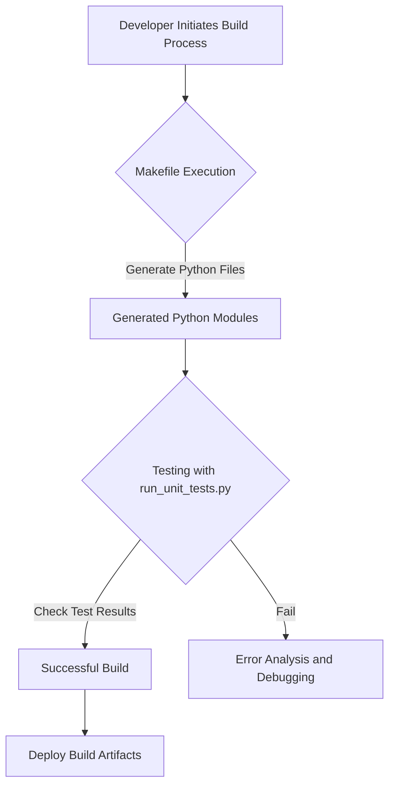
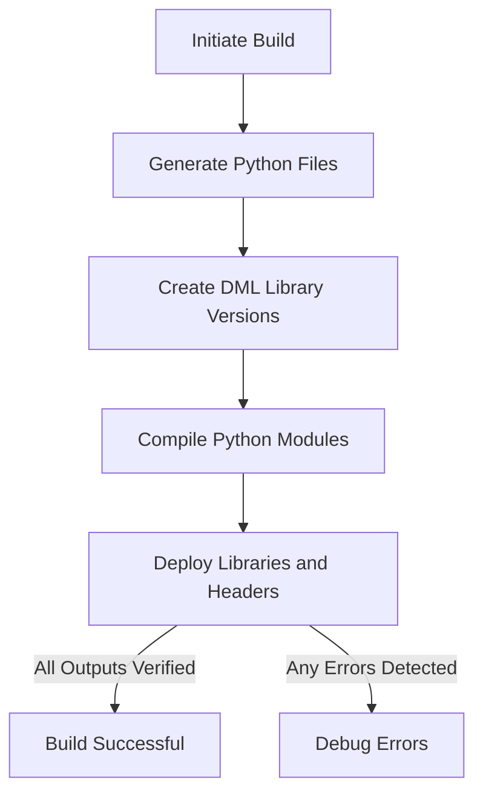
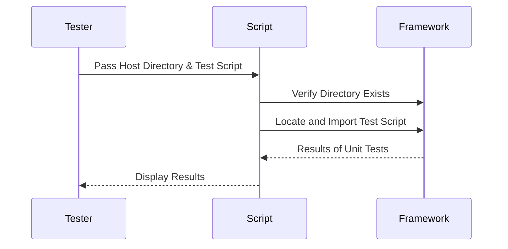

# Deployment and Infrastructure Documentation

## Introduction
The **Deployment and Infrastructure** documentation provides a comprehensive guide for deploying and managing the AI Diagnostics Framework. This framework processes and analyzes hardware diagnostic data while integrating seamlessly with your existing simulation environment. It is designed to handle complex workflows utilizing Python scripts, Makefile-based build systems, and an extensive modular architecture for development and operation.

This documentation is structured to cover the architecture, build process, testing framework, and other implementation details extracted directly from the provided source files.

---

## Table of Contents
1. [Architecture Overview](#architecture-overview)
    - [Mermaid Flowchart: Deployment Workflow](#mermaid-flowchart-deployment-workflow)
2. [Key Components](#key-components)
    - [Python Modules](#python-modules)
    - [Build Directories and Automation](#build-directories-and-automation)
3. [Build System and Workflow](#build-system-and-workflow)
    - [Steps for Building](#steps-for-building)
    - [Mermaid Diagram: Build Process](#mermaid-diagram-build-process)
4. [Testing Framework](#testing-framework)
    - [Running Unit Tests](#running-unit-tests)
    - [Mermaid Sequence Diagram: Test Execution](#mermaid-sequence-diagram-test-execution)
5. [Reference Tables](#reference-tables)
6. [Conclusion](#conclusion)

---

## Architecture Overview

The AI Diagnostics Framework builds upon a modular infrastructure managed via Makefiles and compartmentalized Python scripts. The fundamental architecture is designed to:
- Process input via multiple Python modules (e.g., `dml`, `codegen`, `logging`, etc.).
- Automate building and testing operations comprehensively through Makefile rules.
- Enable deployment and integration into simulation-based workflows.

### Mermaid Flowchart: Deployment Workflow



---

## Key Components

### Python Modules
The AI Diagnostics Framework's functionality is modularized into several Python files located in the `dml/` directory. These modules are responsible for core operations such as data parsing, AST transformations, backend processing, logging, and compatibility handling.

| **Module**             | **Description**                                             |
|-------------------------|-------------------------------------------------------------|
| `__init__.py`          | Initializes the Python package.                             |
| `ast.py`               | Handles abstract syntax tree (AST) generation.              |
| `logging.py`           | Implements logging mechanisms for debugging purposes.       |
| `dmlc.py`              | Main execution script for the DML compiler.                |
| `codegen.py`           | Processes code generation templates.                       |

Sources: [Makefile:11-47]()

---

### Build Directories and Automation

The framework uses the following directories to organize and execute operations:
- **Output Directories**: Build artifacts are generated and sorted in `bin/dml-old-4.8` and `bin/dml`.
- **Python Libraries**: Python modules are moved to `LIBDIR` for execution and testing.
- **Intermediate Files**: Files like parser generators (`parsetab.py`, `parser.out`) are stored temporarily during the build process.

The **Makefile** automates the following:
- Compilation of Python files for the framework's modules.
- Generation of parser tables (`dml12_parsetab.py`, `dml14_parsetab.py`).
- Deployment of critical build outputs into their final destinations.

Sources: [Makefile:8-95]()

---

## Build System and Workflow

The **Makefile** is central to compiling, linking, testing, and deploying the framework. It constructs build outputs, manages dependencies, and performs cleanup tasks when necessary.

### Steps for Building
1. Generate all required Python files within `dml/`.
2. Create specific versions of the DML library (`1.2`, `1.4`) in designated directories.
3. Compile `.py` files into bytecode for the framework.
4. Deploy prebuilt libraries and dependent files.

### Mermaid Diagram: Build Process



Sources: [Makefile:91-95]()

---

## Testing Framework

The framework includes a robust testing suite executed via the `run_unit_tests.py` script. It ensures that functionalities of all the built components are validated in a structured and reliable manner.

### Running Unit Tests
1. Add Python files and modules to the execution path dynamically.
2. Validate whether test scripts are present and conform to expected extensions (`.py`).
3. Run test cases through Python’s `unittest` module.

```python
if __name__ == '__main__':
    (hostdir, testscript) = sys.argv[1:]
    path = os.path.join(hostdir, "bin", "dml", "python")
    sys.path.append(path)
    sys.path.append(os.path.dirname(testscript))
    unittest.main(module=base, argv=[""])
```

Sources: [run_unit_tests.py:7-19]()

### Mermaid Sequence Diagram: Test Execution



Sources: [run_unit_tests.py:7-19]()

---

## Reference Tables

### Build Directories

| **Directory**             | **Purpose**                                 |
|---------------------------|---------------------------------------------|
| `bin/dml-old-4.8`         | Stores backward-compatible libraries.       |
| `bin/dml`                 | Contains up-to-date compiled libraries.     |
| `LIBDIR`                  | Houses generated Python files for testing. |

Sources: [Makefile:8-95]()

### Libraries and Versions

| **Version** | **Output Directory**        |
|-------------|-----------------------------|
| 1.2         | `bin/dml/1.2`              |
| 1.4         | `bin/dml/1.4`              |

Sources: [Makefile:192-219]()

---

## Conclusion

The **Deployment and Infrastructure** of the AI Diagnostics Framework leverages a modular and automated workflow for building and testing its components. Core features include:
- Proper organization of source files and generated outputs.
- Comprehensive automation using `Makefile` rules.
- A dedicated testing framework built for scalability.

This documentation ensures clarity in setting up and integrating the framework for diagnostics and analysis in hardware simulation systems.

---