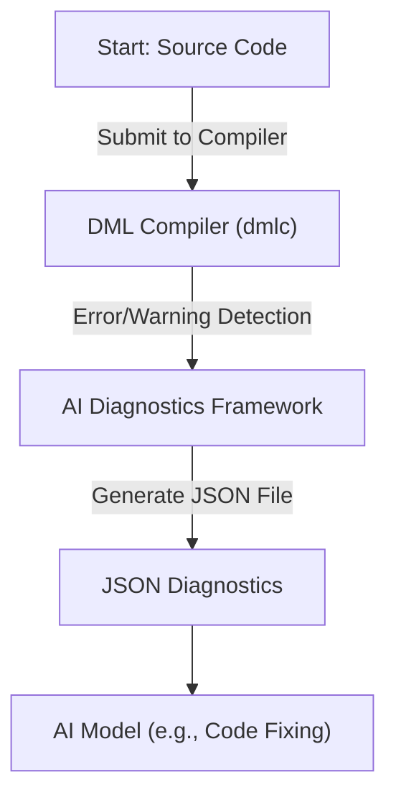
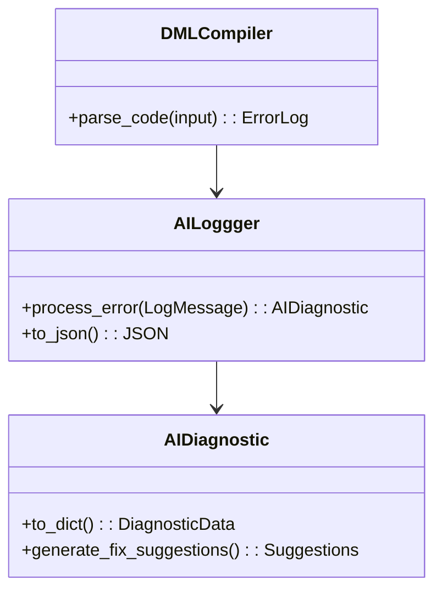
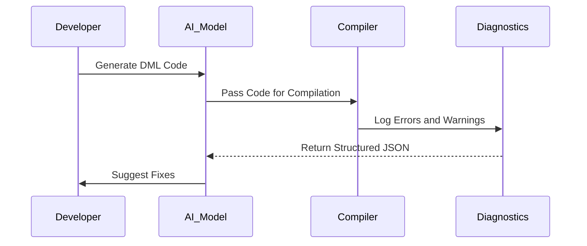

# AI Diagnostics Framework: Core Features

## Introduction
The AI Diagnostics Framework integrates with the Device Modeling Language Compiler (DMLC) to provide structured, actionable, and AI-friendly error diagnostics. Designed to empower developers and AI tools to analyze, categorize, and fix compilation errors, the framework outputs diagnostics in JSON format, making error handling straightforward and systematic. By leveraging the framework, users can combine AI-generated code with automatic feedback and iterative improvements until successful compilation.

This documentation provides an in-depth overview of the framework's purpose, system architecture, usage, and functional highlights.

---

## Detailed Sections

### Overview of Features
- Structured JSON-based diagnostic output.
- Comprehensive error categorization for efficient resolution.
- Actionable fix suggestions for each diagnostic output.
- Integration with AI-assisted workflows to automate error handling.
- Zero overhead when diagnostics are not needed.
- Fully compatible with all existing 199 types of DMLC errors.

### How It Works

#### Basic Workflow
The AI Diagnostics Framework processes errors and warnings emitted by the DMLC. Key data, including error codes, messages, locations, and suggestions, are exported in a machine-readable JSON format. This enables tools and models to:
1. Analyze code behavior.
2. Suggest targeted fixes.
3. Iterate through additional compilations.

---

## Architecture and Data Flow

### System Flow Diagram


### Component Interactions


---

## Key Features and Parameters

### Diagnostic JSON Schema
The JSON output contains the following fields:

| Field                | Type         | Description                                                                 |
|----------------------|--------------|-----------------------------------------------------------------------------|
| `format_version`     | `string`     | JSON schema version.                                                       |
| `compilation_summary`| `object`     | Summary of compilation (errors, warnings, success flag).                    |
| `diagnostics`        | `array`      | Detailed error and warning entries.                                        |

#### Example Diagnostic Entry
| Key                  | Type         | Description                                                                 |
|----------------------|--------------|-----------------------------------------------------------------------------|
| `type`               | `string`     | Type of diagnostic: "error", "warning", or "info".                          |
| `severity`           | `string`     | Severity level: "error", "fatal", or "warning".                             |
| `code`               | `string`     | Unique error code.                                                          |
| `message`            | `string`     | Human-readable message explaining the issue.                                |
| `category`           | `string`     | High-level category suitable for AI processing.                             |
| `location`           | `object`     | Where the error occurred, including `file`, `line`.                         |
| `fix_suggestions`    | `array`      | AI-friendly suggestions for resolving the error.                            |

---

### Example Outputs and Usage

#### Command-Line Example
1. Compile a DML file with diagnostics enabled:
   ```bash
   dmlc --ai-json errors.json my_device.dml
   ```
2. Inspect the resulting `errors.json`:
   ```bash
   cat errors.json | jq
   ```

#### Sample JSON Output
```json
{
  "format_version": "1.0",
  "compilation_summary": {
    "input_file": "my_device.dml",
    "total_errors": 2,
    "total_warnings": 1,
    "success": false
  },
  "diagnostics": [
    {
      "type": "error",
      "code": "EUNDEF",
      "message": "undefined symbol 'foo'",
      "category": "undefined_symbol",
      "location": {"file": "my_device.dml", "line": 42},
      "fix_suggestions": [
        "Check if the symbol is defined in imported files",
        "Verify the symbol name spelling"
      ]
    }
  ]
}
```

---

### Fix Strategy Categorization

#### Error Categories
The framework assigns a `category` field to errors, which provides an AI-friendly label to facilitate automated handling. Here are the key categories:

| Category                | Description                                                   | Suggested Fix Strategy                                    |
|-------------------------|---------------------------------------------------------------|----------------------------------------------------------|
| `syntax`                | Syntax errors in DML code                                     | Validate brackets, semicolons; verify DML version syntax.|
| `undefined_symbol`      | Missing or misspelled symbols                                 | Check imports or rename undefined variable.              |
| `type_mismatch`         | Data type conversion or alignment issues                      | Add explicit type casting or conversions.                |
| `template_resolution`   | Errors related to template inheritance                       | Verify method templates and their precedence.            |
| `import_error`          | Missing or cyclic imports                                     | Add imports or refactor modules.                         |

---

## Python Integration

The framework is compatible with Python, enabling AI models to leverage the diagnostics directly.

#### Example Python Workflow
```python
import subprocess
import json

# Generate, compile, and fix code iteratively
generated_code = your_ai_model.generate(spec)
with open('device.dml', 'w') as f:
    f.write(generated_code)

subprocess.run(['dmlc', '--ai-json', 'errors.json', 'device.dml'])

with open('errors.json') as f:
    diagnostics = json.load(f)

if diagnostics['compilation_summary']['total_errors'] > 0:
    errors = diagnostics['diagnostics']
    fixed_code = your_ai_model.fix_errors(code=generated_code, errors=errors)

    with open('device_fixed.dml', 'w') as f:
        f.write(fixed_code)
```

---

## Sample Workflow Diagram


---

## Conclusion

The AI Diagnostics Framework provides comprehensive, structured diagnostic information to streamline debugging and assist in code fixing. By utilizing a JSON-based schema and integrating AI-driven suggestions, developers can identify and resolve issues faster.

Key advantages include:
- AI-ready structured formats.
- Actionable fix recommendations.
- Compatibility with all DML versions and error types.
- Seamless integration with AI pipelines.

This framework is ideal for developers looking to enhance their workflow efficiency and reduce time spent on repetitive debugging tasks. For more details, refer to the [Intel Device Modeling Language Documentation](https://intel.github.io/device-modeling-language/).