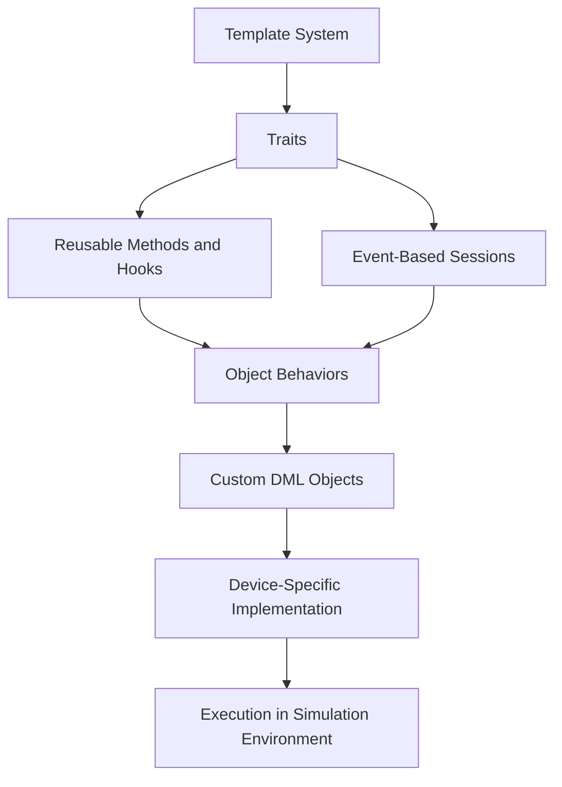
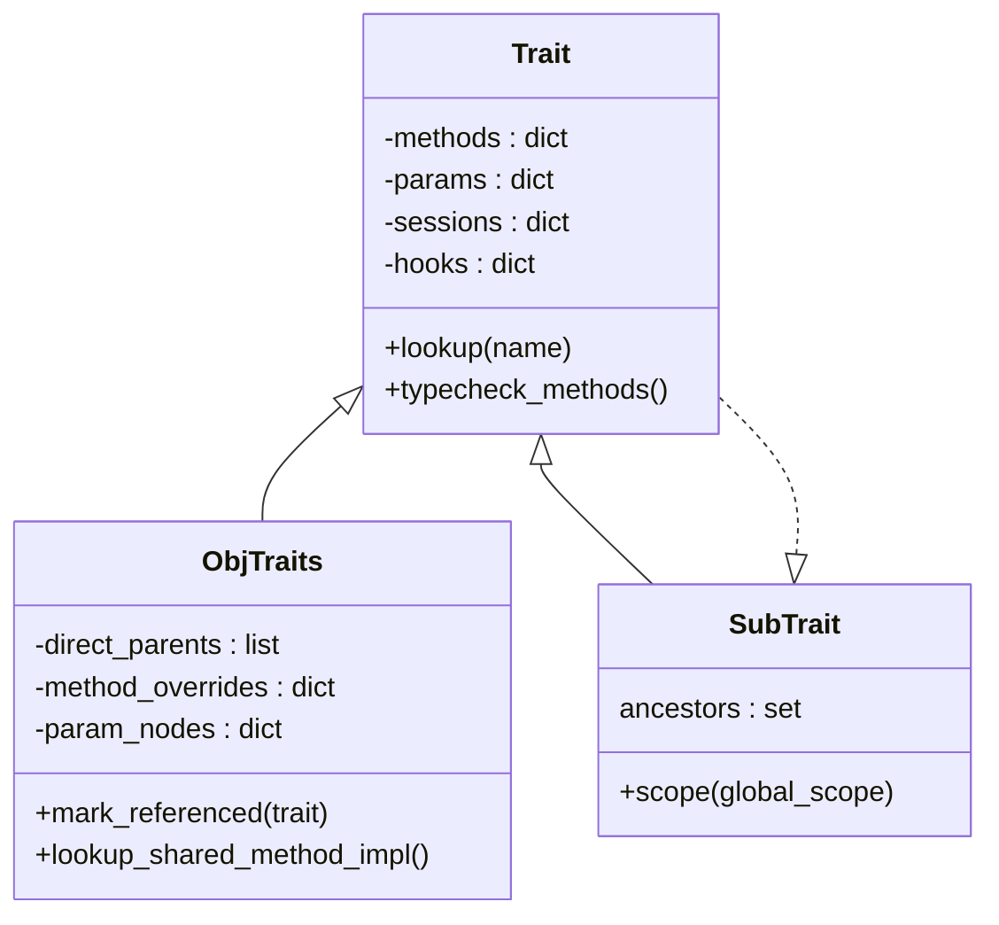
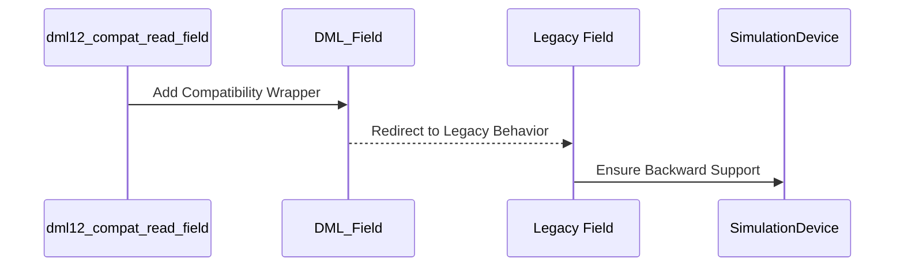

# Extensibility and Customization

This documentation provides comprehensive guidelines for utilizing **extensibility and customization features** within the DML (Device Modeling Language) framework. It outlines the architecture, data flow, component relationships, and process workflows, enabling developers to modify and extend the framework to meet their specific requirements.

---

## Introduction

The **extensibility and customization mechanism** in DML allows developers to create configurable solutions that interact with complex simulation environments. By using a combination of **traits**, **templates**, and defined workflows, developers can introduce new behaviors, override methods, and tailor DML constructs for specific use cases.

Extensibility ensures that a single framework can support diverse feature sets across versions (e.g., DML 1.2 and DML 1.4), while maintaining a high degree of backward compatibility. Customization provides the flexibility to define object behaviors, methods, and interactions in a modular fashion.

---

## Key Components of Extensibility in DML

### Traits

Traits define reusable methods, parameters, and hooks shared across multiple DML objects. They serve as the foundation for extensibility:

- **Methods**: Define specific object behaviors.
- **Parameters**: Encapsulate object configurations.
- **Sessions and Hooks**: Enable fine-tuned event handling and modular behavior assignment.

A trait is typically created using the `mktrait` method, as demonstrated in the `py/dml/traits.py` file.

### Templates

Templates serve as reusable building blocks. They group attributes, parameters, or methods into logical units for inheritance and customization across DML components. For instance, the `bool_attr` template in `lib/1.2/dml12-compatibility.dml` standardizes the interface for boolean attributes.

### Compatibility Templates for Multiversion Support

- `dml12_compat_io_memory_access`: Addresses compatibility for `io_memory_access` between versions 1.2 and 1.4.
- `dml12_compat_read_register` / `dml12_compat_write_register`: Allows field/register access methods in DML 1.2 to comply with 1.4 overrides.

Templates such as these ensure backward compatibility while introducing new functionality.

---

## Architecture and Data Flow

The DML extensibility framework follows a modular hierarchical structure:



- **Templates** define the base structure of traits.
- **Traits** encapsulate behaviors shared across objects.
- **Devices** integrate at runtime with the simulation.

---

## Component Relationships

The following class relationships illustrate the extensibility structure in DML:



---

## Process Workflow for Extending the Framework

### 1. Implementing a Trait

To define behaviors:
1. Define `methods`, `params`, and `hooks` [Sources: `py/dml/traits.py:114-113`](py/dml/traits.py#L114).
2. Use `mktrait` to bind the logical groupings.

_Example:_

```python
def process_trait(site, name, subasts, ancestors, template_symbols):
    methods = {}
    params = {}
    sessions = {}
    hooks = {}
    # Populate methods, params, and hooks here
    return mktrait(site, name, ancestors, methods, params, sessions, hooks, template_symbols)
```

---

### 2. Customizing via Runtime Templates

Templates encapsulate default behaviors and provide logical segregation.

_Example_ - Compatibility template:

```dml
template bool_attr is (attribute, _banned_init_val) {
    param allocate_type = "bool";
    param val = this;
}
```
_Sources: [lib/1.2/dml12-compatibility.dml:21-27](lib/1.2/dml12-compatibility.dml#L21)._

---

### 3. Addressing Compatibility Between Versions

Use dedicated templates, such as:
- **`dml12_compat_read_field`**: Adjusts field read behavior in DML 1.2 for DML 1.4 overrides.
- **`dml12_compat_write_field`**: Adjusts field write behavior similarly.

_Workflow:_


---

## Summary of Key Parameters and Methods

| Component             | Key Functionality                                   | Source                                     |
|-----------------------|----------------------------------------------------|-------------------------------------------|
| `Trait`               | Defines reusable methods and hooks                 | `py/dml/traits.py:690`                    |
| `ObjTraits`           | Manages object-specific trait implementations      | `py/dml/traits.py:629-667`                |
| `dml12_compat` Series | Ensures compatibility across DML versions          | `lib/1.2/dml12-compatibility.dml:10`      |
| `bool_attr`           | Example template for extending attributes          | `lib/1.2/dml12-compatibility.dml:21-27`   |

---

## Code Snippet for Merging Traits

```python
def merge_ancestor_vtables(ancestors, site):
    ancestor_vtables = {}
    for ancestor in ancestors:
        for name in itertools.chain(
            ancestor.vtable_methods, ancestor.vtable_hooks):
            ancestor_vtables[name] = ancestor
    return ancestor_vtables

traits = merge_ancestor_vtables(ancestors_list, site)
```
_Sources: [py/dml/traits.py:273-293](py/dml/traits.py#L273)._

---

## Conclusion

The extensibility and customization features in DML empower developers to:
- Create robust, reusable constructs via traits and templates.
- Bridge gaps between DML versions using compatibility layers.
- Define modular, event-driven workflows for interoperable components.

This modular architecture ensures that simulation frameworks built on DML remain future-proof, flexible, and highly adaptable.