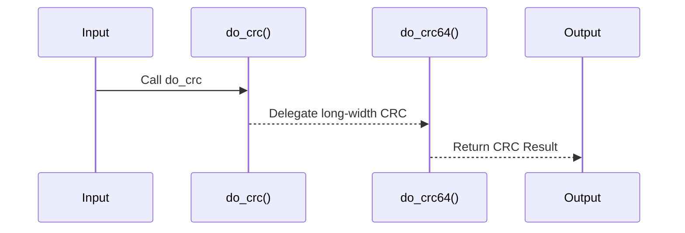
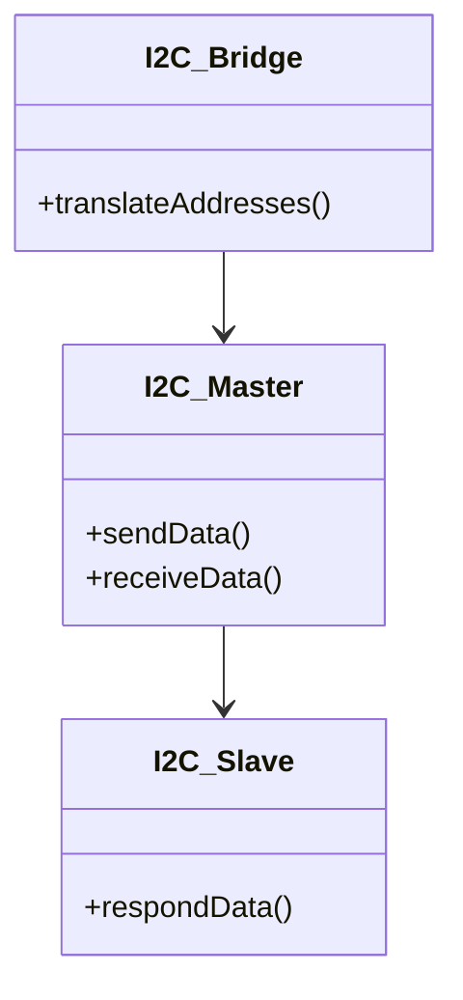

# Modules and Libraries

## Introduction

The **Modules and Libraries** section provides comprehensive documentation for three critical modules used in software development: ARINC-429, CRC, and I2C. These modules serve key roles in supporting communication protocols, error-checking mechanisms, and interface specifications. This page outlines their functionality, design, and interaction with other components, based solely on the provided source files.

## ARINC-429 Module

The **ARINC-429** is a standard data transfer protocol widely utilized in the avionics industry. It facilitates reliable communication between devices using unidirectional data buses. This module provides the necessary constants, methods for data integrity verification, and parity computations. 

### Key Constants

| Name                     | Value               | Description                                                  |
|--------------------------|---------------------|--------------------------------------------------------------|
| `ARINC429_BUS_INTERFACE` | `"arinc429_bus"`    | Defines the ARINC-429 bus interface.                        |
| `ARINC429_RECEIVER_INTERFACE` | `"arinc429_receiver"` | Defines the ARINC-429 receiver interface.                   |
> Sources: [arinc-429.dml:12-13]()

### Methods

#### `parity_32()`
Computes the parity for a 32-bit number. 

```c
method parity_32(uint32 x) -> (uint1 p) {
    x = x ^ (x >> 1);
    x = x ^ (x >> 2);
    x = x ^ (x >> 4);
    x = x ^ (x >> 8);
    x = x ^ (x >> 16);
    p = x & 1;
}
```
> Sources: [arinc-429.dml:16-23]()

#### `calc_arinc429_parity()`
Corrects the parity bit of ARINC-429 words.

```c
method calc_arinc429_parity(uint32 x) -> (uint32 res) {
    local uint1 p;
    inline $parity_32(x) -> (p);
    if (p) res = x;
    else res = x ^ 0x80000000;
}
```
> Sources: [arinc-429.dml:26-31]()

### Architecture and Data-Flow
```mermaid
flowchart TD
    A[ARINC-429 Interface]
    B[Sender Module]
    C[Receiver Module]
    D[calc_arinc429_parity() Method]
    E[parity_32() Method]

    A --> B
    A --> C
    B --> D
    C --> E
    D --> E
```

---

## CRC Module

**Cyclic Redundancy Checks (CRC)** play a crucial role in error-checking. The CRC Module includes methods to compute checksums using customizable parameters, polynomial definitions, and data configurations.

### Key Methods

#### `bit_reverse()`
Reverses the bit order of input data.
```c
method bit_reverse(in_data, bits) -> (out_data) {
    assert bits <= 64;
    out_data = reverse_bits64(in_data) >> (64 - bits);
}
```
> Sources: [crc.dml:15-17]()

#### `do_crc()`
Calculates the CRC for input data using several modifiable options.

```c
method do_crc(uint32 poly, int width, uint32 initial_crc,
              bool reverse_initial_crc,  bool reverse_input,
              bool reverse_output, bool swap_output, bool complement_output,
              bytes_t in_data) -> (uint32 crc) {
    ...
}
```
> Sources: [crc.dml:20-30]()

#### `do_crc64()`
Provides support for CRC computation with widths up to 64 bits.

```c
method do_crc64(uint64 poly, int width, uint64 initial_crc,
                bool reverse_initial_crc, bool reverse_input,
                bool reverse_output, bool swap_output, bool complement_output,
                bytes_t in_data) -> (uint64 crc) {
    ...
}
```
> Sources: [crc.dml:32-89]()

### Workflow for CRC Calculation


---

## I2C Module

The **Inter-Integrated Circuit (I2C)** module provides utilities for implementing I2C communication infrastructure, including master, slave, link, and deprecated interfaces.

### Key Constants

| Name                        | Value               | Description                              |
|-----------------------------|---------------------|------------------------------------------|
| `I2C_LINK_INTERFACE`        | `"i2c_link"`        | Defines the I2C link interface.         |
| `I2C_SLAVE_INTERFACE`       | `"i2c_slave"`       | Defines the I2C slave interface.        |
| `I2C_MASTER_INTERFACE`      | `"i2c_master"`      | Defines the I2C master interface.       |
| `I2C_BRIDGE_INTERFACE`      | `"i2c_bridge"`      | Defines the I2C bridge interface.       |
| `I2C_BUS_INTERFACE (DEPRECATED)` | `"i2c_bus"`   | Deprecated I2C bus interface.          |
| `I2C_DEVICE_INTERFACE`      | `"i2c_device"`      | Defines the generic I2C device.         |
> Sources: [i2c.dml:13-22]()

### I2C Architecture


---

## Comparative Summary

| Module      | Features                            | Functions of Interest         | Use Cases                      |
|-------------|-------------------------------------|--------------------------------|--------------------------------|
| ARINC-429   | Parity computation                  | `calc_arinc429_parity()`      | Avionics data transfer         |
| CRC         | Checksum for validation             | `do_crc()`, `do_crc64()`      | Data integrity, networking     |
| I2C         | Master/slave communication          | Interfaces: `i2c_link`, etc.  | Embedded systems communication|
---

## Conclusion

This document detailed the functionality and design of three critical modules: ARINC-429 for avionics data buses, CRC for data integrity, and I2C for inter-device communication. Each module equips developers with constants, methods, and predefined interfaces to enhance their implementations efficiently.