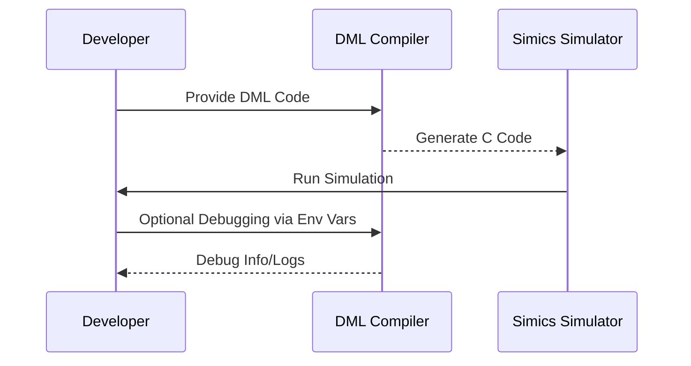

# Device Modeling Language (DML)

## Introduction

The **Device Modeling Language (DML)** is a specialized domain-specific language designed to facilitate the creation of fast, functional, or transaction-level device models for virtual platforms. By utilizing high-level abstractions, DML equips developers with tools to model functional device components such as register banks, registers, bit fields, event posting mechanisms, device interaction interfaces, and logging frameworks. 

The DML compiler (DMLC) translates DML code into C code optimized for specific simulators, such as the [Intel® Simics® simulator](https://www.intel.com/content/www/us/en/developer/articles/tool/simics-simulator.html), with the potential for support for additional backends in the future. 

---

## Architecture Overview

DML employs a modular architecture where the language's constructs are compiled by the DMLC. These constructs define the virtual behavior of devices, integrating seamlessly into supported simulation environments.

### Features:
- High-level abstractions for device modeling components.
- Integration with the Intel Simics simulator.
- Modular framework for future backend plug-ins.
- Custom compiler options for debugging, performance profiling, and error tracing.

Below is an architecture diagram illustrating the flow within the DML ecosystem:

```mermaid
flowchart TD
    DML[Device Modeling Language Source Code] --> DMLC[DML Compiler (DMLC)]
    DMLC -->|Generates| C_Code[C Code Output with APIs]
    C_Code --> Simics[Simics Simulator]
    DMLC -.-> Debug[Debug Tools & Profilers]
```

---

## Building and Testing DMLC

### Prerequisites

To compile and test models using DMLC, you need:
1. Access to the **Simics Simulator**. You can use the [Public Release of Simics](https://software.intel.com/simics-simulator) or access it through commercial channels.
2. A pre-configured Simics project.

### Building DMLC

To build the DML compiler within your Simics project:
1. Clone the DML repository into the `modules/dmlc/` directory inside the Simics project.
2. Run one of the following commands from the project root:
   - **Linux/macOS:** `make dmlc`
   - **Windows:** `bin\make dmlc`

### Testing DMLC

To execute the unit tests provided with the DMLC:
- **Command for Linux/macOS:** `make test-dmlc`
- **Command for Windows:** `bin/test-runner --suite modules/dmlc/test`

These commands ensure that the compiler is working as intended by validating its functionalities with prebuilt tests.

---

## Environment Variables

DMLC provides several environment variables to improve the development workflow, debugging capabilities, and overall flexibility. Below is a summary:

| **Variable**           | **Description**                                                                                                                                                                                  |
|-------------------------|--------------------------------------------------------------------------------------------------------------------------------------------------------------------------------------------------|
| `DMLC_DIR`             | Specifies the directory containing the locally built compiler binaries (`<your-project>/<hosttype>/bin`).                                                                                      |
| `T126_JOBS`            | Allows parallel execution of unit tests. Specify the number of jobs to run concurrently.                                                                                                       |
| `DMLC_PATHSUBST`       | Rewrites error message paths to point to the source files rather than built copies. Useful for debugging issues in the original source.                                                        |
| `PY_SYMLINKS`          | Enables symbolic links to Python files instead of copying them during builds. Facilitates faster edits and traceback debugging.                                                                |
| `DMLC_DEBUG`           | Prints unexpected exceptions to stderr for debugging purposes. Default behavior logs tracebacks to `dmlc-error.log`.                                                                           |
| `DMLC_CC`              | Overrides the default compiler used during unit tests.                                                                                                                                        |
| `DMLC_PROFILE`         | Enables self-profiling and outputs performance data to a `.prof` file.                                                                                                                         |
| `DMLC_DUMP_INPUT_FILES`| Creates an archive of DML source files to reproduce issues in isolation. Archives are compatible with Linux extraction for simplicity.                                                         |
| `DMLC_GATHER_SIZE_STATISTICS`| Outputs code generation statistics in JSON format to optimize generated C code size and compilation speed.                                                                                |

---

## Workflow Overview: Compilation and Debugging

The process workflow of working with DML is as follows:

1. **Development:** Write DML code defining device behavior, registers, interactions, etc.
2. **Compilation:** Use DMLC to compile the DML code into optimized C code for the Simics simulator.
3. **Testing:** Validate the generated C code with the Simics simulator and built-in unit tests.
4. **Debugging:** Use environment variables and debug tools to refine the development process.



---

## Code Snippet: Sample Usage

Below is an example of a possible workflow for setting up a test environment:

```bash
# Clone the DML repository into the required Simics project directory
git clone https://url-to-dml-repo.git modules/dmlc

# Build the DMLC using the Makefile
make dmlc

# Run the unit tests to ensure the compiler is functioning
make test-dmlc

# Optionally set debugging environment variables
export DMLC_DEBUG=1
export DMLC_PATHSUBST=linux64/bin/dml=modules/dmlc/lib
```

Sources for this information: [README.md:36-116]()

---

## Conclusion

The **Device Modeling Language (DML)** and its accompanying compiler (DMLC) serve as essential tools for developers working with virtual platforms. Its high-level abstractions, Simics integration, and robust debugging capabilities streamline the process of creating fast and functional virtual device models. By leveraging the provided tools, developers can model, compile, and validate virtual devices efficiently, ensuring robust functionality and seamless integration with the target simulation environments.

For more details and updates, refer to the [Intel Simics simulator documentation](https://www.intel.com/content/www/us/en/developer/articles/tool/simics-simulator.html).