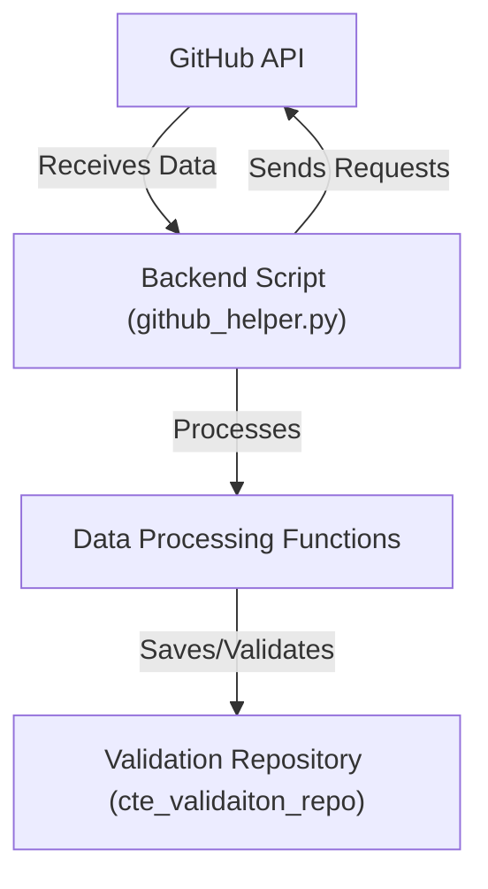
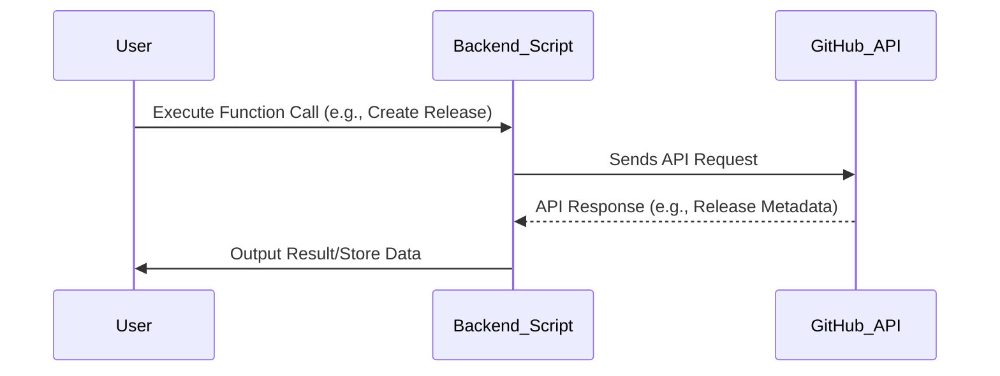

# Backend Systems

## Introduction

The **Backend Systems** documentation provides a comprehensive explanation of the internal workings, architecture, components, and workflows found in backend implementations. Based on the provided source files `scripts/github_helper.py` and `cte_validaiton_repo`, this documentation offers insights into GitHub integrations, automation scripts, and collaboration processes.  

This guide is designed to assist developers, DevOps engineers, and other stakeholders in understanding and using the backend components effectively. The goal is to enable seamless interaction with the system, customization, and troubleshooting.

---

## Overview of Components

### Primary Files
- `scripts/github_helper.py`: Contains core functionality for interacting with GitHub repositories, managing pull requests, releases, and assets.  
  Sources: [scripts/github_helper.py:13-462]()
  
- `cte_validaiton_repo/`: Represents a placeholder repository for validation workflows. Minimal data was provided from this source.  
  Sources: [cte_validaiton_repo/:2]()

---

## System Architecture

Below is the architectural flow visualizing the interaction between backend components, GitHub APIs, and other relevant processes.

### Architecture Flowchart



---

## Interactions and Workflows

### GitHub API Interaction Workflow

The `github_helper.py` script contains several functions that demonstrate how backend systems interact with GitHub's API. These functions include fetching data (e.g., pull requests, labels, commits), posting comments, and managing releases.

#### Workflow


---

## Breakdown of Major Functionalities

### Key Functions

#### 1. **Fetching GitHub PR Labels**
Retrieves a list of labels associated with a pull request.  

- **Method Name:** `get_labels()`  
- **Input Parameters:**  
  | Parameter  | Type     | Description                      |  
  |------------|----------|----------------------------------|  
  | `token`    | `str`    | GitHub API token (optional).     |  
  | `pr_number`| `str`    | Pull request number.             |  
- **Code Implementation:**  
  Sources: [scripts/github_helper.py:33-50]()  

```python
def get_labels(token: Optional[str] = None, pr_number: Optional[str] = None) -> list[str]:
    token = get_github_token(token)
    pr_number = get_pr_number(pr_number)
    headers = {
        "Accept": "application/vnd.github+json",
        "Authorization": f"Bearer {token}"
    }
    url = f"{REPO_API_URL}/issues/{pr_number}/labels"
    response = requests.get(url, headers=headers, proxies=PROXIES)
    response.raise_for_status()
    labels = response.json()
    return [label['name'] for label in labels]
```

---

#### 2. **Creating a GitHub Release**
Automates the process of creating a release in a GitHub repository.  

- **Method Name:** `create_github_release()`  
- **Input Parameters:**  
  | Parameter       | Type     | Description                            |  
  |-----------------|----------|----------------------------------------|  
  | `version`       | `str`    | Version name of the release.           |  
  | `release_notes` | `str`    | Description of release changes.        |  
  | `token`         | `str`    | GitHub API token (optional).           |

- **Code Implementation:**  
  Sources: [scripts/github_helper.py:105-128]()  

```python
def create_github_release(version: str, release_notes: str, token: Optional[str] = None) -> Any | None:
    token = get_github_token(token)
    url = f"{REPO_API_URL}/releases"
    headers = {
        "Authorization": f"token {token}",
        "Accept": "application/vnd.github.v3+json"
    }
    payload = {
        "tag_name": version,
        "name": version,
        "body": release_notes,
        "draft": False,
        "prerelease": False
    }
    response = requests.post(url, json=payload, headers=headers, proxies=PROXIES)
    ...
```

---

### Additional Functionality Highlights

- **Fetching GitHub Tags:** `get_tags_names()`  
  Sources: [scripts/github_helper.py:70-80]()  

- **Compare Git Branches for Changes:** `get_modified_files_from_temp_repo()`  
  Sources: [scripts/github_helper.py:155-187]()  

---

## Data Flow Analysis

### Data Models and Parameters

| Function                       | Input Parameters                   | Output                  | Function Description                                                |  
|--------------------------------|------------------------------------|-------------------------|----------------------------------------------------------------------|  
| `get_labels`                   | `token`, `pr_number`              | `list[str] (labels)`    | Retrieves labels for a GitHub pull request.                         |  
| `create_github_release`        | `version`, `release_notes`, `token`| `Any (release URL)`     | Automates creation of GitHub releases.                              |  
| `fetch_branches` (helper)      | `repo_dir`, `branches`            | `None`                  | Fetches specific branches for comparison.                           |

---

## Challenges and Considerations

1. **GitHub Rate Limits:** The `send_review()` function in particular accounts for GitHub rate-limiting errors by falling back to posting general comments.  
   Sources: [scripts/github_helper.py:395-404]()  

2. **Error Handling:** Functions such as `upload_asset_to_release()` ensure status codes are validated before progressing.  
   Sources: [scripts/github_helper.py:141-144]()  

---

## Conclusion

The **Backend Systems** documentation has outlined the key components and capabilities of the system as derived from the source files `github_helper.py` and `cte_validaiton_repo`. These components play a critical role in automating development workflows, integrating with GitHub APIs, and optimizing repository management.  

Future scaling opportunities include enhancing validation mechanisms and integrating logging for traceability. This foundation ensures reliable backend operations and effective development collaboration.