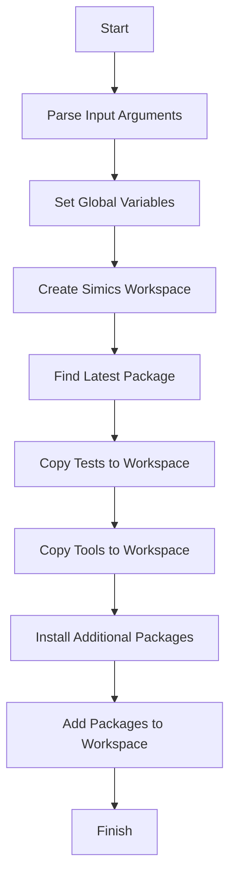
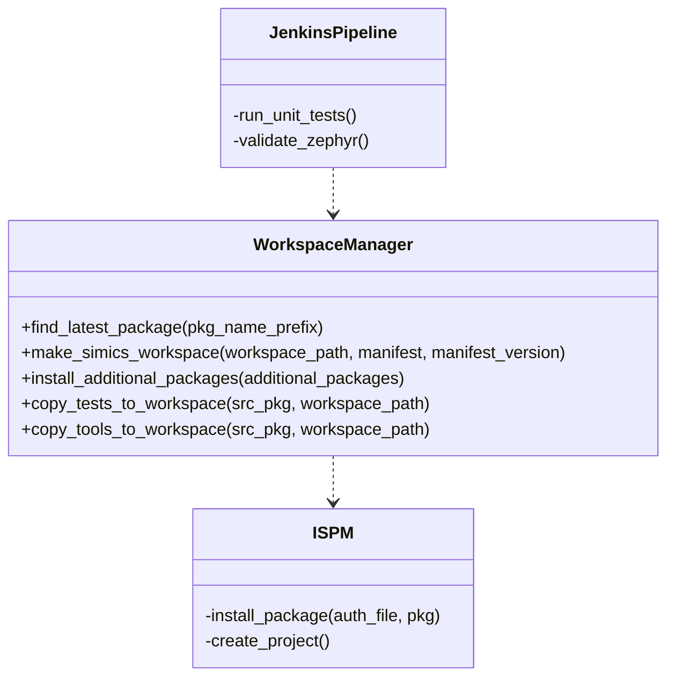
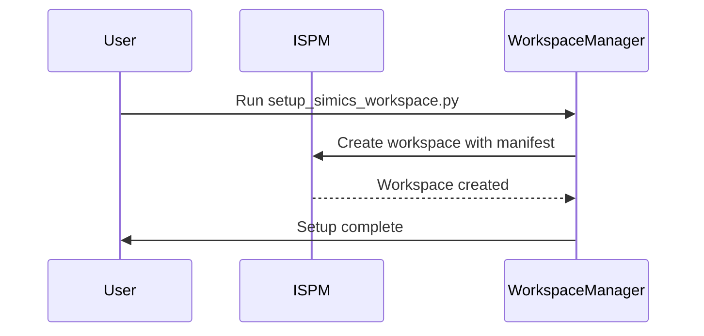

# System Architecture

## Introduction
The **System Architecture** documentation provides a detailed overview of the key components, workflows, and repository structure for efficiently managing and deploying the software system. It specifically focuses on the functionality derived from scripts and configuration files used in this project. The goal of this document is to ensure clarity, traceability, and maintainability for developers and system administrators working with the system.

This documentation covers the following aspects:
- Repository structure and its purpose
- Detailed workflows for Simics workspace management
- Integration of tools and tests into workspaces
- Relationships between core components and their configurations

---

## Repository Overview

The repository is organized into different directories and files, each serving a unique purpose:
- **`.github/`**: Contains GitHub Action workflows and issue templates.
- **`.jenkins/`**: Houses Jenkins pipeline definitions, including CI/CD tasks like testing, coverage, and packaging.
- **`scripts/setup_simics_workspace.py`**: The main Python script for setting up workspaces in the Netbatch environment, including tools installation, workspace creation, and custom configurations.

### Repository Structure
The following table summarizes the main repository components:

| Directory/File                 | Description                                                                 |
|--------------------------------|-----------------------------------------------------------------------------|
| `.github/`                     | Configuration files for GitHub workflows and collaboration tools.          |
| `.jenkins/`                    | Jenkins pipelines and validation tasks for CI/CD.                          |
| `scripts/setup_simics_workspace.py` | Script for creating and managing Simics workspaces, including tools and packages. |

---

## System Workflow and Architecture

### Simics Workspace Management
The **setup_simics_workspace.py** script provides a comprehensive mechanism for creating a fully functional Simics workspace. This script integrates functionalities such as:
- Finding the latest package versions.
- Installing required Simics packages.
- Copying tests, tools, and custom modules to the workspace.

#### Workflow Overview


#### Key Functions
- **`find_latest_package(pkg_name_prefix)`**: Identifies the most recent version of a package based on its naming prefix.  
  **Source**: [scripts/setup_simics_workspace.py:43](scripts/setup_simics_workspace.py#L43)  

- **`make_simics_workspace(workspace_path, manifest, manifest_version=None)`**: Creates a new Simics workspace and installs the required packages.  
  **Source**: [scripts/setup_simics_workspace.py:53](scripts/setup_simics_workspace.py#L53)

- **`install_additional_packages(additional_packages)`**: Automates the installation of extra Simics packages for compatibility.  
  **Source**: [scripts/setup_simics_workspace.py:107](scripts/setup_simics_workspace.py#L107)

---

## Component Relationships

The relationships between components in the system are highlighted in the following class diagram:



The `WorkspaceManager` serves as the core utility for managing Simics workspaces, and it integrates with `ISPM` for package management and installation.

---

## Process Workflows

### Workspace Creation Process
The following sequence diagram demonstrates the detailed interactions during workspace creation:



---

## Configuration Parameters

The script supports several configurable parameters for customizing the workspace setup process. The following table lists key parameters:

| Parameter             | Description                                      | Default Value                      |
|-----------------------|--------------------------------------------------|------------------------------------|
| `--workspace`         | Name for the Simics workspace.                   | `SIMICS_WORKSPACE`                |
| `--manifest-version`  | Specifies the version of the workspace manifest. | Latest version                     |
| `--pkg-path`          | Path for installing Simics packages.             | Defined in script (`SIMICS_PKGS_INSTALL_PATH`) |
| `--ispm`              | Path of ISPM tool.                               | Defined in script (`ISPM_PATH`)    |
| `--ispm-auth-file`    | Path to the ISPM authentication file.            | Defined in script (`ISPM_AUTH_FILE`)|

---

## Code Example

The snippet below demonstrates how to create a Simics workspace and copy tools into it using `setup_simics_workspace.py`:

```python
# Parse user arguments
args = parse_args()
workspace = args.workspace if args.workspace else 'SIMICS_WORKSPACE'
workspace_path = os.path.join(os.getcwd(), workspace)

# Create workspace
make_simics_workspace(workspace_path, PLATNAME, args.manifest_version)

# Copy tools and tests
latest_srv_pm_pkg_path = find_latest_package(SRV_PM_PKG_PREFIX)
copy_tools_to_workspace(latest_srv_pm_pkg_path, workspace_path)
copy_tests_to_workspace(latest_srv_pm_pkg_path, workspace_path)
```

**Source**: [scripts/setup_simics_workspace.py:168](scripts/setup_simics_workspace.py#L168)

---

## Conclusion

This document outlines the repository structure, system workflow, and key processes for setting up and managing Simics workspaces. The seamless integration of Jenkins, GitHub Actions, and workspace management scripts provides a robust mechanism for maintaining system reliability and consistency. By leveraging modular scripts and clear configurations, the system encourages scalability and maintainability in CI/CD workflows.