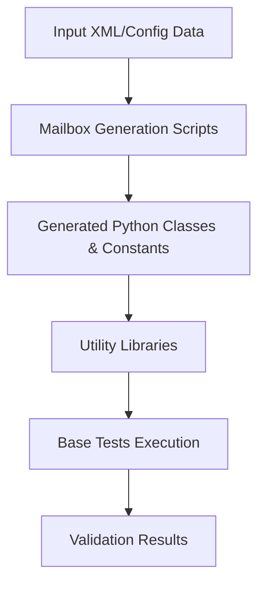
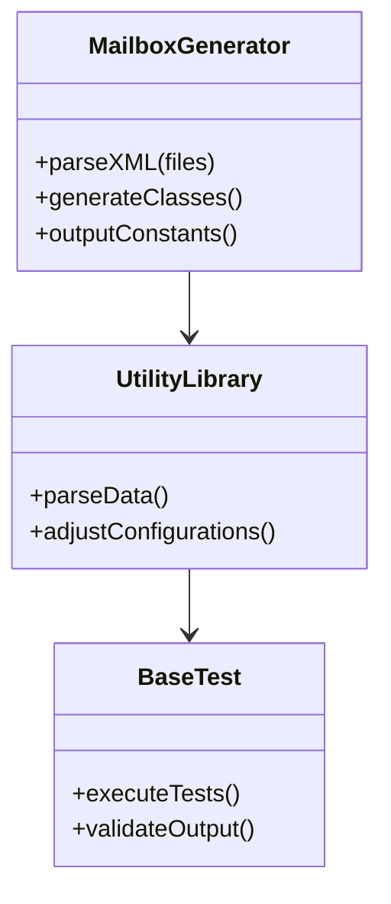
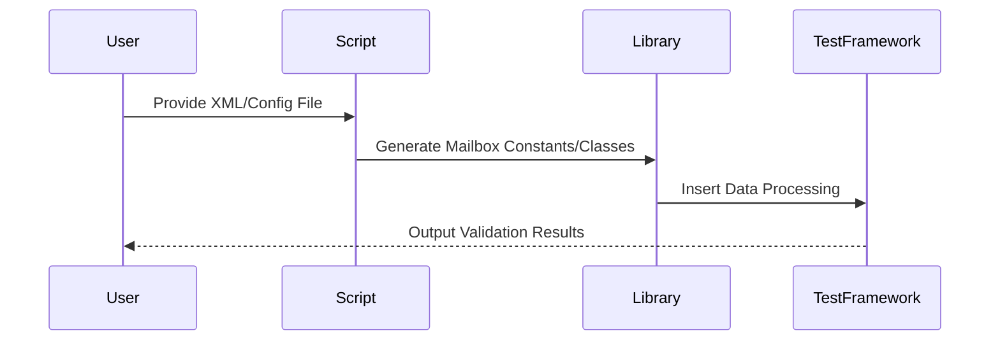

# Data Management and Flow

This document provides an in-depth overview of the **Data Management and Flow** system as derived from the referenced source files. It explains how data is generated, manipulated, and processed by various components. This guide includes information on architecture, workflows, and component relationships to ensure technical clarity and transparency.

---

## Table of Contents
- [Introduction](#introduction)
- [System Overview](#system-overview)
  - [Key Components](#key-components)
  - [Data Flow](#data-flow)
- [Detailed Architecture](#detailed-architecture)
  - [Mailbox Generation](#mailbox-generation)
  - [Library Functions](#library-functions)
  - [Base Tests](#base-tests)
- [Visual Diagrams](#visual-diagrams)
  - [Architecture and Data Flow](#architecture-and-data-flow)
  - [Component Relationships](#component-relationships)
  - [Process Workflows](#process-workflows)
- [Key Data Models and Parameters](#key-data-models-and-parameters)
  - [Summary Table](#summary-table)
- [Code Snippets and Usage Patterns](#code-snippets-and-usage-patterns)
- [Conclusion](#conclusion)

---

## Introduction

The **Data Management and Flow** system is responsible for ensuring that data is stored, processed, and utilized cohesively among various software components. The system is primarily used to:

1. Generate mailbox configurations dynamically.
2. Provide libraries for utilities related to Device Firmware Configuration, RAPL utilities, and more.
3. Define base test frameworks for validating features and ensuring consistent software behavior.

By leveraging a modular and script-driven design, the system ensures adaptability and extensibility for a wide range of use cases.

---

## System Overview

### Key Components

The system is composed of the following major components:

1. **Mailbox Generation Scripts** ([scripts/mailbox_generation_scripts](scripts/mailbox_generation_scripts/)):
   - Tools for processing and generating mailbox XML definitions, constants, and classes.
   - Core scripts include `mailbox_gen.py`, `mailbox_xml_parser.py`, and `mailbox_classes_generator.py`.
   - Sources: 
     - [class_file_generator.py:line](scripts/mailbox_generation_scripts/class_file_generator.py)
     - [mailbox_gen.py:line](scripts/mailbox_generation_scripts/mailbox_gen.py)

2. **Common Libraries** ([val_content/lib](val_content/lib/)):
   - Helper libraries for features such as RAPL, thermal management, platform functionalities, and firmware utilities.
   - Libraries implement core methods for platform interaction and data operations.
   - Examples:
     - [adr_utils.py:line](val_content/lib/adr_utils.py)
     - [rapl_utils.py:line](val_content/lib/rapl_utils.py)

3. **Base Test Framework** ([val_content/base_tests](val_content/base_tests/)):
   - Provides the foundation for feature validation unit tests.
   - Example tests include `adr_base_flow.py`, `pega_base_test.py`, and `socket_rapl_base_test.py`.

---

### Data Flow

The data processing flow within this system consists of the following stages:

1. **Data Generation:**
   - XML files and constants are generated to define mailbox configurations.
   - Scripts such as `mailbox_xml_parser.py` interpret static inputs into structured data.

2. **Library Processing:**
   - Utility functions refine and process input data to align with specific hardware or software needs.

3. **Test Execution:**
   - Tests leveraging base frameworks validate the functionality of the generated data against hardware/software implementations.

---

## Detailed Architecture

### Mailbox Generation

Mailbox generation is central to the data system. It involves parsing XML configurations, generating Python classes, and defining operational constants.

#### Highlights:
- **Dynamic XML Parsing:**
  Scripts like `mailbox_xml_parser.py` interpret XML files, turning them into Python-readable data structures.
  - Sources:
    - [mailbox_xml_parser.py:line](scripts/mailbox_generation_scripts/mailbox_xml_parser.py)
  
- **Code Generation:**
  - Python and constant files are dynamically built using files such as `class_file_generator.py`.

- **Logging Capabilities:**
  - Managed via the `py_logger.py`, ensuring robust runtime monitoring.

### Library Functions

Utility libraries offer shared methods used throughout the system. Functions target:
- Voltage regulation (e.g., `vr_hot_utils.py`, `rapl_utils.py`).
- Addressable Device-Routing (e.g., `adr_utils.py`).
- Memory and thermal management (e.g., `hiop_utils.py`, `socket_rapl_utils.py`).

Sources:
- [adr_utils.py](val_content/lib/adr_utils.py)
- [rapl_utils.py](val_content/lib/rapl_utils.py)

### Base Tests

The base test framework validates system functionality. Key frameworks include:
- **`base_test.py`** ([base_test.py](val_content/base_tests/base_test.py)):
  Defines common test functionality.
- **Feature-Specific Tests:**
  - Validating platform states (`socket_rapl_base_test.py`).
  - Ensuring reset flows (`reset_ssp_mode_base_test.py`).

---

## Visual Diagrams

### Architecture and Data Flow



### Component Relationships



### Process Workflows



---

## Key Data Models and Parameters

### Summary Table

| Component                 | Purpose                       | Source                                    |
|---------------------------|-------------------------------|------------------------------------------|
| Mailbox Generation Scripts| Configure mailbox formats     | [mailbox_gen.py](scripts/mailbox_generation_scripts/mailbox_gen.py) |
| Utility Libraries         | Provide helper functions      | [adr_utils.py](val_content/lib/adr_utils.py) |
| Base Test Framework       | Validate overall functionality| [base_test.py](val_content/base_tests/base_test.py) |

---

## Code Snippets and Usage Patterns

**Example: Generating Mailbox Configurations**

```python
from mailbox_xml_parser import MailboxXMLParser

# Parse an XML file for configuration
xml_data = MailboxXMLParser.parse("config_file.xml")

# Process parsed data
constants = MailboxConstantsGenerator.generate(xml_data)
Logger.info("Mailbox configuration generated successfully.")
```
Sources: [mailbox_xml_parser.py:line](scripts/mailbox_generation_scripts/mailbox_xml_parser.py)

---

## Conclusion

The **Data Management and Flow** system ensures the smooth integration of data processing, utility libraries, and test frameworks. By automating mailbox generation, enabling reusable utilities, and providing a strong test foundation, the system maintains scalability and robustness throughout the development lifecycle.