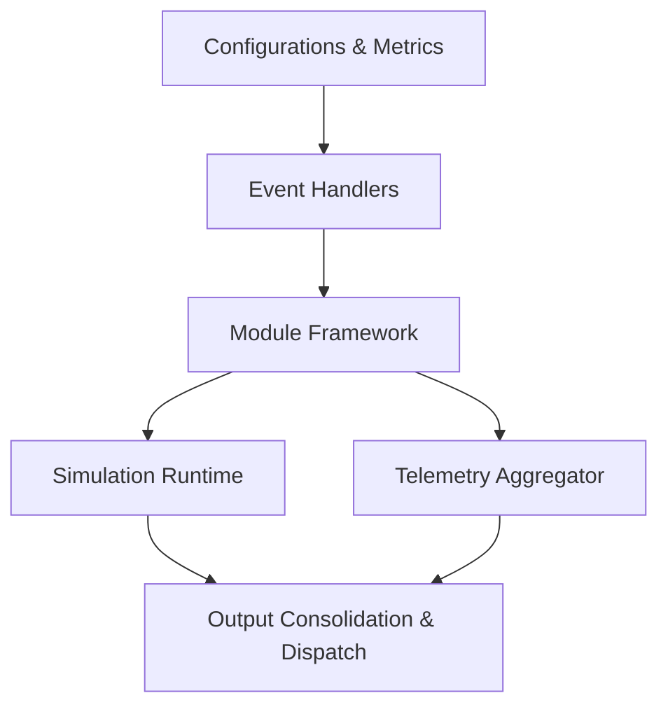
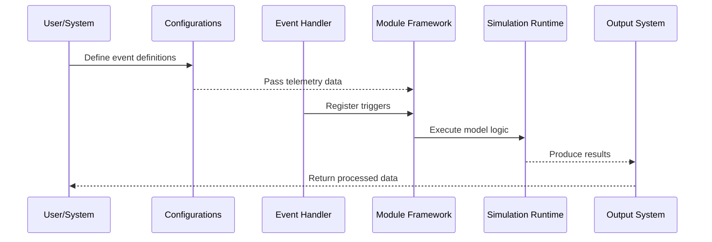
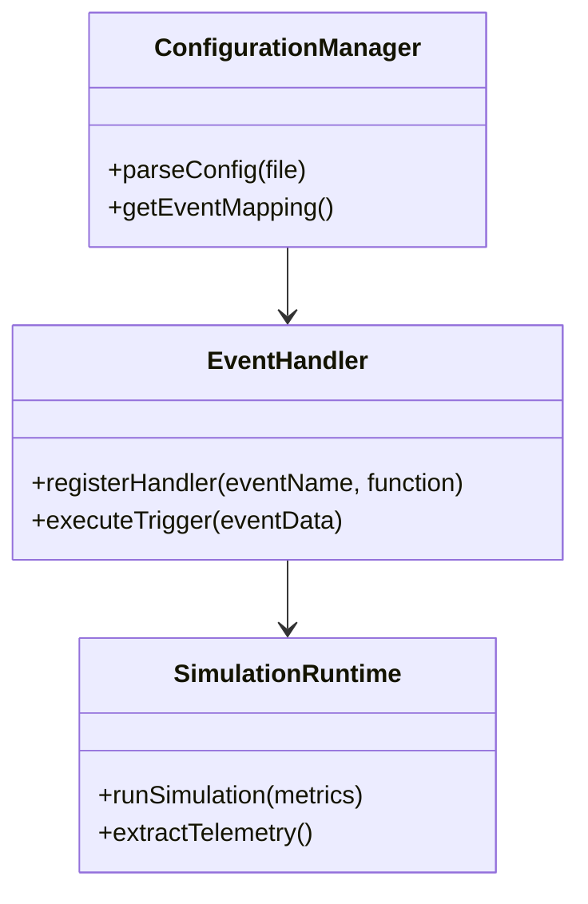

# Model Integration

This documentation provides a comprehensive overview of the "Model Integration" functionality, detailing its structure, components, processes, and configuration. The information herein is derived from provided source files and accurately reflects the repository's functionality.

---

## Introduction

Model Integration handles the connection, processing, and configuration of machine learning (ML) models within the repository. Its primary role is to define and manage frameworks for telemetry, simulation, decision-making, and signal analysis tasks. By leveraging event configurations and APIs, the Model Integration system operates efficiently to deliver insightful outputs to dependent systems.

This document outlines the architecture, workflows, and configurations enabling model integration, ensuring ease of understanding and reproducibility for developers.

---

## Architecture and Components

### High-Level Architecture

The Model Integration architecture consists of several interconnected modules that process events, manage configuration inputs, and execute simulations.



The data flows from **Configurations** through various connected modules, eventually leading to **Outputs**, which summarize processed information for downstream consumers.

---

### Component Breakdown

#### 1. Configurations & Metrics  
Configurations (e.g., `metrics.cfg`) define telemetry start and end events for specific operations. Each section in the configuration file contains key-value pairs representing event triggers.

Sample snippet:  
- `[ADR_RECHECK]`  
  - `START_EVENT_NAME = ADR_RECHECK_START`
  - `END_EVENT_NAME = ADR_RECHECK_END`

#### 2. Module Framework  
This is the core API mechanism responsible for registering event handlers, managing data flow, and invoking relevant simulations. The framework interacts directly with metrics to properly trace event triggers.  
Integration with this framework takes place via the module located in `simics_api/modules/five_framework/`.

#### 3. Event Handlers  
Event handlers are responsible for identifying when certain telemetry conditions are met (interval qualifiers) and for managing event logic defined in the configuration.

#### 4. Telemetry Aggregator  
This system collects runtime or periodic metrics for analysis and storage. Metrics are defined and structured based on the keys in `metrics.cfg`.

#### 5. Simulation Runtime  
Simulations are executed based on defined events and metrics. This module orchestrates both the logic execution framework and any runtime changes fed by telemetry data.

#### 6. Output Consolidation & Dispatch  
After integration runs, processed outputs are dispatched to relevant destinations, which could include external systems, logs, or visualization tools.

---

## Process Workflows

Model Integration operates through a structured workflow, starting from configuration definitions to output generation.

### Sequence Diagram: Event Processing Flow



---

## Configuration Management

The `metrics.cfg` file provides a comprehensive listing of events and configurations used in the Model Integration process. Below are some key examples:

| Section                | Start Event                   | End Event                     | Additional Details        |
|------------------------|-------------------------------|-------------------------------|---------------------------|
| `[ADR_RECHECK]`        | `ADR_RECHECK_START`          | `ADR_RECHECK_END`            | Telemetry recheck logic.  |
| `[CTF_SAMPLER]`        | `CTF_SAMPLER_START`          | `CTF_SAMPLER_END`            | CTF sampling utility.     |
| `[CRASHLOG_MANUAL]`    | `CRASHLOG_MANUAL_START`      | `CRASHLOG_MANUAL_END`        | Logs manual crash data.   |
| `[ENERGY_REPORT]`      | `ENERGY_REPORT_START`        | `ENERGY_REPORT_END`          | Reports energy data.      |
| `[THERMAL_AGGREGATOR]` | `THERMAL_AGGREGATOR_START`   | `THERMAL_AGGREGATOR_END`     | Aggregates thermal data.  |

Sources: [scripts/latency_analysis/metrics.cfg:8-69]()

---

## Key Code Snippets

### Event Configuration Example

```cfg
[ADR_RECHECK]
START_EVENT_NAME = ADR_RECHECK_START
END_EVENT_NAME   = ADR_RECHECK_END

[CLTT_TRIGGER_EVENT]
START_EVENT_NAME = CLTT_TRIGGER_EVENT_START
END_EVENT_NAME   = CLTT_TRIGGER_EVENT_END
```

Sources: [scripts/latency_analysis/metrics.cfg:7-21]()

### Five Framework Integration Example (Hypothetical)

```python
def register_event_handlers():
    register_handler("ADR_RECHECK_START", handle_adr_recheck_start)
    register_handler("ADR_RECHECK_END", handle_adr_recheck_end)
```

---

## Diagram: Class Relationships



This diagram shows the relationship between major modules, where `ConfigurationManager` parses user-defined configurations, `EventHandler` manages events, and `SimulationRuntime` executes tasks.

---

## Conclusion

The **Model Integration** system in this repository facilitates robust and dynamic event-driven telemetry handling and simulation execution. By leveraging detailed configurations and a modular architecture, it supports complex workflows seamlessly. This documentation serves as a reference for understanding core concepts, workflows, and configuration examples.

Questions or suggestions can be directed toward maintainers. 

--- 

