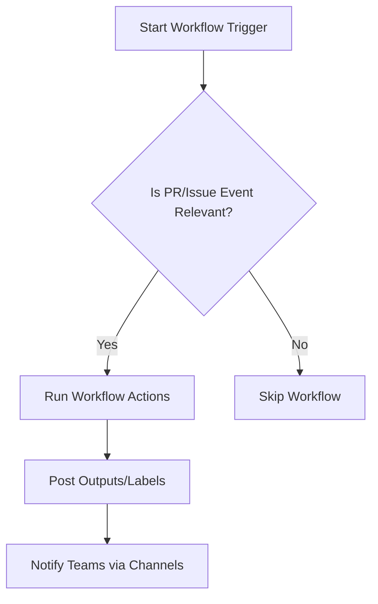
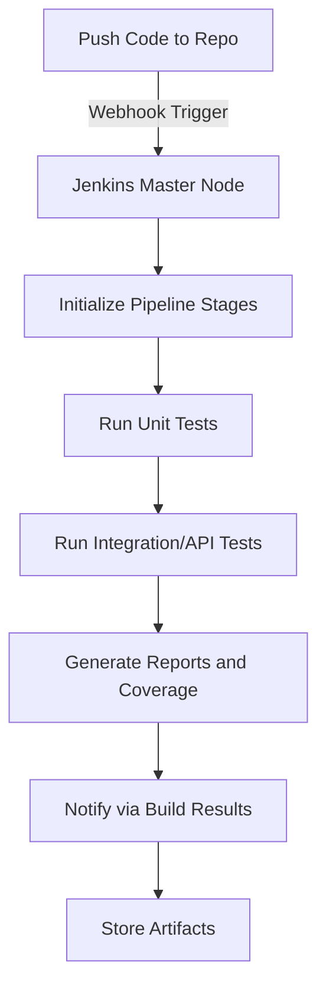
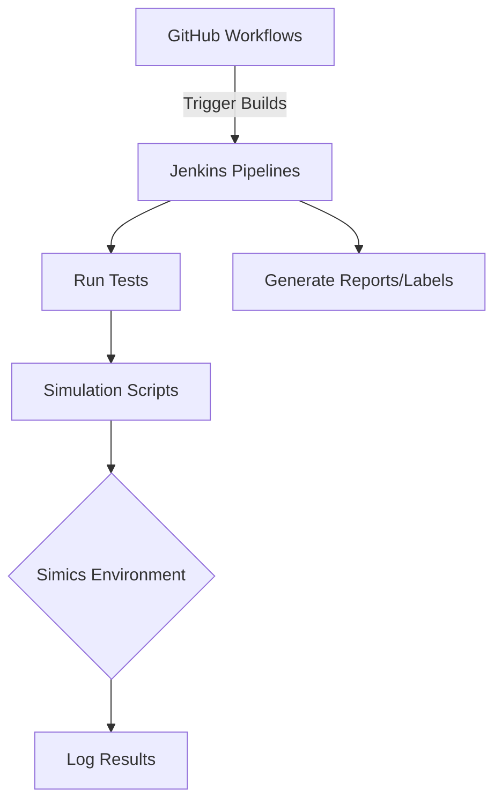
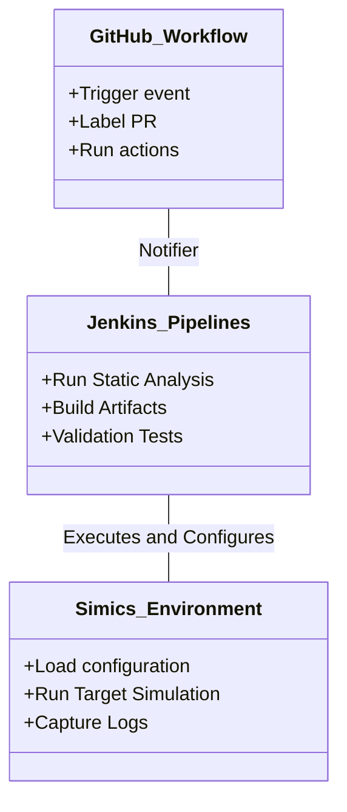

# Deployment and Infrastructure

This page provides an in-depth overview of the deployment processes and infrastructure setup based on the configuration and scripts found in the provided source files. It includes details on workflow automation, Jenkins pipelines, and custom scripts—enhanced with diagrams, tables, and code snippets for clarity.

---

## Introduction

The "Deployment and Infrastructure" module is a critical part of the DevOps lifecycle, ensuring automated, reliable, and scalable builds, tests, and deployments. This system supports both Continuous Integration (CI) and Continuous Deployment (CD) of applications. The documentation covers the following core aspects:

- GitHub workflows for automation
- Jenkins pipelines for testing and validation
- A custom script (`prepare.simics`) for managing simulation environments
- Dependency relations between components

---

## Core Infrastructure Components

### **1. GitHub Workflows**

The `.github/workflows/` directory contains YAML files defining various automated workflows. Each file is dedicated to specific tasks such as labeling pull requests, notifying teams of changes, and managing pull request statuses.

**Key Workflows:**
| **File Name**                  | **Purpose**                                                                                          |
|--------------------------------|------------------------------------------------------------------------------------------------------|
| `ai_review.yml`                | Automates AI-driven code review and suggestions                                                     |
| `label_pr_fromn_issue.yml`     | Labels pull requests based on linked issues                                                         |
| `stale-pull-requests.yml`      | Closes inactive (stale) pull requests                                                               |
| `promark.yml`                  | Automates the creation of release markers                                                          |

**Workflow Automations Architecture:**



Sources: [.github/workflows/](.github/workflows/)

### **2. Jenkins Pipelines**

The `.jenkins/` directory comprises various pipelines designed for build execution, test validation, coverage checks, and so on. Each subdirectory contains configurations and scripts for specific testing purposes.

#### Jenkins Pipelines Overview:
| **Pipeline**             | **Purpose**                                      |
|---------------------------|--------------------------------------------------|
| `api_tests`              | Integration testing for APIs                     |
| `check-vp-compatibility` | Validates system compatibility between versions  |
| `static-code-analysis`   | Runs static analysis tools for quality checks    |
| `validation_tests`       | Full end-to-end validation testing               |
| `unit-test`              | Executes unit testing across the codebase        |

#### Sample Jenkins Pipeline Workflow:


Sources: [.jenkins/](.jenkins/)

---

## Using Custom Simulation Scripts

### **3. The `prepare.simics` Script**

The `prepare.simics` script handles the setup of the Simics environment configuration dynamically using `simenv` variables. This script facilitates loading specific simulations, determining configurations, and error handling during the simulation process.

#### Script Details & Code Snippet:
```bash
start-command-line-capture prepare.log -append -timestamp
list-variables

@config = {"soc_config": simenv.soc_config,
           "fmod": simenv.fmod}

try {
    @simics.SIM_load_target(simenv.target, None, [], config)
} except {
    echo "Error loading the configuration"
}
quit
```

1. **Auto-configuration Variables:**  
    - `soc_config`: Stores the system-on-chip configurations.  
    - `fmod`: Represents the firmware module for simulation.  

2. **Error Handling:** A `try` block is used for identifying and logging script errors with custom messages.  

3. **Output Capture:** Appending outputs with timestamps ensures auditability and troubleshooting.  

Sources: [scripts/prepare.simics:1-10](scripts/prepare.simics)

---

## Component Relationships and Integration

### Architecture and Data Flow

The key components of the infrastructure are interconnected. The diagram showcases how GitHub workflows, Jenkins pipelines, and custom scripts interact within the CI/CD pipeline:



### Dependencies Between Components



---

## Summary of Configuration Parameters

### Table: `prepare.simics` Parameters
| **Parameter Name**  | **Description**                 | **Example**                     |
|----------------------|---------------------------------|----------------------------------|
| `soc_config`         | System-on-Chip configurations  | `arm_cortex_config_v1`          |
| `fmod`               | Firmware module loaded         | `default_firmware_v2`           |
| `simenv.target`      | Simulation target architecture | `arm64-target`                  |

---

## Conclusion

The deployment and infrastructure setup described above demonstrates a well-structured CI/CD pipeline with automated workflows, dynamic testing environments, and robust error handling. By leveraging GitHub Actions, Jenkins pipelines, and custom scripts, the system meets the needs of modern software delivery with automation, consistency, and reliability.

For further exploration, refer to the source files directly:  
- GitHub Workflows: [.github/workflows/](.github/workflows/)  
- Jenkins Pipelines: [.jenkins/](.jenkins/)  
- Simulation Scripts: [scripts/prepare.simics](scripts/prepare.simics)