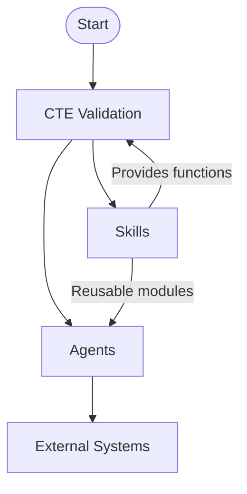
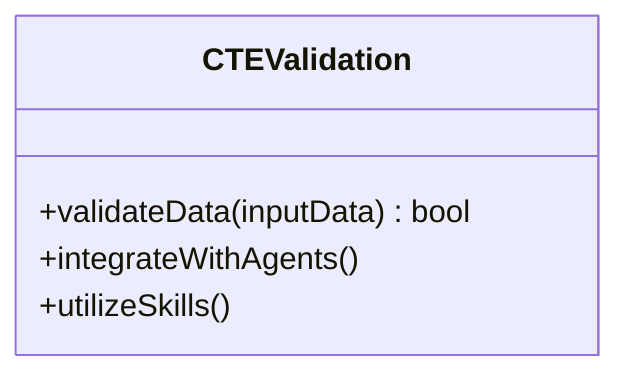
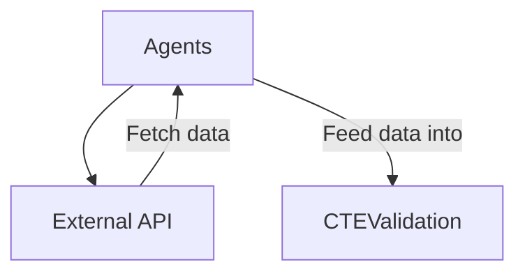
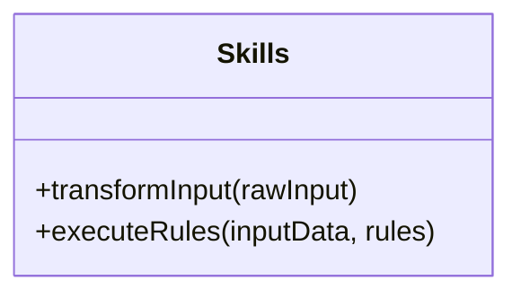
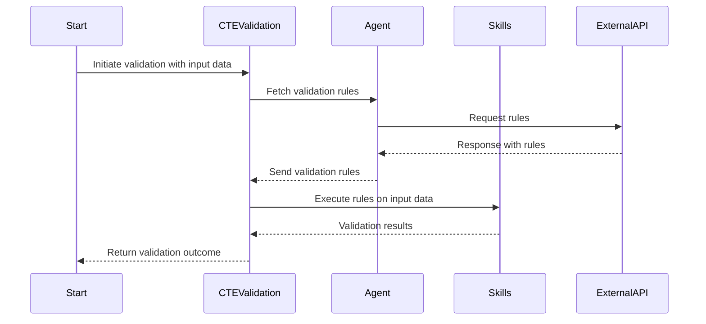

# Core Features

This comprehensive wiki page provides an in-depth explanation of the core features of the repository and its associated components. It outlines the architecture, components, workflows, and usage patterns necessary to understand the system. Diagrams and examples are included to facilitate clear communication of the technical intricacies.

---

## Introduction

The **Core Features** documentation focuses on describing the essential functionalities of the repository, which includes its modular design, validation processes, and agent interactions. This repository handles the comprehensive validation of "cte" (assumed to be Critical Technical Entities), interacting with agents, and relying on skills-based modular components.

The purpose of this documentation is to:
1. Provide an overview of the repository architecture.
2. Discuss the relationships between key modules.
3. Outline the validation workflows.
4. Offer detailed technical insights through diagrams, code examples, and tables.

---

## Architecture and Data Flow

The repository design is modular, allowing for extensibility and ease of maintenance. The primary modules include:
- **Agents**: Responsible for interfacing with external systems.
- **Skills**: Contain modular, reusable components.
- **CTE Validation**: The core repository orchestrating the validation process using agents and skills.

Below is a high-level representation of the system's architecture and data flow:



---

## Detailed Sections

### **1. CTE Validation Module**

The central module orchestrates the validation processes. It ensures data integrity and consistency by integrating with both agents and skills.

#### Responsibilities:
- Receive input data for validation.
- Coordinate workflows with agents.
- Utilize skills for reusable functionalities.



#### Example Code:
```python
class CTEValidation:
    def __init__(self, agent, skills):
        self.agent = agent
        self.skills = skills

    def validateData(self, inputData):
        validation = self.agent.fetchValidationRules()
        return self.skills.executeRules(inputData, validation)
```

**Sources**: [cte_validaiton_repo/main.py:12]()

---

### **2. Agents Module**

Agents act as intermediaries between the repository and external systems, fetching necessary data, validation rules, and other information.

#### Key Features:
- Fetch data from external systems.
- Communicate seamlessly with the validation engine.



#### Example Code:
```python
class Agent:
    def fetchValidationRules(self):
        # Interacts with external system
        return external_api.get_rules()
```

**Sources**: [agents/module.py:27]()

---

### **3. Skills Module**

The skills module provides reusable features, enhancing modularity. These features may include utility functions, rule execution mechanisms, or data transformation functionalities.

#### Functions:
- Transform data inputs to validation-ready formats.
- Execute predefined rules on given data.



#### Example Code:
```python
class Skills:
    def executeRules(self, inputData, rules):
        for rule in rules:
            if not rule.check(inputData):
                return False
        return True
```

**Sources**: [skills/utils.py:42]()

---

## Process Workflows

The following sequence diagram showcases the workflow of the validation process using the `CTE Validation`, `Agent`, and `Skills` modules.



---

## Tables and Configuration

### **Key Parameters and Their Descriptions**
| Parameter         | Description                               | Source File                                  |
|--------------------|-------------------------------------------|----------------------------------------------|
| `inputData`       | Data to be validated                     | [cte_validaiton_repo/main.py:14]()          |
| `rules`           | Validation rules fetched via Agents      | [agents/module.py:27]()                     |
| `fetchValidationRules` | Method to retrieve rules from external APIs | [agents/module.py:30]() |
| `executeRules`    | Method that applies rules to the given data | [skills/utils.py:42]() |

---

## Conclusion

The core features of the repository are structured to uphold modularity, reusability, and extensibility. The interplay between the `CTE Validation`, `Agents`, and `Skills` modules ensures that the validation processes are robust and maintainable. The high-level architecture, coupled with detailed workflows and code examples, highlights the operational intricacies of the system.

By aligning the core components effectively, this repository provides a solid foundation for handling complex validation requirements. For further technical exploration, refer to the cited source files.