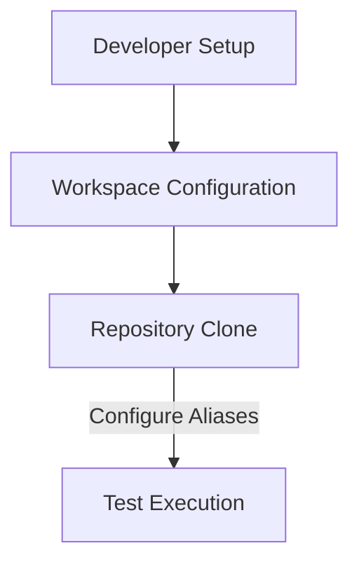
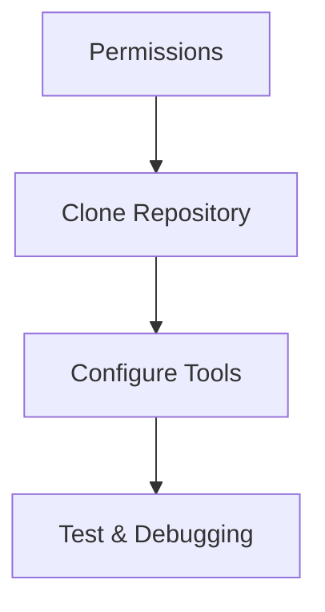

# Developer Onboarding

Welcome to the Developer Onboarding guide! This document provides a comprehensive introduction and structured process for setting up your development environment, accessing essential tools and repositories, and starting your journey as a contributor. Whether you're cloning the repository, configuring environment variables, or setting up Visual Studio Code for Primecode validation, this guide will assist you every step of the way.

## Table of Contents

- [Introduction](#introduction)
- [Permissions](#permissions)
- [Quick Start](#quick-start)
  - [1. Clone the Repository](#1-clone-the-repository)
  - [2. Set Shared Aliases](#2-set-shared-aliases)
  - [3. Download and Setup SRVPM Model](#3-download-and-setup-srvpm-model)
  - [4. Run a Test](#4-run-a-test)
- [Environment Setup](#environment-setup)
  - [1. Prerequisites](#1-prerequisites)
  - [2. SSH Configuration for VS Code](#2-ssh-configuration-for-vs-code)
  - [3. Shared Aliases](#3-shared-aliases)
  - [4. Workspace Setup](#4-workspace-setup)
  - [5. Keyboard Shortcuts](#5-keyboard-shortcuts)
  - [6. Autocompletion](#6-autocompletion)
- [Diagrams](#diagrams)
  - [Architecture Flow](#architecture-flow)
  - [Repository Workflow](#repository-workflow)
- [Conclusion](#conclusion)

---

## Introduction

Successfully onboarding new developers is critical to maintaining high productivity and reducing ramp-up time. This onboarding guide outlines how to set up permissions, clone and access repositories, configure essential development tools, and run your first test on the system. By closely following this guide, you'll gain the foundational understanding required to contribute effectively to the repository.

---

## Permissions

Access to specific tools, platforms, and repositories is essential for development. Ensure you obtain these permissions:

| Permission Name                                  | Function                                                                 |
|-------------------------------------------------|-------------------------------------------------------------------------|
| DMR IP Blue Badge FE Users                      | Access to DMR project                                                  |
| Coral Rapids Arch Design BB                     | Access to [COR HAS](https://goto/corhas)                               |
| Server Firmware Primecode Validator             | GitHub repository access                                               |
| Primecode Documentation Reader                  | Primecode HAS and JIRA access                                          |
| Primecode Firmware DDP Read                     | Xeon PM Arch HAS                                                       |
| PROMARK DATACENTER REPO VIEWERS                 | Access Promark repository                                              |

Sources: [Onboarding.md:5–16]()

---

## Quick Start

Follow the steps below to get started with the repository setup.

### 1. Clone the Repository

1. Create your workspace directory under the following path:  
   `/nfs/site/disks/psfw/USERNAME/`
   
2. Clone the repository into your workspace:
   ```sh
   cd $WORK_AREA
   git clone --recurse-submodules https://github.com/intel-restricted/firmware.management.primecode.simics-2.git val_repo
   ```

Sources: [Quick-Start.md:13–21]()

---

### 2. Set Shared Aliases

Edit the `~/.aliases` file and add the following configurations:
```sh
setenv QUICK_SETUP true
setenv WORK_AREA 'paste path to WORK_AREA here'
setenv SIMICS_REPO $WORK_AREA/val_repo
setenv VP_REPO $WORK_AREA/vp_repo
source $SIMICS_REPO/scripts/shared_aliases
```

> **Restart your terminal** after applying these changes.  

Sources: [Quick-Start.md:25–39]()

---

### 3. Download and Setup SRVPM Model

Use the automatic setup script to complete the configuration:

```sh
cd $SIMICS_REPO
set_ws
```

Refer to the [setup script documentation](https://github.com/intel-restricted/firmware.management.primecode.simics-2/blob/main/doc/simics_api/setup.md) for additional context.

Sources: [Quick-Start.md:44–51]()

---

### 4. Run a Test

Verify the installation by executing a test:
```sh
run_test test_name_without_py
```

Sources: [Quick-Start.md:55–59]()

---

## Environment Setup

This section helps you configure Visual Studio Code and related tools for optimal workflow.

### 1. Prerequisites

Ensure you have completed the steps in the [Quick Start guide](#quick-start).

Sources: [Environment-Setup.md:11–12]()

---

### 2. SSH Configuration for VS Code

1. **Generate SSH keys:**  
   ```sh
   ssh-keygen -t rsa -b 4096
   ```
2. **Copy your public key** to the Linux host:
   ```sh
   cat ~/.ssh/id_rsa.pub >> ~/.ssh/authorized_keys
   ```
3. Configure SSH in VS Code's `SSH Config` file:
   ```sh
   Host zsc16
       HostName "your_host_ip"
       User "your_username"
       IdentityFile "~/.ssh/id_rsa"
   ```

Sources: [Environment-Setup.md:15–42]()

---

### 3. Shared Aliases

The `shared_aliases` file simplifies repetitive tasks like test execution and environment configuration.

| Alias           | Description                         |
|------------------|-------------------------------------|
| `run_test`       | Runs a single test                 |
| `setup_vsc`      | Creates workspace files for VSCode |

Sources: [Environment-Setup.md:47–60]()

---

### 4. Workspace Setup

Use the `setup_vsc` alias to create VSCode workspace files and streamline your development environment:
```sh
setup_vsc
```

Sources: [Environment-Setup.md:67–74]()

---

### 5. Keyboard Shortcuts

Add the following shortcuts to `keybindings.json` to enhance productivity:
```json
[
    { "key": "ctrl+k x", "command": "workbench.action.tasks.runTask", "args": "View Log" },
    { "key": "ctrl+r r", "command": "workbench.action.tasks.runTask", "args": "run test" }
]
```

Sources: [Environment-Setup.md:80–117]()

---

### 6. Autocompletion (Beta)

Use the `StubGenerator` tool to generate stubs for autocompletion:
```py
from scripts.stub_generator import StubGenerator
StubGenerator().generate(self.vp)
```

Sources: [Environment-Setup.md:122–140]()

---

## Diagrams

### Architecture Flow



---

### Repository Workflow



---

## Conclusion

This onboarding guide provides developers with the necessary steps and resources to quickly begin working on the repository. From permissions setup to configuring VS Code and running the first test, we outlined the key processes to simplify the onboarding process.  

By following the steps laid out here, you’ll be equipped with the tools and understanding needed for a smooth start. For detailed information, refer to the cited sections in the source documentation.