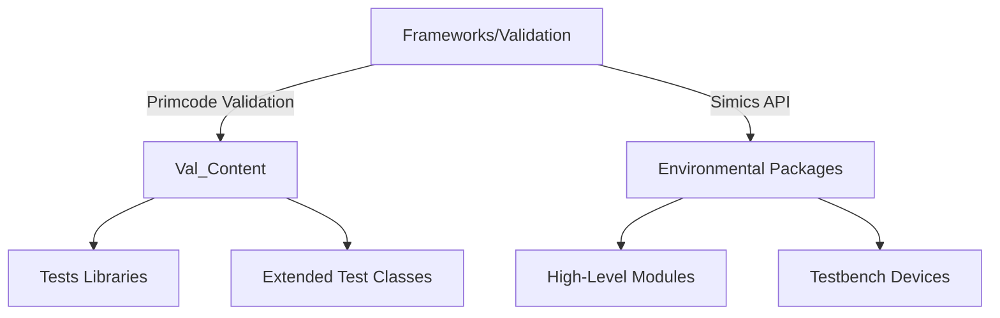
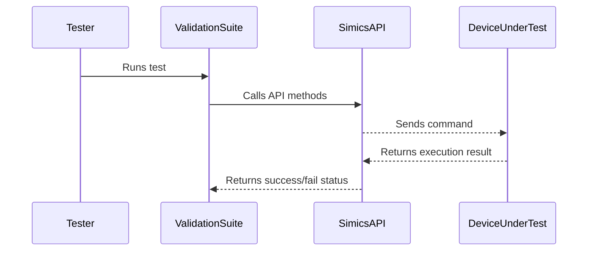

# Documentation and Coding Standards

This page provides a detailed guide on the documentation practices and coding standards adopted for the `frameworks.validation.primecode-simics` repository. By adhering to these guidelines, developers can ensure consistency, maintainability, and professionalism across all contributions to the codebase.

---

## Introduction

### Purpose
The purpose of this document is to establish standards and guidelines for documentation and coding in the `frameworks.validation.primecode-simics` repository. These practices streamline collaboration, minimize technical debt, and facilitate the validation of Primecode firmware and associated simulation models.

### Scope
This document applies to all contributors working within the repository, specifically during activities such as:
- Developing the validation test suite.
- Modifying or extending the Simics high-level API.
- Creating and maintaining documentation.

---

## Coding Standards

### General Conventions

#### Filename and Class/Style Guidelines
- File Naming: Use `snake_case` formatting for file names (e.g., `file_name.py`). [doc/Getting-Started/Coding-Convention.md:5]()
- Class Name: Use `PascalCase` for class names (e.g., `ClassName`).
- Indentation: Always use 4 spaces for indentation. Avoid tabs. [doc/Getting-Started/Coding-Convention.md:9]()
- Line Limits: Limit lines to 119 characters.

#### Variable and Function Naming
- Use `snake_case` for variables and function names. [doc/Getting-Started/Coding-Convention.md:8]()

#### Constants
- Common constants (e.g., across all DUTs) should reside in a separate class within an appropriate interface.
- Device-specific constants are defined as variables in their corresponding interface classes. [doc/Getting-Started/Coding-Convention.md:17]()

### Logging
- Use the `dbg` logger for interface debugging.
- Use the `step` logger for documenting test step progress. [doc/Getting-Started/Coding-Convention.md:12]()

### Best Practices
- Prefer `f-strings` over other string formatting methods for readability. Example:
  ```python
  CONST = 5
  f"{CONST=}"  # CONST=5
  ```
- Avoid directly calling private methods (methods starting with `_`) unless absolutely necessary. [doc/Getting-Started/Coding-Convention.md:41]()

---

## Directory and File Structure

### Validation Content Structure
The following directory structure is recommended for organizing test files and related components:

```plaintext
val_content
  lib
    factories                           'factory'
      pstate_factory.py
    platform                            'platform level'
      pstate
        pstate_platform_interface.py    'PstatePlatformInterface'
    ...
  die
    common                              'cbb+imh+ioh level'
      pkgc
        pkgc_die_interface.py           'PkgcDieInterface'
    ...
```

This structure aims to separate checks, monitors, drivers, and interfaces for better modularity and readability. Refer to [doc/Getting-Started/Coding-Convention.md:51]() for the complete structure.

---

## API and Interface Implementation

### Interface Template
Each interface should inherit from its respective base component, ensuring modular and extendable designs. Below is an implementation example:

```python
class PstateDieCbbInterface(BaseDieComponent):
    def test(self):
        self.wrapper.do_something()

class PstateDieCorCbbInterface(BaseDieComponent):
    def test(self):
        self.wrapper.do_something_different_on_coral()
```
[doc/Getting-Started/Coding-Convention.md:30]()

### API Usage
- Do not directly import Simics API modules from `simics_api`. Use `simmod` instead.
- Methods in `simics_api` should gradually migrate to new-style interfaces. [doc/Getting-Started/Coding-Convention.md:20]()

---

## Ongoing Repository Management

### CI/CD Pipeline Commands
Trigger pipeline actions directly via PR comments. Supported commands include:

| Command                              | Description                                      |
|--------------------------------------|--------------------------------------------------|
| `val-tests`                          | Triggers validation tests.                       |
| `/recheck.simics-api-tests`          | Re-runs Simics API tests.                        |
| `/recheck.static-code-analysis`      | Triggers static code analysis rerun.             |
| `/recheck.unit-tests`                | Triggers all unit tests rerun.                   |
| `/recheck.build-documentation`       | Rebuilds documentation.                          |

Refer to [README.md:66]() for detailed management of CI/CD pipelines.

---

## Visualization

### Repository Architecture Overview
Below is a high-level illustration of the repository's architecture:



### Simics API Workflow
The following illustrates the workflow for a Simics API test:



---

## Code Congruency

Below are the key sections of the `pylintrc` file for static analysis:

### Ignored Paths
Certain directories are ignored during linting:
```plaintext
ignore-paths = venv|unit_tests
```
[pylintrc:5]()

### Spelling
Spelling validation uses the `en_US` dictionary:
```plaintext
spelling-private-dict-file = spelling_dictionary.dic
```
[pylintrc:13]()

---

## Conclusion

### Summary
- **Consistency:** Following PEP8 standards ensures uniformity.
- **Automation:** Automated pipelines via Jenkins streamline code review and integration.
- **Documentation:** Comprehensive README and Markdown files support knowledge-sharing.
- **Structure:** A modular directory design facilitates extensibility.

By abiding by these guidelines, contributors can maintain high-quality, efficient, and reliable code. For further assistance, refer to the [Wiki](https://github.com/intel-restricted/firmware.management.primecode.simics-2/wiki) or specific file references.