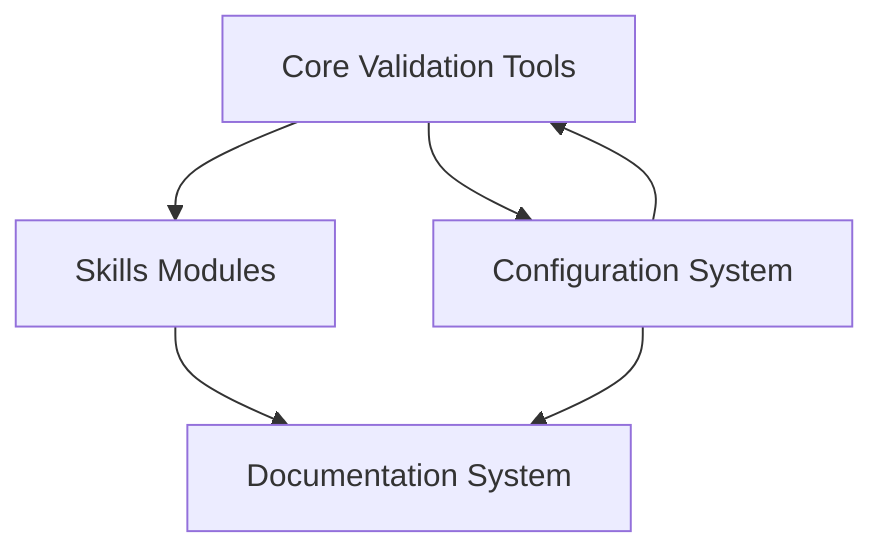
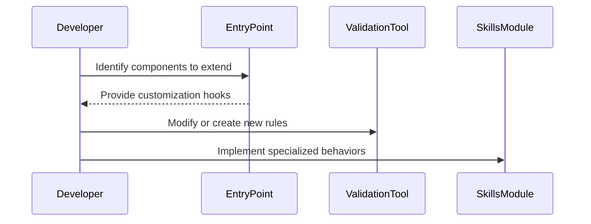

# Extensibility and Customization

## Introduction

The "Extensibility and Customization" feature of the repository allows users to adapt and expand its functionality to suit their unique requirements. This capability is critical for ensuring the system can integrate seamlessly into diverse workflows, accommodate domain-specific validation needs, and evolve with changing requirements. By leveraging modular architecture, configuration-driven design, and predefined interfaces, the repository empowers technical users to adapt its behavior through minimal code changes.

This documentation provides a comprehensive overview of how users can extend and customize the repository's tools and functionality. It covers overarching architectural principles, component relationships, process flows, and the tools available for effective customization.

---

## Overview of Extensibility Architecture

The repository is built on a modular design that supports seamless customization. Extendable components include validation tools, data models, and skills-based workflows. Each component has a predefined interface to minimize disruption when additional functionality is introduced.

### Key Architectural Principles:
1. **Modularity:** Components interact via interfaces to ensure low coupling.  
2. **Configuration-driven Customization:** Key parameters and behaviors can be modified via configuration files.  
3. **Scalable Workflows:** Extensible pipelines ensure workflows grow as your requirements evolve.

---

## Major Components and Relationships

### High-Level Architecture

The overall extensibility and customization are supported by the following components:  

- **Core Validation Tools:** Reusable tools for data integrity and compliance.
- **Skills Modules:** Plug-in modules to introduce new capabilities.  
- **Configuration System:** YAML/JSON configuration files to adjust behavior without code changes.  
- **Documentation System:** Scripts to auto-generate user-facing documentation on newly-added features.  

#### Component Relationship Diagram



---

## Tools for Customization

The repository provides specific tools to help users extend its functionality:

- **Validation Tools:** A collection of scripts and methods for implementing domain-specific rules.
  - Sources: [doc/Validation-Central/Tools/Tools.md:1]()
  
- **Skills Modules:** Customizable by placing scripts in the `skills/` directory.
  - Sources: [skills/:base]()  
   
- **Documentation Generation:** Auto-generation scripts ensure modifications are reflected in the documentation.
  - Sources: [scripts/docs/documentation.py:header]()

---

## Customization Workflow

### Step 1: Analyze Requirements  
  Understand the components of the repository that align with your customization goals.

### Step 2: Identify Entry Points  
  Entry points include:
  - Validation Tool methods  
  - Adding `skills/` modules  
  - Adjusting configurations  

### Step 3: Implementation  
  Write reusable code/scripts and add necessary documentation.

#### Workflow Diagram  


---

## Key Parameters and Configuration

Below is a summary of configurable aspects of the repository:

| **Parameter**      | **Purpose**                      | **Location**             |
|---------------------|----------------------------------|--------------------------|
| `tool_name`         | Name of validation tool          | `Tools.md`              |
| `skills_template`   | Base skill implementation file   | `skills/`               |

---

## Code Examples

### Example 1: Adding a Validation Tool  
Below is an example of creating a new validation script:  

```python
# my_custom_tool.py
def validate_custom_data(data):
    if not data:
        raise ValueError("Data cannot be empty")
    print("Validating:", data)
```

  - Sources: [doc/Validation-Central/Tools/Tools.md:header]()  

### Example 2: Adding a Skill Module  
Adding the `skills/new_skill.py` file to introduce a new functionality:
```python
# skills/new_skill.py
from core_library import BaseSkill

class NewSkill(BaseSkill):
    def execute(self):
        print("Executing new skill")
```
  - Sources: [skills/:base]()  

---

## Conclusion

Extensibility and customization are at the heart of the repository's utility, enabling users to adapt workflows and tools to suit their needs. By leveraging tools such as modular validation methods, skills-based frameworks, and configuration files, users can make significant adjustments with minimal disruption. The clear separation of functionality ensures that extending one component seamlessly integrates with the rest of the repository. Understanding the principles outlined in this documentation will empower developers to maximize the repository’s potential for their specific use cases.