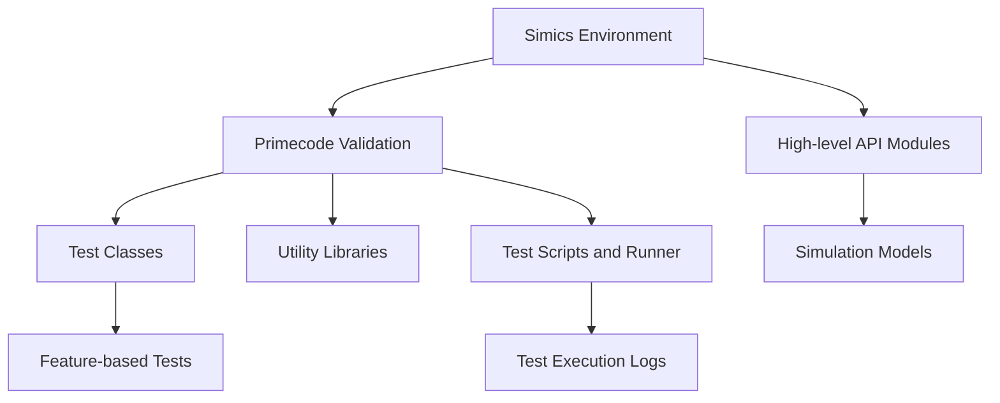
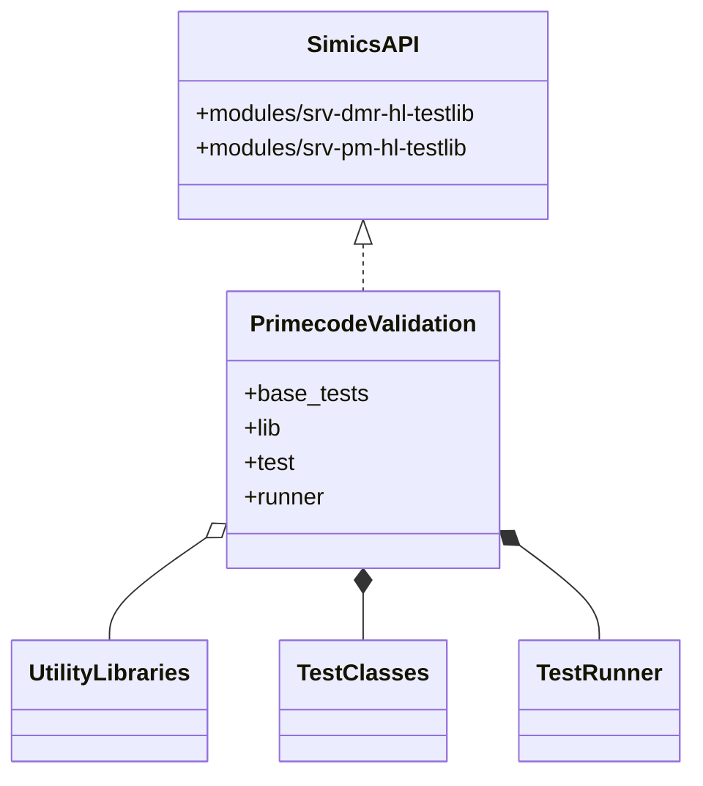
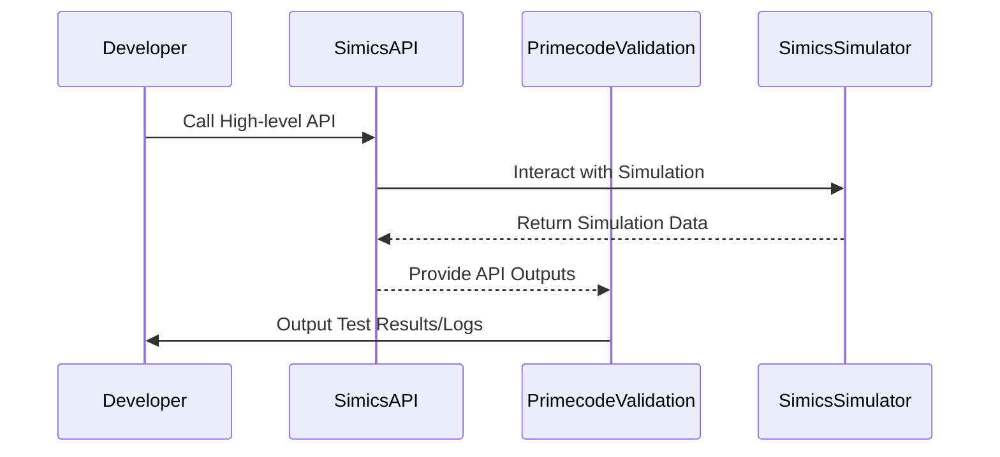

# frameworks.validation.primecode-simics Wiki

## Introduction

The **frameworks.validation.primecode-simics** repository is a powerful tool designed for Primecode firmware validation specific to Intel's Diamond Rapids (DMR) platform. This framework facilitates comprehensive testing for the Intel Xeon datacenter CPUs, laying a solid foundation for validation and development workflows. The repository hosts validation test suites, high-level API modules, and rigorous development utilities tailored for integration with the Simics simulation environment. 

The content in this document provides an overview of the repository architecture, components, and workflows involved in the firmware validation process.

---

## Detailed Sections

### Repository Structure and Components

The primecode-simics repository is structured into logical components, each catering to specific functionalities for firmware validation and simulation. Key components include:

#### Simics Environment
High-level API modules that enable interaction with the simulation environment:
- **`simics_api`**
  - `modules/srv-dmr-hl-testlib`: DMR-specific API calls.
  - `modules/srv-pm-hl-testlib`: General Server Power Management API calls.
  - `modules/srv-pm-tb-devs`: Testbench Device for CXL validation.

#### Primecode Validation
A collection of validation tools and test resources:
- **`val_content`**
  - `base_tests`: Classes for extended tests customized for Primecode features.
  - `lib`: Utility libraries for reusable validations.
  - `test`: Directory for feature-based tests.
  - `runner`: Tools and records for test execution, including logs and disabled tests.

#### Documentation and Automation
- **`doc`**: Houses all documentation related to API, development, and validation workflows.
- **`scripts`**: Contains automation procedures and tools for expediting validation processes.

Source: [README.md:21-32](README.md:21-32)

---

### Mermaid Diagrams

#### Architecture and Data Flow



#### Component Relationships



#### Process Workflow



---

### Execution Environment

The execution environment provided for testing in this repository is based on the **Simics** simulator. It focuses on SRV PMSS (Server Power Management Sub-System), using standalone virtual platforms. Key features include:
- Testbench devices for CXL testing.
- Environmental packages available through the `isim-vp-server-pm` team, external to this repository.

Source: [README.md:42-52](README.md:42-52)

---

### Tables

#### Key Directories and Descriptions

| Directory      | Purpose                                                                                  | Source                |
|----------------|------------------------------------------------------------------------------------------|-----------------------|
| `simics_api`   | High-level API modules enabling interactions with Simics simulation.                     | [README.md:23](README.md:23) |
| `val_content`  | Containers for validation-related files, tests, and utilities.                          | [README.md:24](README.md:24) |
| `doc`          | Centralized documentation for project and repository.                                    | [README.md:31](README.md:31) |
| `scripts`      | Automation tools for validation and development.                                         | [README.md:32](README.md:32) |

---

### Code Snippets

#### Sample High-level API Usage

Example usage for accessing the **SRV PMSS API**:

```python
from simics_api.modules.srv_pm_hl_testlib import PowerManagementAPI

pm_api = PowerManagementAPI()
result = pm_api.get_power_readings()
print(result)
```

Source: [README.md:49](README.md:49)

#### Basic Test Runner Execution

```python
from val_content.runner.test_runner import TestRunner

runner = TestRunner()
runner.run_test("feature_x_test_case")
```

Source: [README.md:29](README.md:29)

---

### Documentation

The project documentation is available in two formats:
1. **ProMark Documents**: High-level details on validation and architecture.
2. **Markdown Files**: Technical repository details, collaboration principles, and guides.

Important documentation links:
- [Simics API Docs](https://docs.intel.com/documents/primecode-simics/simics_api/index.html)
- [Setup Instructions](./doc/simics_api/setup.md#simplified-setup)
- [CI/CD Pipeline Info](https://github.com/intel-restricted/firmware.management.primecode.simics-2/wiki/Cicd)

Source: [README.md:35-69](README.md:35-69)

---

## Conclusion

The **Primecode-Simics Validation Framework** is a robust repository for validating Intel's Diamond Rapids datacenter CPUs. With its modular structure, high-level APIs, reusable validation libraries, and documentation, it serves as an essential tool in the development lifecycle. By leveraging the Simics environment, it ensures streamlined testing and rapid iteration, solidifying the framework as a cornerstone of Primecode firmware validation.