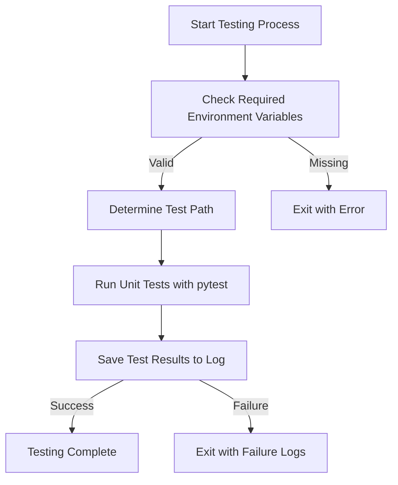
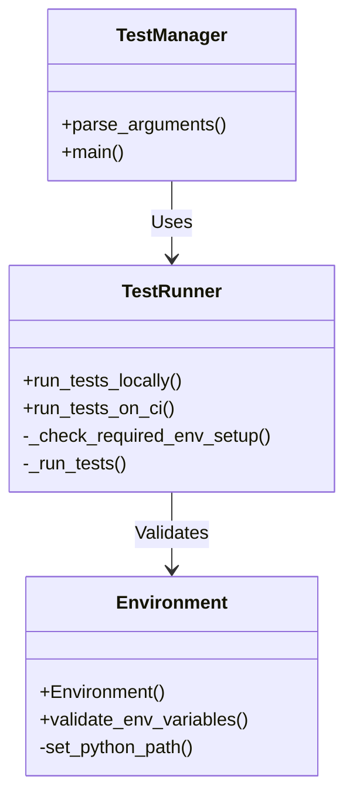
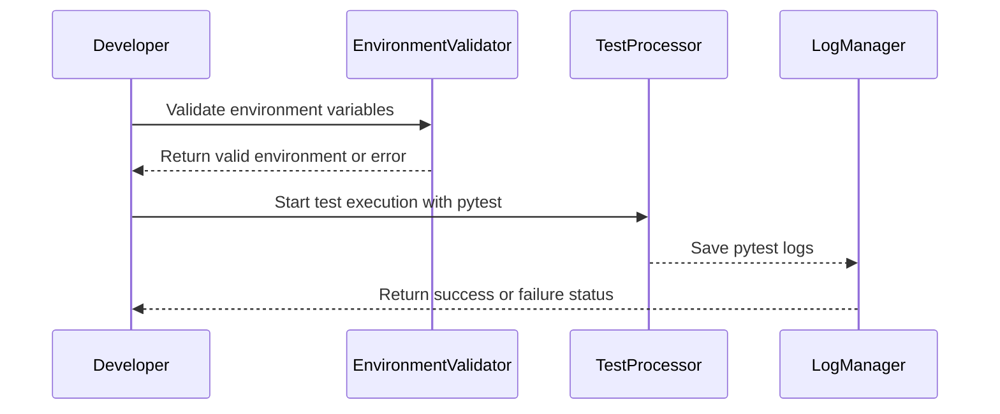

# Testing and Validation

This document describes the automated testing frameworks and validation processes employed in the repository. The focus is on ensuring code quality, reliability, and compliance with the project's requirements using automated unit tests and validation steps. The following sections provide an in-depth explanation of the testing architecture, processes, and tools used in the repository.

---

## Table of Contents

1. [Introduction](#introduction)
2. [Testing Framework Architecture](#testing-framework-architecture)
3. [Validation Workflows](#validation-workflows)
4. [Environment Setup and Requirements](#environment-setup-and-requirements)
5. [Execution Flows](#execution-flows)
    - [Local Test Runs](#local-test-runs)
    - [Continuous Integration (CI) Test Runs](#continuous-integration-ci-test-runs)
6. [Key Components Overview](#key-components-overview)
7. [Outputs and Logs](#outputs-and-logs)
8. [Conclusion](#conclusion)

---

## Introduction

The purpose of the "Testing and Validation" system is to provide a robust framework for verifying the integrity and functionality of components in the repository. With the increasing complexity of software, automated testing ensures that all code units behave as expected across various environments. Additionally, validation workflows extend the testing process to confirm that the repository adheres to project-specific requirements.

This documentation focuses on describing the testing framework implemented in `scripts/run_unit_tests.py` and the associated directories `unit_tests/` and `val_content/test/`. The scope includes setup, execution flows, and output analysis for both local and CI (Continuous Integration) environments.

---

## Testing Framework Architecture

The repository's testing framework utilizes Python-based unit tests, organized within the directory structure for modularity. The central script, `run_unit_tests.py`, provides methods for executing tests both locally and in CI environments.



### Directory Structure Overview

The testing framework relies on the following critical components:

- **`scripts/run_unit_tests.py`:**  
  This Python script contains the core logic for configuring and triggering tests.

- **`unit_tests/`:**  
  Directory containing the unit test modules, organized into subdirectories for specific components such as `ip_manager` and `lib`.  
  Sources: [unit_tests/:1-5]()

#### Class Diagram for Testing Infrastructure



---

## Validation Workflows

Two execution workflows are implemented for flexible validation: local test runs by developers and CI test runs within automated pipelines.

### Workflow Overview

#### Local Test Runs

The following steps outline the process for running tests on a developer's local machine:

1. Validate the `SIMICS_REPO` environment variable is set.  
2. Determine the path of the unit tests to run.  
3. Execute the tests using pytest.  
4. Log the output to `pytest_results.log`.  

Sources: [scripts/run_unit_tests.py:48-57]()

#### CI Test Runs

In CI environments:

1. Validate both `SIMICS_WORKSPACE` and `REPO_PATH` are configured.  
2. Rename `conftest.py` temporarily to avoid issues.  
3. Switch to the CI workspace and execute tests.  
4. Publish logs and handle errors.  

Sources: [scripts/run_unit_tests.py:60-74]()

#### Sequence Diagram for Test Execution



---

## Environment Setup and Requirements

### Required Environment Variables

| Variable       | Description                                |
|----------------|--------------------------------------------|
| `SIMICS_REPO`  | The root path of the repository directory  |
| `PYTHONPATH`   | Python module search path (configured dynamically) |  

Sources: [scripts/run_unit_tests.py:18-22]()

### Dependencies

- Python interpreter located in a virtual environment at `{SIMICS_REPO}/simics_api/.venv/bin/python`.
- pytest framework for executing unit tests.  
- Configurable Python path to ensure compatibility with repository-specific modules.  

Sources: [scripts/run_unit_tests.py:50-52]()

---

## Execution Flows

### Local Test Runs

Tests are executed locally using the `--test_path` argument. If no path is provided, the script defaults to running all tests in the `unit_tests/` directory.

Sample Command:

```sh
python3 scripts/run_unit_tests.py --test_path path/to/test
```

Sources: [scripts/run_unit_tests.py:48-55]()

### CI Test Runs

Tests in CI environments require additional arguments (`--ci`, `--simics_path`, `--repo_path`) to configure properly.

Sample Command:

```sh
python3 scripts/run_unit_tests.py --ci --simics_path SIMICS_WORKSPACE --repo_path REPO_PATH
```

Sources: [scripts/run_unit_tests.py:60-74]()

---

## Key Components Overview

### Core Functions

| Function Name            | Purpose                                                   | Source                           |
|--------------------------|-----------------------------------------------------------|----------------------------------|
| `_check_required_env_setup()` | Validates that required environment variables are set.  | [scripts/run_unit_tests.py:17-22]() |
| `_run_tests()`           | Executes the pytest command and logs output.              | [scripts/run_unit_tests.py:25-45]() |
| `run_tests_locally()`    | Configures the environment and runs the tests in local mode. | [scripts/run_unit_tests.py:48-57]() |
| `run_tests_on_ci()`      | Adapts the test execution for CI/CD environments.          | [scripts/run_unit_tests.py:60-74]() |

---

## Outputs and Logs

Test outputs are logged in `{test_directory}/pytest_results.log`. This file contains detailed information about test execution, including:

- Test success/failure details.
- Deprecations and warnings (explicitly suppressed).  
- Errors with complete traceback.

Sources: [scripts/run_unit_tests.py:39-41]()

---

## Conclusion

The repository's testing and validation processes automate the verification of code quality and compliance. Developers execute tests locally to confirm code behavior, while the CI system validates changes in larger workflows. Leveraging Python's pytest framework ensures comprehensive test coverage and streamlined debugging through detailed logs.

This robust testing structure guarantees confidence in maintaining and enhancing the system as it evolves.