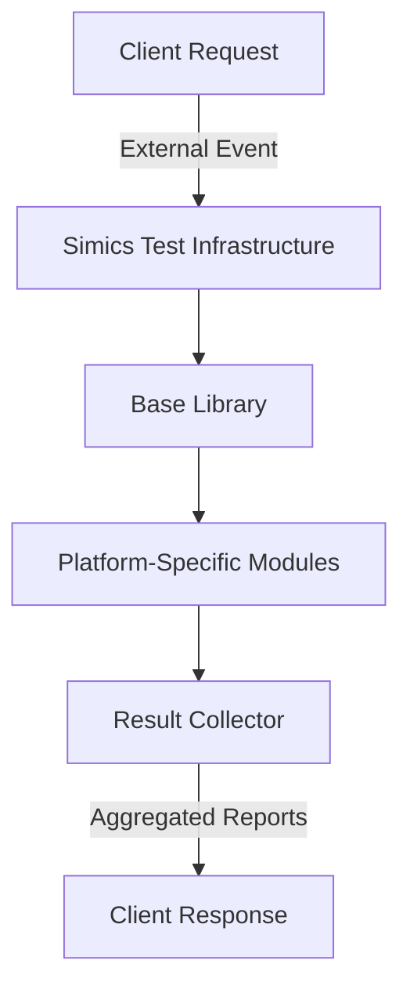
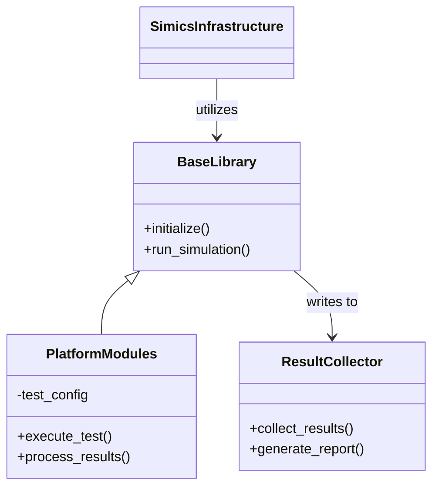
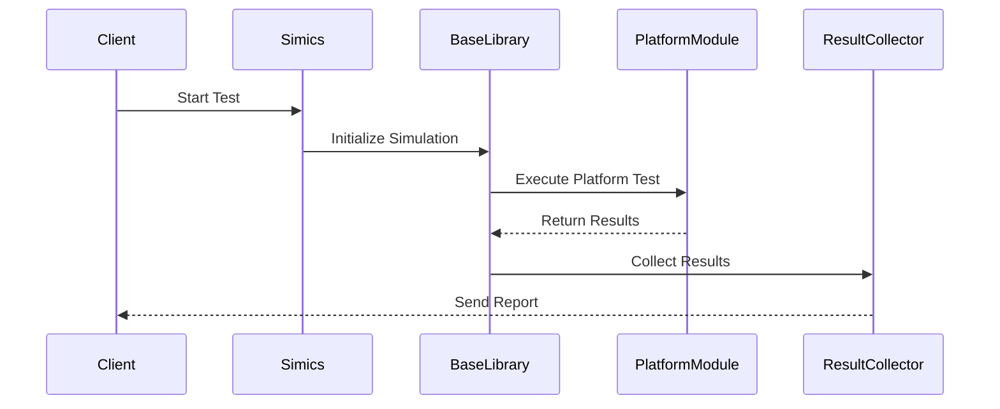

# Backend Systems

## Introduction

The "Backend Systems" module forms the core server-side framework that underpins the functionality of a distributed and scalable testing environment. Its purpose is to facilitate reliable, automated testing workflows by integrating essential components such as simulation tools (e.g., Simics test infrastructure), asynchronous task management, and platform-specific test cases and utilities. 

This documentation outlines the architecture, components, workflows, and configuration details of the system. It provides technical insights, visual depictions of the system behavior, modular relationships, and example code to ensure precise usage and integration.

## Architecture Overview

The Backend Systems module is designed with a modular architecture, enabling flexibility and maintainability. It emphasizes separation of concerns by categorizing its functionalities into base libraries, platform-specific test cases, and reusable components.

### General Architecture and Data Flow



- **Client Request:** Initiates testing or simulation workflows.
- **Simics Test Infrastructure:** Handles the provisioning and control of simulation environments.
- **Base Library:** Provides foundational utilities and reusable components.
- **Platform-Specific Modules:** Implements test logic tailored to specific hardware/software platforms.
- **Result Collector:** Aggregates and processes output for client consumption.

## Components and Their Relationships

### High-Level Class Diagram



- `BaseLibrary`: Core abstraction layer for common functionalities.
- `PlatformModules`: Extends `BaseLibrary` with platform-specific logic.
- `SimicsInfrastructure`: An external module interfacing with the `BaseLibrary`.
- `ResultCollector`: Handles test result aggregation and reporting.

### Platform Modules in Detail

The platform modules represent individual platform-specific cases, such as:
- **COR (Core):** Handles tests specific to core hardware simulation.
- **DMR (Dimmer):** Responsible for tests targeting dimmer-specific functionality.

Sources: [srv-pmss-tests/plats/cor.py:line](), [srv-pmss-tests/plats/dmr.py:line]()

## Process Workflow

### Sequence Diagram of a Test Execution



## Configuration and Parameters

### Key Parameters

| Parameter         | Description                              | Source                                              |
|-------------------|------------------------------------------|-----------------------------------------------------|
| `test_config`      | Configuration details for the test case | [srv-pmss-tests/plats/dmr.py:line]()                |
| `platform_id`      | Identifier for the platform being tested | [srv-pmss-tests/plats/cor.py:line]()                |
| `result_dir`       | Directory for storing test outputs       | [srv-pm-testlib/base.py:line]()                     |

### Example Configuration

```python
test_config = {
    "platform_id": "COR",
    "timeout": 300,
    "result_dir": "./results",
    "retry": 2
}
Sources: [srv-pmss-tests/plats/cor.py:line]()
```

## Code Snippets

### Example of Initializing a Test Case

```python
from base import BaseLibrary
from plats.cor import CoreTest

# Initialize base library
base = BaseLibrary()

# Instantiate platform-specific test
core_test = CoreTest(test_config={
    "platform_id": "COR",
    "timeout": 300
})

# Execute the test
results = core_test.execute_test()
base.process_results(results)
```

Sources: [srv-pm-testlib/base.py:line](), [srv-pmss-tests/plats/cor.py:line]()

## Conclusion

The Backend Systems module demonstrates a robust foundation for managing complex testing scenarios. With its modular design, extensibility, and integration of simulation tools like the Simics test infrastructure, the framework effectively supports a range of use cases. By combining reusable base libraries with platform-specific extensions, developers can ensure reliability, maintainability, and scalability in testing workflows. For further examples and usage, refer to the provided code repositories.