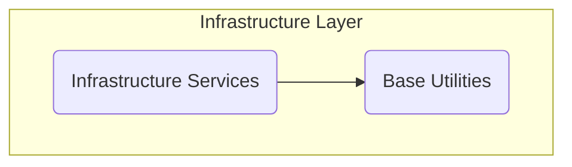
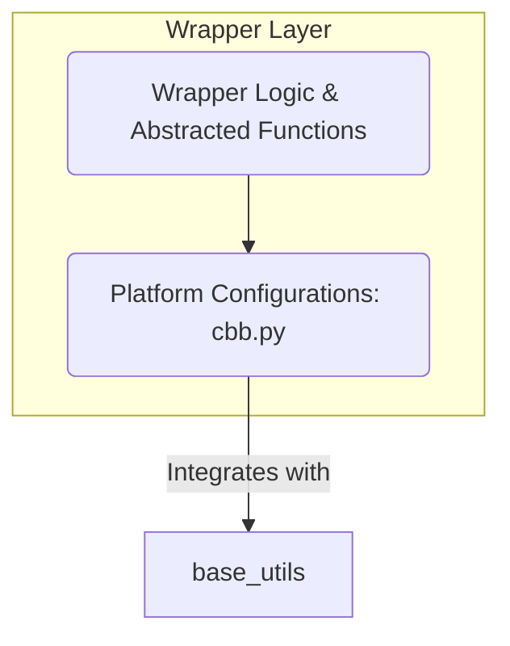
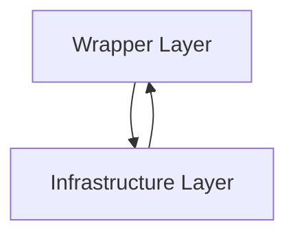
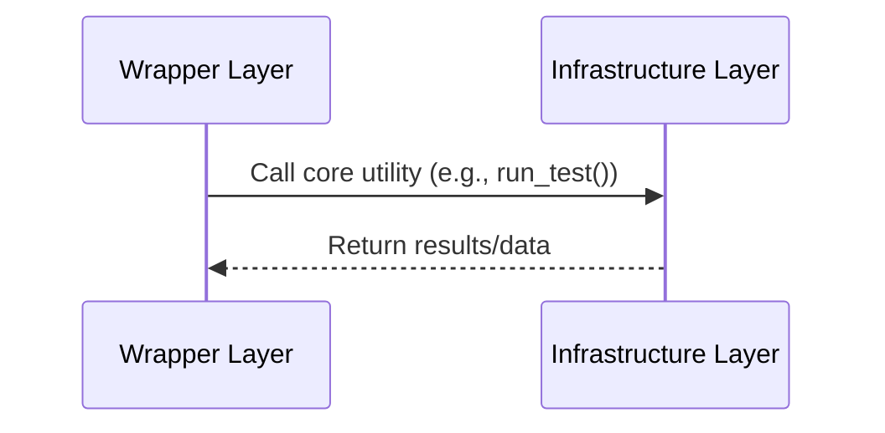
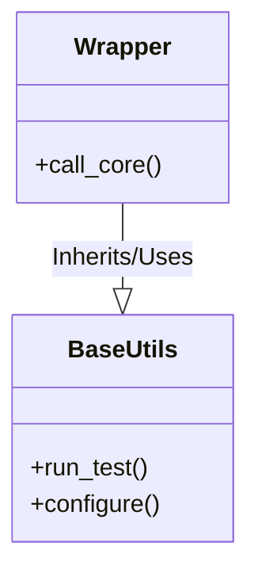

# System Architecture

## Introduction

The "System Architecture" described in this repository outlines a layered approach to managing infrastructure components and wrapper logic for systems. The implementation is designed to ensure modularity, adaptability, and separation of responsibilities. This document provides an in-depth view of the architecture, data flow, and key processes within the system.

The repository consists of multiple layers, including an **infrastructure layer** for core functionalities and a **wrapper layer** that provides extended abstractions for specific use cases. By using the outlined architecture, developers can efficiently create, extend, and maintain robust systems with minimal coupling between layers.

---

## Architecture Overview

The architecture is built upon two primary layers: 

1. **Infrastructure Layer**: The foundation of the system, handling core operations and low-level functionality.
2. **Wrapper Layer**: A higher layer providing abstractions, enhancements, and application-specific utilities.

These layers interact to ensure that core functionalities are reusable while providing mechanisms to introduce additional, customized behaviors.

---

## Component Breakdown

### Infrastructure Layer

This layer provides essential functionality and services. Its primary duty is to abstract the low-level complexities of interacting with hardware or software components.

#### Responsibilities:
- Managing foundational services, configurations, and models.
- Providing reusable libraries, such as `base.py`, which contains generic test framework utilities.  
*Sources*: [srv-pm-testlib/base.py]()

#### Key Features:
- **Modularity**: Independent components that can be reused.
- **Scalability**: Supports integration of additional services.

#### Flow Diagram:


---

### Wrapper Layer

The wrapper layer adds a level of customization, acting as a bridge between the underlying infrastructure and the broader system use cases. 

#### Responsibilities:
- Abstractions over infrastructure components.
- Case-specific enhancements and utilities.
- Key implementations, such as the `plats/cbb.py` module, which configures platform-specific behaviors for system testing.  
*Sources*: [srv-pmss-tests/plats/cbb.py]()

#### Flow Diagram:


---

### Data Flow Overview

In general, the data flows from the wrapper layer to the infrastructure layer for processing and back to the wrapper for specific enhancements or outputs. This ensures clean separation and avoids direct dependencies between layers.



---

## Key Processes

### Sequence Diagram: Wrapper Calling Infrastructure

The following process describes how a wrapper (e.g., `cbb.py` in the wrapper layer) interacts with base utilities from the infrastructure layer:



### Class Diagram: Layer Components

The architectural components are represented as classes/modules below:



---

## Tables

### Module Summary

| **Module**       | **Layer**          | **Functionality**                                     | **Source**                      |
|-------------------|--------------------|-------------------------------------------------------|----------------------------------|
| `base.py`         | Infrastructure     | Core utilities for testing, configuration            | [srv-pm-testlib/base.py]()      |
| `cbb.py`          | Wrapper            | Platform-specific functionality for system testing   | [srv-pmss-tests/plats/cbb.py]() |

---

## Example Code

### From `base.py`

The `run_test` function is a core utility available in the infrastructure layer:

```python
def run_test(param):
    # Example of a reusable core test function
    pass
```
*Sources*: [srv-pm-testlib/base.py]()

### From `cbb.py`

The `configure_platform` function in `cbb.py` demonstrates how the wrapper layer utilizes the infrastructure’s utilities:

```python
from base import run_test

def configure_platform():
    result = run_test("platform_parameters")
    # Apply platform-specific enhancements
    return result
```
*Sources*: [srv-pmss-tests/plats/cbb.py]()

---

## Conclusion

This document detailed the repository's layered architecture, emphasizing the modular design that separates the infrastructure layer from the wrapper layer. The **infrastructure layer** provides core functionalities, while the **wrapper layer** enhances and abstracts these utilities for specific use cases. By adhering to this architecture, the repository ensures scalability, maintainability, and ease of integration.

For further information, refer to the source files:
- Infrastructure: [srv-pm-testlib/base.py]()
- Wrapper: [srv-pmss-tests/plats/cbb.py]()