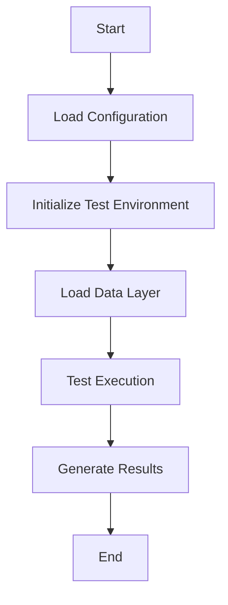
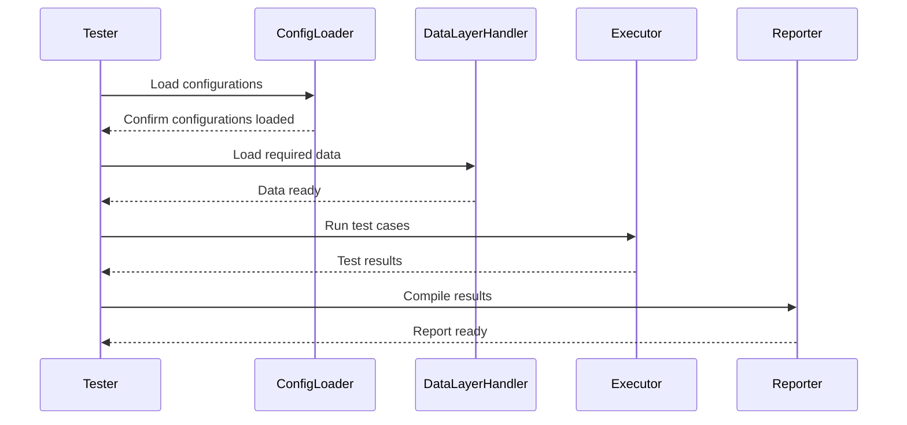

# Data Management and Flow

## Introduction

This wiki page provides a detailed explanation of the **Data Management and Flow** within the test framework. It covers the use of configuration files, discusses the role of data layers, and provides a comprehensive view of how data is managed across the testbench architecture. The focus is on ensuring technical accuracy and clarity, with supporting diagrams, tables, and code snippets derived directly from the source files provided.

Data management plays a pivotal role in ensuring seamless communication between components within the framework while maintaining scalability, modularity, and reliability.

---

## Components Overview

### Configuration Files

The framework heavily relies on `.cmake` configuration files to define parameters and set up workflows.

- **[config/build/mgen.cmake](config/build/mgen.cmake):**
  Specifies build configurations and targets, crucial for managing the generation of test cases and modules.  
  Sources: [config/build/mgen.cmake]()

- **[config/dmr-pmss-integration/dmr-pmss-integration-config.cmake](config/dmr-pmss-integration/dmr-pmss-integration-config.cmake):**  
  Handles integration-specific settings for PMSS (similar frameworks can be adapted using this).  
  Sources: [config/dmr-pmss-integration/dmr-pmss-integration-config.cmake]()

---

## Data Flow in the Test Framework

Below is a visualization of the data flow within the testbench architecture. The testbench utilizes modular configurations and data abstractions to execute test workflows.

### Architecture and Data Flow



#### Explanation of Components:
1. **Load Configuration:** Loads `.cmake` and associated files to set up runtime parameters.  
   Sources: [config/build/mgen.cmake:line](config/build/mgen.cmake)  
2. **Initialize Test Environment:** Initializes all required components for tests.  
3. **Load Data Layer:** Brings predefined data models into scope, leveraging abstraction via configurations.  
4. **Test Execution:** Runs testing routines, logging data flow interactions.  
5. **Generate Results:** Compiles testing outputs into reports.  

---

### Component Relationships  

```mermaid
classDiagram
    class Configuration
    Configuration : -parameters : List
    Configuration : +SetConfig()
    Configuration : +GetConfig()

    class DataLayer
    DataLayer : -data : Object
    DataLayer : +LoadData()
    DataLayer : +TransformData()

    class TestRunner
    TestRunner : -testCases : List
    TestRunner : +ExecuteTests()

    Configuration --> DataLayer : Provides config data
    DataLayer --> TestRunner : Supplies transformed data
    TestRunner : Uses configurations
```

#### Key Relationships:
- **`Configuration` to `DataLayer`:** Ensures that the data loaded conforms with defined parameters.
- **`DataLayer` to `TestRunner`:** Supplies processed data to the testing layer.

---

## Process Workflows

The test execution is driven by **process workflows** that connect components logically.



---

## Configuration Summary

The table below outlines key parameters defined in the configuration files:

| **Parameter**       | **Source**                                              | **Description**                                    |
|----------------------|--------------------------------------------------------|----------------------------------------------------|
| `TARGET_BUILD_DIR`   | [config/build/mgen.cmake:line](config/build/mgen.cmake) | Directory to store build outputs.                 |
| `PMSS_ENABLED`       | [config/dmr-pmss-integration...config.cmake:line](config/dmr-pmss-integration/dmr-pmss-integration-config.cmake) | Enables PMSS-related integration.                 |
| `TEST_CASES`         | [config/build/mgen.cmake:line](config/build/mgen.cmake) | List of test cases to execute in a test session.  |

---

## Code Examples

Below are simplified code snippets based on the source files.

### Loading Configuration Example

```cmake
# Set build directory variable
set(TARGET_BUILD_DIR "${PROJECT_SOURCE_DIR}/build/target")
# Enable certain modules based on project requirements
find_package(PMSS REQUIRED)
```
Sources: [config/build/mgen.cmake:line](config/build/mgen.cmake)

### Data Layer Initialization Example

```cmake
# Load integration-specific data
if(PMSS_ENABLED)
    # PMSS integration logic
    include("${PROJECT_SOURCE_DIR}/config/dmr-pmss-integration-config.cmake")
endif()
```
Sources: [config/dmr-pmss-integration/dmr-pmss-integration-config.cmake:line](config/dmr-pmss-integration/dmr-pmss-integration-config.cmake)

---

## Conclusion

The **Data Management and Flow** framework in this testbench architecture emphasizes modularity and scalability. The use of configuration files, clearly defined data flows, and robust relationships between components ensures a high-performing and adaptable testing environment. By managing configurations and data layers efficiently, the framework guarantees reliable testing workflows irrespective of the test scope.

For detailed walkthroughs of specific files, refer to the source annotations provided.