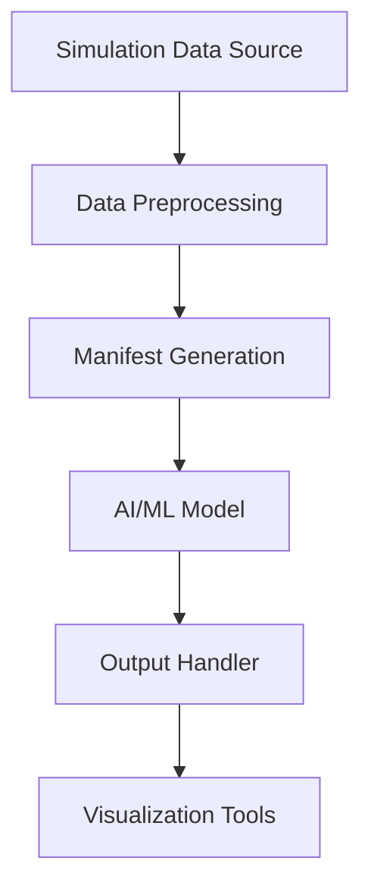
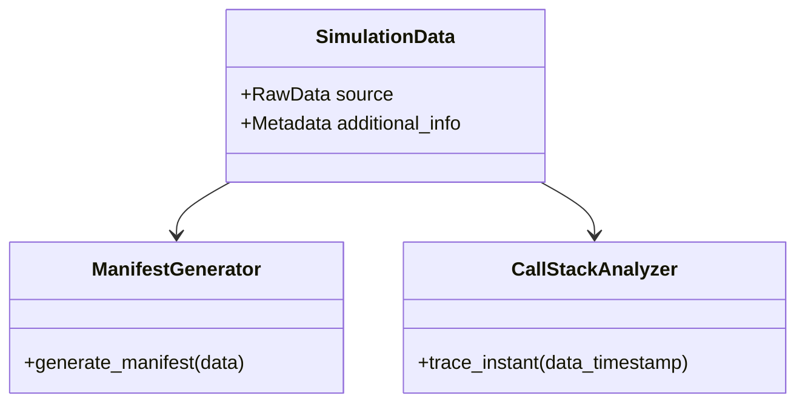
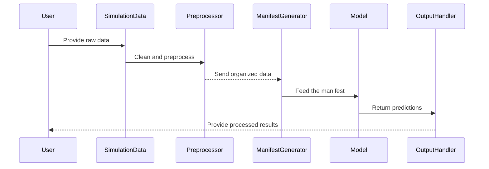

# Model Integration

## Introduction

Model Integration refers to the seamless incorporation of AI or ML models into a larger simulation or computational framework. This process ensures that models can interact with simulation data effectively, facilitating tasks such as prediction, decision-making, or enhanced analysis. Based on the source scripts outlined, this documentation provides a structured overview of the architecture, data flows, and workflows necessary for the integration process. The documentation focuses on the `manifest-gen.py` and `callstack_at_instant.py` scripts to derive insights and implementation specifics.

## Architecture and Data Flow

### Overview

Model Integration involves multiple interconnected components that handle tasks such as data preprocessing, simulation data acquisition, model invocation, and result handling. The architecture is designed to ensure modularity, allowing changes or updates to specific components without impacting the entire system.

### Data Flow Visualization



**Explanation:**
- **A to B:** Raw simulation data is passed to a preprocessing module to clean and organize it.
- **B to C:** The manifest file, encapsulating metadata, is generated.
- **C to D:** The AI/ML model consumes the manifest data and processes it.
- **D to E:** The processed output from the model is handled appropriately.
- **E to F:** Final results are visualized for further analysis.

Sources: `manifest-gen.py`, `callstack_at_instant.py`

---

## Components and Their Relationships

### Component Breakdown

The following system components are directly associated with Model Integration:

#### Manifest Generator

**Description:** Helps to create a manifest file containing metadata describing the data being processed.  
Sources: [srv-pmss-tools/manifest-gen.py:line]()

#### Call Stack Analyzer

**Description:** Traces data interactions at a specific moment in time to debug or evaluate the process state.  
Sources: [scripts/trace/callstack_at_instant.py:line]()



---

## Process Workflows

### Example Workflow: Integrating AI/ML with Simulation Data



---

## Key Tables

### Parameters for Manifest Generation

| **Parameter Name** | **Type**   | **Description**                                   | **Source File**               |
|---------------------|------------|---------------------------------------------------|--------------------------------|
| `source_files`      | List[str]  | Files to include in the manifest                 | [srv-pmss-tools/manifest-gen.py:line]() |
| `include_metadata`  | Boolean    | Whether to attach additional metadata            | [srv-pmss-tools/manifest-gen.py:line]() |
| `output_path`       | str        | Filepath to save the generated manifest          | [srv-pmss-tools/manifest-gen.py:line]() |

---

### Call Stack Analysis Inputs

| **Input Name**       | **Type** | **Description**                             | **Source File**                 |
|-----------------------|----------|---------------------------------------------|----------------------------------|
| `timestamp`           | Float    | Specific time instant to analyze            | [scripts/trace/callstack_at_instant.py:line]() |
| `trace_level`         | Str      | Level of detail for the call stack analysis | [scripts/trace/callstack_at_instant.py:line]() |

---

## Code Snippets

### Example Python Code: Generating a Manifest File

```python
from manifest_gen import generate_manifest

# Example: Generate a manifest file
data_sources = ["simulation1.csv", "simulation2.csv"]
output_file = "manifest.json"
generate_manifest(source_files=data_sources, output_path=output_file)
```

Sources: [srv-pmss-tools/manifest-gen.py:line]()

### Example Python Code: Analyzing a Call Stack

```python
from callstack_at_instant import analyze_callstack

# Example: Analyze a call stack at a specific time
timestamp = 1624523423.45
analyze_callstack(timestamp=timestamp, trace_level="detailed")
```

Sources: [scripts/trace/callstack_at_instant.py:line]()

---

## Conclusion

Model Integration is a pivotal process in connecting AI or ML models to simulation data, ensuring a robust and modular system architecture. By leveraging components like `manifest-gen.py` for metadata management and `callstack_at_instant.py` for trace analysis, this integration supports accurate data flow, debugging, and result delivery. 

This documentation highlights the key architectural components, data processes, and implementation workflows, providing an extensive guide for implementing and managing AI/ML integrations within a simulation framework.