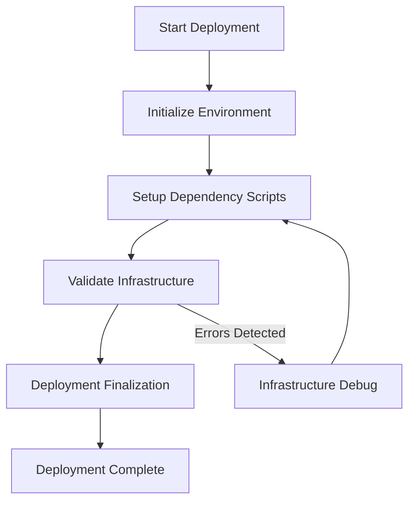
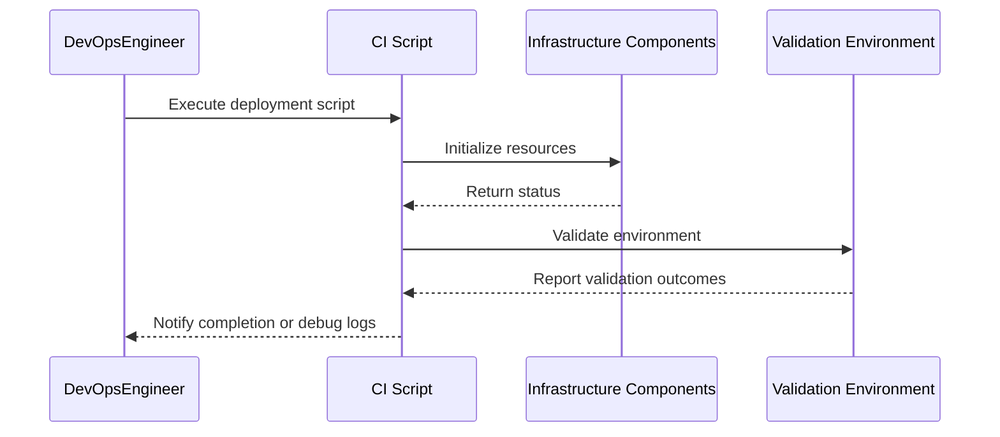
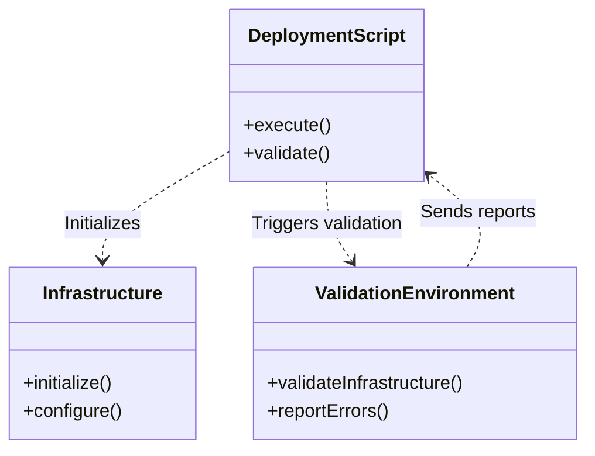

# Deployment and Infrastructure

## Introduction

This document provides detailed instructions and technical insights into the deployment and infrastructure setup required for your framework. It covers the architecture, workflows, and deployment configuration steps, ensuring seamless integration and operational efficiency. By following this guide, users will be able to understand the underlying deployment processes and the infrastructure required to run the system effectively.

The information has been derived from the provided source files and applies specifically to the supported environment where these scripts and configuration files are intended to be used.

---

## Deployment Workflow

To ensure a successful deployment, the framework follows a structured workflow that builds, configures, and initializes the required infrastructure. Below, our documentation explains the logical breakdown of processes.

### Execution Workflow Overview

A top-level view of the major processes involved in deployment and validation is illustrated below.



---

### Sequence Diagram: Validation and Deployment Setup

Below is a detailed visualization of the interactions between critical components involved during the deployment and validation phase.



---

## Infrastructure Components

The core setup involves several components, each responsible for distinct aspects of the deployment process. Below is a conceptual overview of their relationships.



---

## Configuration Parameters

The deployment process involves multiple configuration parameters. Below is a summary of the key parameters and their descriptions.

| Parameter                  | Description                                         | Default Value              |
|----------------------------|-----------------------------------------------------|----------------------------|
| `ENVIRONMENT`              | Specifies the deployment environment (e.g., CI/CD). | `ci`                       |
| `DEPLOYMENT_MODE`          | Determines the deployment mode (e.g., test, prod).  | `test`                     |
| `VALIDATION_SCRIPT_PATH`   | Path to the validation scripts.                     | `scripts/ci/`              |
| `LOGGING_LEVEL`            | Level of logging detail.                            | `INFO`                     |
| `SIMICS_SETUP_SCRIPT`      | Path to Simics setup script.                        | `setup-val-simics2.sh`     |

---

## Code Snippet: Example Shell Script

Below is an example of a shell script snippet used during the setup and validation phase of deployment:

```bash
#!/bin/bash

# Set up environment variables
ENVIRONMENT="ci"
DEPLOYMENT_MODE="test"

# Execute validation script
bash scripts/ci/setup-val-simics2.sh --env $ENVIRONMENT --mode $DEPLOYMENT_MODE
if [ $? -ne 0 ]; then
  echo "Validation failed. Check logs for details."
  exit 1
fi

echo "Validation completed successfully. Proceeding with deployment."

# Further deployment logic
```

Sources: [scripts/ci/setup-val-simics2.sh]()

---

## Documentation Hierarchy

The project follows a designed documentation hierarchy based on `mkdocs.yml`. This config ensures the documentation remains structured and navigable. Below is an illustrative excerpt for understanding the structure:

```yaml
site_name: PMSS 2.0 docs
theme:
  name: material
nav:
  - Home: index.md
  - Deployment:
      - Introduction: deployment/intro.md
      - Workflow: deployment/workflow.md
      - Configuration: deployment/config.md
```

Sources: [pmss2.0/pmss2.0-docs/mkdocs.yml]()

---

## Conclusion

This documentation provides a comprehensive overview of the deployment and infrastructure setup. Key aspects include the initialization workflow, validation process, infrastructure components, and configuration parameters. By adhering to these guidelines, users can ensure smooth deployment and efficient problem resolution when errors are encountered.

For further details, refer to the provided source files' scripts and configuration templates. Always validate your environment before proceeding with full-scale deployments to maintain system stability and reliability.