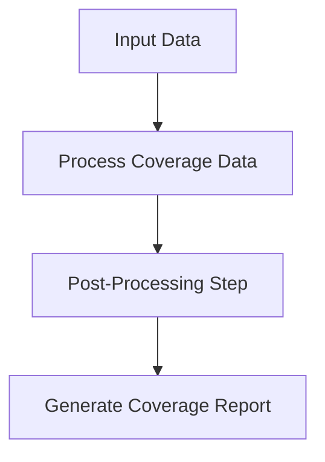
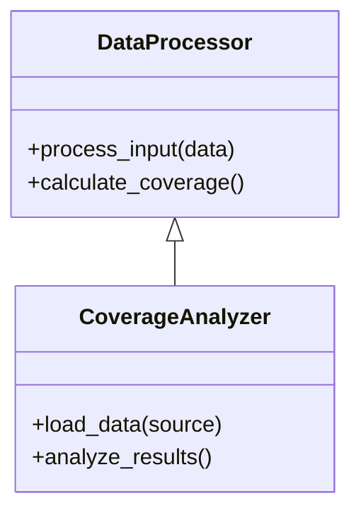
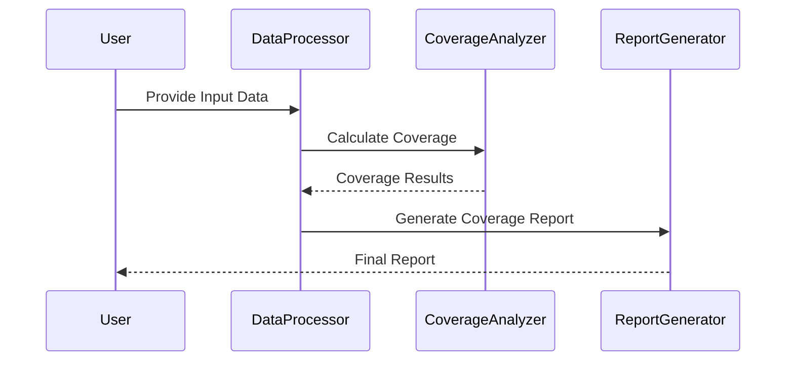

# Best Practices and Contribution

## Introduction
The **Best Practices and Contribution** guide serves as a comprehensive resource for developers and contributors working with this framework. It outlines coding standards, contribution protocols, system design principles, and workflows necessary for the effective development and maintenance of the project. The documentation ensures consistency, fosters collaboration, and provides a foundation for scalable and maintainable code.

This page will guide both new contributors and experienced developers on how to adhere to the project's standards and contribute efficiently.

---

## Best Practices

### General Coding Standards

Adhering to a consistent coding standard improves readability and maintainability. This framework follows the PEP 8 style guide for Python development, and contributors are required to:
- Use clear and descriptive variable, function, and module names [Sources: scripts/covpost.py].
- Limit lines of code to 79 characters.
- Document functions and classes with concise and meaningful docstrings.
- Remove any unused imports or redundant code before committing.

_Example: Proper function signature and docstring alignment:_

```python
def calculate_post_coverage(data):
    """
    Calculates post-processing coverage based on the given data.

    Args:
        data (dict): The input data required for coverage calculation.

    Returns:
        float: Percentage of coverage post-calculation.
    """
    # Implementation here
```
[Sources: scripts/covpost.py]

---

### Project Directory Structure

The repository uses an organized directory structure for better modularity and code separation. Contributors should maintain this structure when introducing new features:

| **Directory/File**      | **Purpose**                              |
|--------------------------|------------------------------------------|
| `scripts/covpost.py`     | Core components for coverage processing  |
| `README`                 | Project overview and initial setup guide|

[Sources: README]

---

### Testing
- Write unit tests for every new feature or modification.
- Ensure a minimum of 90% test coverage is maintained across the codebase.

---

## Contribution Process

### Workflow

To contribute to the project, follow the standardized Git workflow to ensure smooth integration of changes.

#### Step 1: Fork the Repository
Start by forking the main repository to create your personal working copy.

#### Step 2: Clone and Create a Branch
Clone your forked repository locally and create a new feature branch.

```bash
# Clone the repository
git clone https://github.com/username/repo.git
cd repo

# Create and switch to a new branch
git checkout -b feature/new-functionality
```

#### Step 3: Make Changes and Commit
Implement your changes following best practices, documented coding standards, and appropriate testing.

```bash
# Add changes and commit
git add scripts/covpost.py
git commit -m "Add new functionality for calculating detailed coverage"
```

#### Step 4: Push and Submit
Push your feature branch to your fork and create a pull request to the main repository.

---

### Pull Request Guidelines

All submitted pull requests should:
- Be associated with a corresponding issue (when applicable).
- Include a clear and descriptive title and summary.
- Pass all tests and checks in the continuous integration pipeline.
- Be reviewed by at least one project maintainer before merging.

---

## Architecture and Data Flow

The system design integrates modular components to achieve seamless functionality. Below is a visualization of the architecture and data flow:



[Sources: scripts/covpost.py]

---

## Component Relationships

The following diagram illustrates the relationship between the project's core components:



[Sources: scripts/covpost.py]

---

## Process Workflows

A detailed workflow for the post-processing operation:



[Sources: scripts/covpost.py]

---

## Summary Table of Parameters

| **Parameter**       | **Description**                              | **Default Value** |
|----------------------|----------------------------------------------|-------------------|
| `data`              | Input data for coverage calculation          | None              |
| `source`            | Source file or database to load data         | "" (empty)        |

_Ensure all parameters are validated and described in the function's docstring._  
[Sources: scripts/covpost.py]

---

## Conclusion

To sum up, this page provides detailed insights into the best practices and contribution protocols within this framework. Contributors are encouraged to follow the prescribed guidelines for coding, testing, and submission to foster consistency and collaboration. By adhering to these standards, we can ensure the long-term success of the project.

For any questions or clarifications, refer to the source files listed or contact the project maintainers.