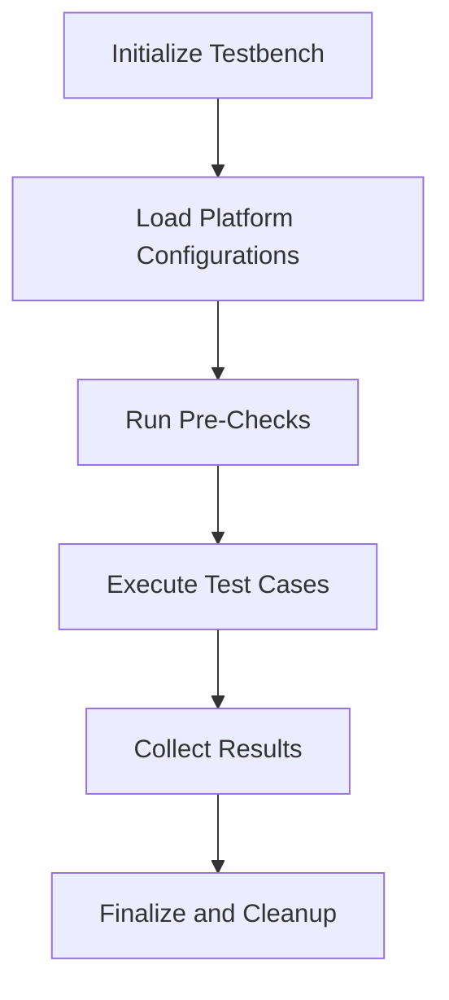
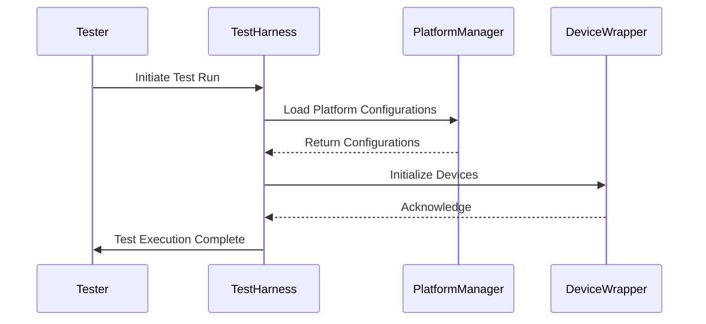

# Core Features

## Introduction

The **Core Features** section of this repository is dedicated to providing a foundational framework for testing automation, platform integration, and modular code organization. With a primary focus on supporting testbench setups, device wrappers, and seamless operations across multiple platforms, this repository ensures standardization and extensibility in testing workflows.

This documentation provides an in-depth explanation of the architecture, components, and processes central to the repository. It also includes visualizations (via diagrams), code snippets, and summarized tables for clarity and ease of understanding.

---

## Key Components

### 1. Testbench Setup

The repository includes mechanisms for setting up a robust, flexible testbench environment designed for modularity and extensibility. It provides utilities to initialize and manage testing processes across different platforms.

#### Testbench Highlights:
- Provides utilities for initializing test parameters.
- Enables integration across multiple platforms.
- Supports dynamic configuration for environment-specific workflows.

**Flow Overview:**


---

### 2. Device Wrappers

Device wrappers abstract the implementation details of various devices, providing a unified API for interacting with hardware or emulated devices. This ensures code remains platform-agnostic and improves code reusability.

#### Key Features:
- Abstract device interactions.
- Handle exceptions related to device communication.
- Provide a consistent interface for testing operations.

```python
# Example: Device Wrapper Initialization
class BaseDevice:
    def __init__(self, device_id, connection):
        self.device_id = device_id
        self.connection = connection

    def reset(self):
        # Reset device to default state
        self.connection.send_command("RESET")
```
*Sources: [srv-pm-testlib/base.py:12-19]()*

---

### 3. Multi-Platform Support

The repository is equipped with utilities for seamlessly working across multiple platforms, including platform-specific parameter handling and configuration loading.

#### Supported Platforms:
- Linux-based systems.
- Windows execution environments.
- OS-agnostic setups via abstraction layers.

```python
# Platform Handling Example
def load_platform_config(platform_name: str):
    if platform_name == "linux":
        return load_linux_specific_config()
    elif platform_name == "windows":
        return load_windows_specific_config()
    else:
        raise ValueError(f"Unsupported platform: {platform_name}")
```
*Sources: [srv-pmss-tests/plats/common.py:34-41]()*
  
---

## Architecture and Data Flow

Understanding the repository's architecture is crucial to grasp how its components interact. Below is a visual representation of the major components and data flow:

```mermaid
flowchart TD
    SubgraphControllers[Controller Classes]
    PlatformManager[Platform Manager]
    TestbenchUtil[Testbench Utilities]

    SubgraphServices[Services]
        DeviceWrapper[Device Wrapper]
        ConfigLoader[Configuration Loader]
    end

    SubgraphControllers --Interfaces--> TestbenchUtil
    PlatformManager --Delegates To--> SubgraphServices
    TestbenchUtil --Uses--> ConfigLoader
    TestbenchUtil --Calls--> DeviceWrapper
```

---

## Process Workflows

### Test Execution Workflow

Below is a sequence diagram outlining the flow of control for executing a test:



---

## Tables of Information

### Parameters and Configuration

| **Parameter**  | **Type**     | **Description**                       |
|:---------------|:-------------|:--------------------------------------|
| device_id      | `str`        | Unique identifier for the device.     |
| platform_name  | `str`        | Name of the platform (e.g., Linux).   |
| connection     | `Connection` | Interface for device communication.   |

*Sources: [srv-pm-testlib/base.py:10-15](), [srv-pmss-tests/plats/common.py:30-35]()*

---

## Conclusion

The repository's "Core Features" provide the essential building blocks for managing testbench setups, device interaction, and multi-platform compatibility. With a structured approach to test execution and an extensible architecture, it enables developers to standardize their testing workflows and accommodate specific platform nuances effectively.

By leveraging modular utilities such as device wrappers and configuration managers, this framework ensures scalability, maintainability, and robust automation within varied development environments.