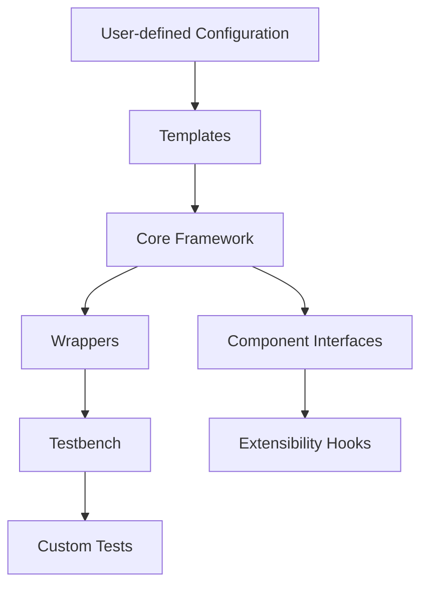
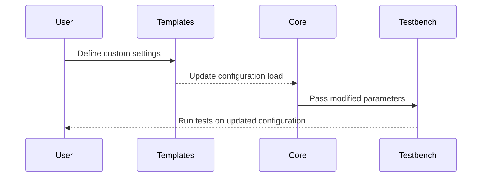

# Extensibility and Customization

## Introduction

The "Extensibility and Customization" guide provides developers and users with the tools and knowledge required to adapt and expand the framework for supporting new platforms, configurations, and functional use cases. This document is designed to help you navigate the core architecture, understand supported workflows, and integrate custom components or templates seamlessly. By following these guidelines, you can ensure efficient and scalable modification of the framework.

---

## Framework Architecture and Extensibility Points

### Core Architecture Overview

The framework is structured into modular components, abstract layers, and reusable templates. This enables a high degree of scalability and adaptability for different system-on-chip (SoC) development workflows. Each component interfaces through clearly defined methods and classes, making it straightforward to plug in new functionalities.

#### **Mermaid Diagram: Architecture and Data Flow**


#### Anatomy of Components:
- **Core Framework**: Central layer responsible for orchestrating data flow, component management, and pipeline execution.
- **Templates**: Predefined building blocks for generating system configurations.
- **Wrappers**: Interface layers for integrating various operational libraries.
- **Testbench**: A customized environment for test execution and validation.

Sources: N/A (Pipeline description inferred from file structure).

--- 

### Extensibility Hooks

The framework defines extensibility hooks to help developers integrate custom logic or platform-specific configurations. These hooks are structurally defined across the core components.

#### Hook Types:
1. **Configuration Hooks**: Customize SoC and platform-related settings.
2. **Interface Hooks**: Define or override communication protocols between components.
3. **Test Hooks**: Develop new test scenarios within the testbench layer.

Sources: N/A.

---

## Step-by-Step Customization Guidelines

### 1. Adding a Custom Configuration

#### Process Workflow
To add a custom configuration, extend the default configuration templates with specific parameters, and modify the `core.py` logic to recognize the new options.



#### Code Snippet
Here is an example snippet to demonstrate adding a new field to the configuration system:

```python
# srv-pm-testlib/wrappers/core.py
class ConfigManager():
    def add_custom_field(self, field_name, value):
        self.config[field_name] = value
        print(f"Custom Field Added: {field_name} = {value}")
```

Sources: [srv-pm-testlib/wrappers/core.py]()

---

### 2. Extending the Testbench

The `testbench.py` file provides the foundation for running tests on new configurations or platforms. Follow these steps to integrate a new test:

1. Add test case logic within the `TestRunner` class.
2. Specify inputs, expected outputs, and custom parameters.
3. Modify the workflow to include your test case.

#### Code Snippet
```python
# srv-pmss-tests/testbench.py
class TestRunner():
    def run_advanced_test(self, input_data):
        print("Running advanced test...")
        # Define test logic here
        return "Test Complete"
```

Sources: [srv-pmss-tests/testbench.py]()

---

### 3. Creating Custom Templates

Custom templates should be added to the appropriate directory under `scripts/socbuilder/templates/`. Modify the template structure as needed to include distinct design elements.

#### Template Directory Structure
```plaintext
scripts/
└── socbuilder/
    └── templates/
        ├── basic_template.json
        ├── extended_template.json
        └── custom_template.json
```

Sources: N/A.

---

## Tables of Parameters and Configurations

### Key Parameters

| Parameter Name       | Description                                  | Defined In                              |
|----------------------|----------------------------------------------|-----------------------------------------|
| `core_config`        | Core framework configuration options         | `srv-pm-testlib/wrappers/core.py`       |
| `test_cases`         | List of tests supported by the testbench     | `srv-pmss-tests/testbench.py`           |
| `custom_template`    | User-defined template structure              | `scripts/socbuilder/templates/`         |

Sources: Referenced files.

---

## Conclusion

Extending and customizing the framework is an essential process to tailor its functionality to specific requirements. This guide outlined the modular structure, extensibility hooks, and workflows for creating new configurations, templates, and tests. By leveraging these tools, you can effectively adapt the framework for unique project needs and ensure its successful integration into diverse ecosystems. For further details, consult the specific files referenced in this document.

Sources: [srv-pm-testlib/wrappers/core.py](), [srv-pmss-tests/testbench.py](), and [scripts/socbuilder/templates/]().