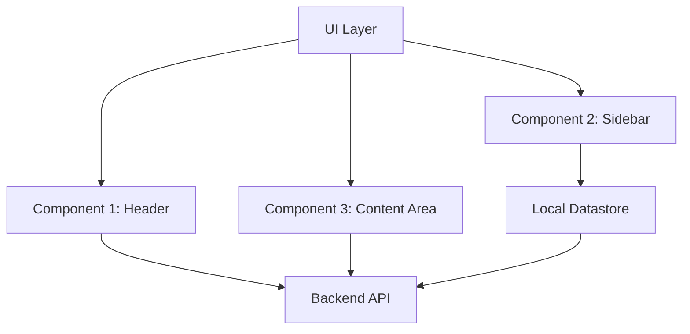
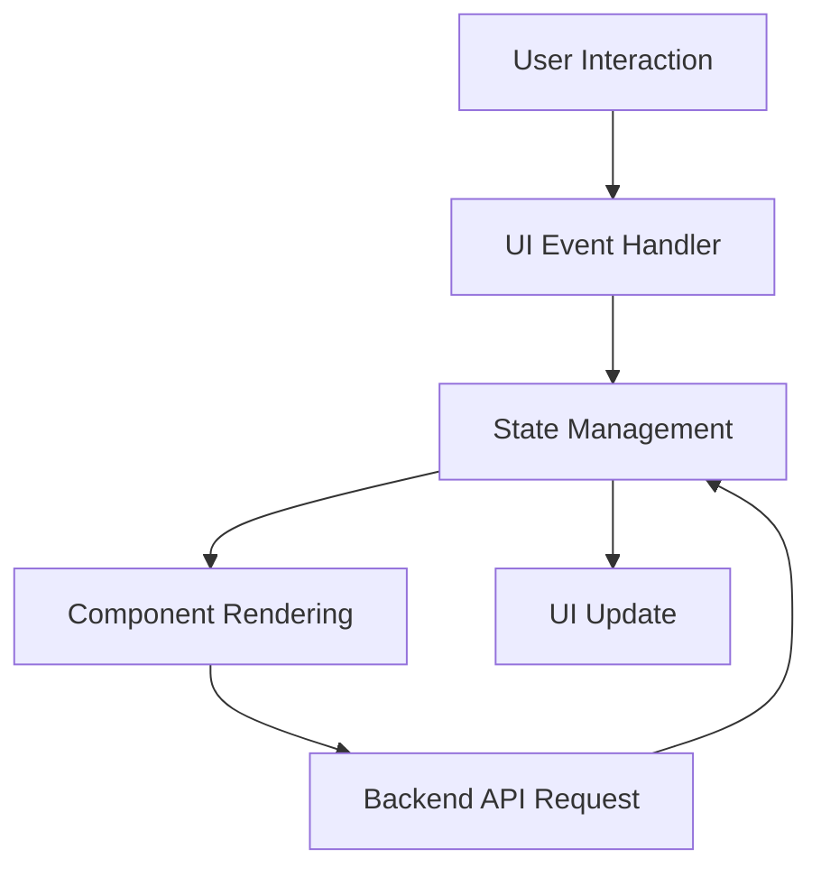
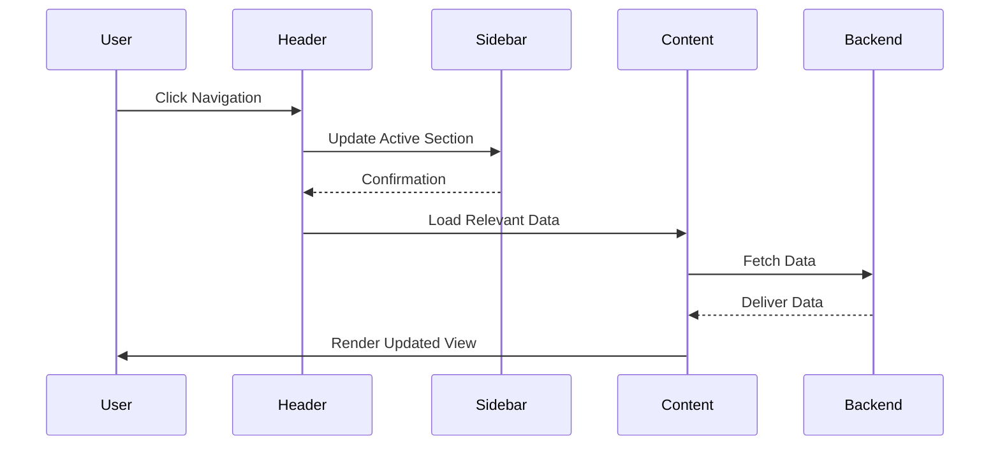

# Frontend Components Documentation

## Introduction

The **Frontend Components** of this project define the user-interactive elements and their associated functional workflows as part of the system architecture. These components are responsible for rendering the user interface (UI), handling interactions, and ensuring seamless communication with the backend API. This document provides a detailed overview of the individual components, their relationships, and the processes involved in achieving functionality in the system.

The primary objective of this document is to serve both as a technical reference and as a guide for developers contributing to or maintaining the frontend system. The scope covers UI requirements, data flow, and the visual representation of relationships between components.

---

## Detailed Sections

### 1. Core Architecture

#### Overview
The frontend system is structured to adhere to modular development principles, ensuring scalability and maintainability. Each component addresses a specific responsibility within the UI while contributing to the overall user experience.

Key goals:
- Consistency in design and functionality
- Responsiveness across devices
- Ease of integration with backend services

#### Flowchart: Component-Based Architecture
Below is a high-level visualization of how the frontend components are structured and interconnected:



**Sources:**  
[pmss2.0/capabilities_table.drawio:all]()

---

### 2. Key Frontend Components

#### Header Component
The `Header` component is a persistent section at the top of the application interface. It handles navigation, user authentication buttons, and branding.

Properties:
- **State Management:** Tracks active navigation items.
- **Event Listeners:** `onClick()` for menu items.
- **UI Dependencies:** Connects to the theme API for dynamic styling.

#### Sidebar Component
The `Sidebar` serves as the primary navigation menu, offering quick access to different sections of the application.

Features:
- **Accordion Menu:** Collapsible sections for sub-navigation.
- **Responsive Behavior:** Collapses into an icon-based menu on smaller screens.

#### Content Area
The `Content Area` dynamically renders information based on the user's interaction with other components. It is the primary workspace for users.

Key properties:
- **Dynamic Rendering:** Updates based on user-selected actions.
- **Integration:** Communicates with the backend to fetch and display data.

---

### 3. Data Flow and Process Workflows

The communication model integrates user action, state management, and backend communication processes within the frontend architecture.

#### Flowchart: Data Flow and Communication


This model ensures that user inputs are first validated and stored within the local state before being communicated to the backend.

---

### 4. Sequence Diagram: Component Communication

Each frontend component interacts with the backend to fetch real-time data. Below is a detailed visualization of the interactions:



---

## Tables: Key Configuration Details

| **Component**  | **Responsibilities**             | **Interactions**                          | **Dependencies**       |
|-----------------|----------------------------------|-------------------------------------------|------------------------|
| `Header`       | Renders top navigation           | User, Sidebar, Theme API                  | Global CSS, Event Listeners |
| `Sidebar`      | Navigation menu                  | Header, State Management                  | Responsive Design API  |
| `Content Area` | Dynamic content rendering        | Backend API, State Management, User Input | Component Props       |

---

### Code Snippets

#### Example: Dynamic State Update in the Header Component
The following code snippet illustrates how the Header dynamically updates its state based on user interaction:

```javascript
import React, { useState } from 'react';

const Header = () => {
  const [activeItem, setActiveItem] = useState('home');

  const handleNavigation = (item) => {
    setActiveItem(item);
    console.log(`Navigated to ${item}`);
  };

  return (
    <div className="header">
      <button onClick={() => handleNavigation('home')}>Home</button>
      <button onClick={() => handleNavigation('profile')}>Profile</button>
    </div>
  );
};

export default Header;
```

---

## Conclusion

In summary, the **Frontend Components** of this system are modular, user-centered, and designed to facilitate robust communication with the backend. This documentation provides a foundational understanding of the architecture, component relationships, and processes that govern the frontend system. By adhering to this structure, developers can ensure seamless integration, scalability, and maintainability.

**Sources:**  
[gui-requirements.txt:all]()  
[pmss2.0/capabilities_table.drawio:all]()