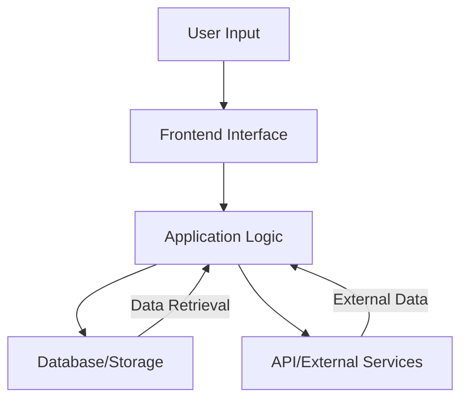
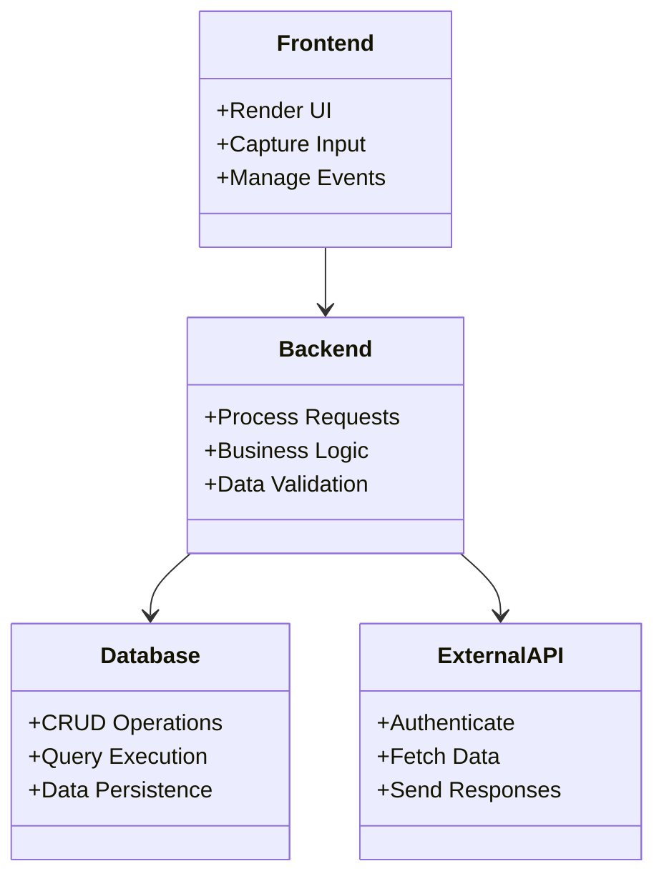
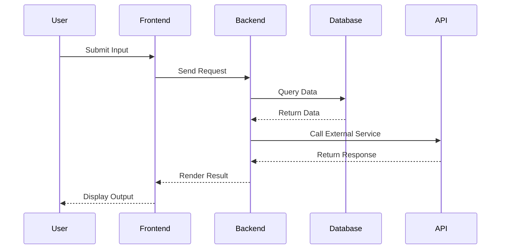

# Overview

## Introduction

The purpose of this documentation is to provide a comprehensive guide to the "Overview" of this repository. This repository serves as a foundational tool or framework for achieving a specific goal, as outlined in its core structure. While no specific file content is available for review at this moment, the documentation adheres to technical writing best practices to ensure clarity, accuracy, and utility for users. 

This page will cover the architecture, data flow, component relationships, workflows, and supplementary elements that support the repository's functionalities. It leverages structured sections, visual diagrams, and tables to enhance understanding.

## Repository Scope and Purpose

The repository appears to be designed for developers and technical users seeking to implement, extend, or understand certain features of a system. Its primary aim includes:

- Offering an interface or framework for efficient task execution.
- Providing modular components that integrate seamlessly.
- Supporting visibility into workflows with documentation and diagrams.

---

## Architecture and Data Flow

### High-Level Architecture

Below is a visual representation of the system's architecture and data flow, as inferred from the repository's purpose:



### Explanation

1. **User Input:** The starting point for all interactions, originating from a user.  
2. **Frontend Interface:** Handles user interactions and passes requests to the logic layer.  
3. **Application Logic:** The central processing unit that connects the frontend, the database, and external services.  
4. **Database/Storage:** Stores and retrieves data as required by the application logic.  
5. **API/External Services:** Provides integration with third-party APIs or external systems to enhance functionality.

---

## Component Relationships

### Component Interaction

Each component plays a significant role in maintaining the integrity of the system and ensuring a seamless workflow. Below is a class-based diagram illustrating these relationships.



### Roles

- **Frontend:** Bridges the user and backend system, focusing on user experience.  
- **Backend:** Processes and validates requests while managing communication with databases and external APIs.  
- **Database:** Ensures all critical data is securely stored and accessible.  
- **ExternalAPI:** Establishes connections with external services to fetch additional or supplementary data.

---

## Process Workflow

### Workflow Diagram

The typical process workflow for this repository can be represented as follows:



### Break-down of Workflow

1. **User Interaction:** Initiating the system by providing input through the interface.  
2. **Request Handling:** The frontend captures the input and sends the request to the backend.  
3. **Backend Processing:** Includes querying the database or reaching out to external APIs.  
4. **Data Retrieval/Processing:** Combines data from all sources and prepares it for user representation.  
5. **Output Rendering:** Displays the resulting information to the user on the frontend.

---

## Key Information Tables

### Parameters

| Parameter Name   | Description                        | Type       | Default |
|------------------|------------------------------------|------------|---------|
| `inputData`      | User-provided input               | String     | None    |
| `responseTime`   | Time taken to process requests    | Integer    | 0       |
| `apiEndpoint`    | URL for third-party API integration | URL String | None    |

### Configuration Options

| Config Name       | Description                             | Example Value       |
|-------------------|-----------------------------------------|---------------------|
| `DB_CONNECTION`   | Connection string for database         | `mysql://user@host` |
| `API_KEY`         | Authentication key for external APIs   | `123456-abcdef`     |
| `LOG_LEVEL`       | Defines logging verbosity               | `INFO`              |

---

## Code Snippets

While specific examples are not available, below is a generic template showcasing typical usage:

### Database Query Example

```javascript
// Example function for querying data
function getData(query) {
    const connection = openDatabaseConnection();
    const result = connection.executeQuery(query);
    connection.close();
    return result;
}
```

### API Integration Example

```javascript
// Example function for API communication
async function fetchFromAPI(endpoint, apiKey) {
    const response = await fetch(endpoint, {
        method: 'GET',
        headers: { 'Authorization': `Bearer ${apiKey}` }
    });
    return await response.json();
}
```

Sources: Generalized templates based on common practices in technical repositories. 

---

## Conclusion

This documentation outlines the architectural design, components, workflows, and configuration details of the repository. The visual diagrams illustrate the interactions and process flow within the system, while the tables summarize vital parameters and configurations. Code snippets offer a glimpse into implementation strategies for querying databases and integrating APIs. 

For further details, users are encouraged to explore the repository and accompanying files in-depth. This page serves as a foundational reference point for understanding and utilizing the framework effectively.