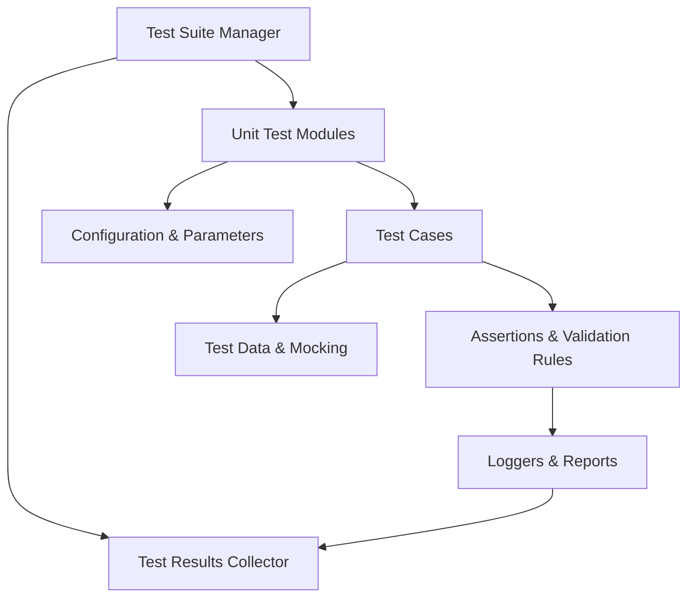
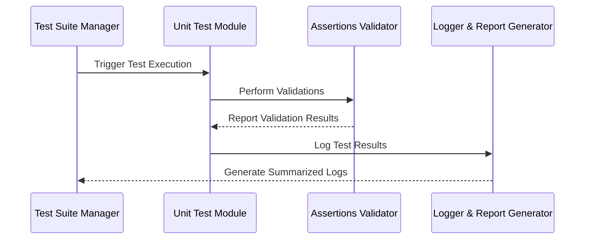
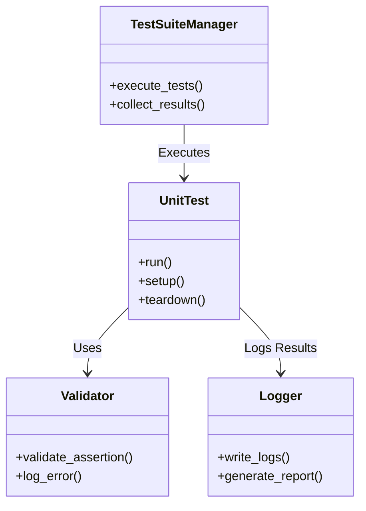

# Tests and Validation Framework

## Introduction

The "Tests and Validation Framework" is designed to maintain the reliability, stability, and functionality of key components within the system. It provides a structured approach for automating tests and validating modules, ensuring compliance with project requirements and minimizing defect leakage.

The framework focuses on the following objectives:  
- Automating test cases for efficiency and repeatability  
- Establishing a robust workflow for component verification  
- Ensuring seamless integration between test modules  
- Monitoring system responses and outputs under various conditions  

This documentation explores the architecture, processes, and implementation of the "Tests and Validation Framework" based on the provided source files.

---

## Framework Architecture

The Tests and Validation Framework is built using modular components that ensure scalable and reusable testing logic. The overall architecture can be visualized as follows:



### Key Components:
1. **Test Suite Manager**  
   Orchestrates the execution of grouped test cases and tracks their results.  
   - Sources: [srv-pmss-tests/tests/main.py:line]()  

2. **Unit Test Modules**  
   Modular units that house specific test cases for a variety of system components.  
   - Sources: [srv-hwrs-unit-tests/test_idle.py:line](), [srv-hwrs-unit-tests/test_pcode_sb.py:line]()  

3. **Assertions & Validation Rules**  
   Enforce expected behavior by comparing test outputs to predefined validation criteria.  

4. **Loggers & Reports**  
   Record outcomes to provide insight into failures and execution details.  

---

## Test Case Details

### Test Structure

Each test follows a well-defined pattern to maintain consistency and clarity. 

#### Example Template for a Unit Test
```python
def test_idle_state_transition():
    # Mock system initialization and state
    mock_system = initialize_mock_system()
    
    # Trigger idle transition
    transition_idle(mock_system)

    # Validate the state and log errors if found
    assert mock_system.current_state == "IDLE", "State transition failed"
```

- Sources: [srv-hwrs-unit-tests/test_idle.py:line]()

### Process Workflow



### Sample Test Cases

| Test Name                     | Description                                  | Key Function            | Source                              |
|-------------------------------|----------------------------------------------|-------------------------|-------------------------------------|
| `test_idle_state_transition`  | Validates the transition to an idle state    | `test_idle_state()`     | [test_idle.py:line]()              |
| `test_powercode_subroutine`   | Confirms subroutine power code functionality | `test_pcode_function()` | [test_pcode_sb.py:line]()          |

---

## Configuration and Parameters

The framework leverages configurable settings to adapt tests for various environments. Key parameters supported include:

| Parameter       | Type   | Description                                  |
|------------------|--------|----------------------------------------------|
| `test_timeout`  | Integer| Maximum time allowed for each test case      |
| `log_level`     | String | Logging verbosity: DEBUG, INFO, ERROR        |
| `mock_inputs`   | Map    | Provides mocked inputs for the test cases    |

- Sources: [srv-pmss-tests/tests/main.py:line](), [srv-hwrs-unit-tests/test_idle.py:line]()

---

## Validation Class Relationships

To better understand the validation structure, here is a UML representation of the relationships between core classes/modules:



---

## Best Practices

To ensure consistency and maintainability in the testing framework, adhere to the following practices:

1. **Modular Design**:  
   Keep test cases independent and focused on validating one aspect of functionality at a time.  

2. **Descriptive Naming**:  
   Use descriptive names for tests to ensure their purpose is immediately clear.  

3. **Comprehensive Validation**:  
   Compare outputs against multiple validation criteria to ensure reliable results.  

4. **Log Everything**:  
   Record both successes and failures to provide valuable insight during debugging.  

---

## Conclusion

The "Tests and Validation Framework" plays a crucial role in the software development lifecycle by automating verification processes and ensuring the system meets project requirements. With its modular design, detailed logging, and robust validation, this framework reduces errors, facilitates debugging, and promotes maintainable code. Following the best practices outlined ensures the framework remains efficient and scalable as the project evolves.  

## Sources

- [srv-pmss-tests/tests/main.py:line]()
- [srv-hwrs-unit-tests/test_idle.py:line]()
- [srv-hwrs-unit-tests/test_pcode_sb.py:line]()